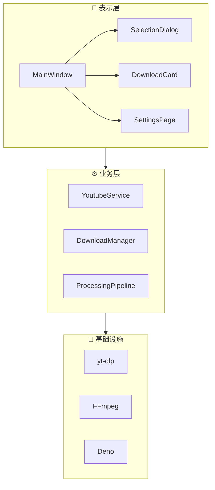

# FluentYTDL

<p align="center">
  
</p>

<p align="center">
  <strong>🎬 现代、流畅、轻量的 YouTube/视频下载器</strong>
</p>

<p align="center">
  <a href="https://www.python.org/"></a>
  <a href="LICENSE"></a>
  <a href="https://github.com/SakuraPuare/FluentYTDL/releases"></a>
  <a href="#"></a>
</p>

---

## ✨ 功能亮点

### 🎨 Fluent Design 现代界面

基于微软 Fluent Design 设计语言，采用 QFluentWidgets 构建的现代化用户界面：

- **深色/浅色模式** - 自动跟随系统主题，或手动切换
- **流畅动画** - 过渡效果平滑自然
- **响应式布局** - 适配不同窗口大小
- **毛玻璃效果** - 精致的亚克力背景

---

### 📋 剪贴板智能监听

复制即下载，无需手动粘贴：

- **自动检测链接** - 复制 YouTube 链接后自动弹出下载对话框
- **智能过滤** - 只识别有效的视频/播放列表链接，忽略其他内容
- **一键开关** - 在设置中随时启用/禁用此功能
- **后台静默** - 不干扰正常的复制粘贴操作

---

### 🎞️ 多格式全面支持

从 360p 到 8K，从视频到纯音频：

| 类型 | 支持格式 |
|------|----------|
| **视频** | MP4, WebM, MKV (4K/8K/HDR) |
| **音频** | MP3, AAC, FLAC, Opus, M4A |
| **字幕** | SRT, VTT, ASS (自动下载) |
| **封面** | 自动嵌入视频缩略图 |

**格式选择模式：**

- **简易模式** - 9 种常用预设，一键选择
  - 🎬 最佳画质 (MP4) / 🎯 最佳画质 (原盘)
  - � 2160p 4K / 1440p 2K / 1080p 高清 / 720p 标清 / 480p / 360p
  - 🎵 纯音频 (MP3 320k)
  
- **专业模式** - 精确选择视频流和音频流
  - 可组装模式：分别选择视频和音频，自动合并
  - 整合流模式：选择已封装的完整流
  - 仅视频/仅音频：单独下载

---

### 🔐 Cookie 认证系统

自动提取浏览器 Cookie，解锁受限内容：

- **会员专享视频** - 下载 YouTube Premium 会员内容
- **年龄限制内容** - 跳过登录验证
- **地区限制绕过** - 结合代理使用
- **支持主流浏览器** - Chrome、Edge、Firefox 一键提取
- **自动刷新** - CookieSentinel 后台监控，Cookie 过期自动更新
- **状态指示** - 主界面实时显示 Cookie 状态（正常/异常/过期）

---

### ⏭️ SponsorBlock 广告跳过

自动识别并移除视频中的广告片段：

| 片段类型 | 说明 |
|----------|------|
| **Sponsor** | 赞助广告片段 |
| **Intro** | 片头/开场动画 |
| **Outro** | 片尾/结束画面 |
| **SelfPromo** | 自我推广内容 |
| **Interaction** | 点赞订阅提醒 |
| **Preview** | 预告/回顾片段 |
| **MusicOfftopic** | 音乐视频中的非音乐部分 |
| **Filler** | 无关紧要的填充内容 |

**工作原理：**
1. 下载时自动查询 SponsorBlock 数据库
2. 使用 FFmpeg 精确移除标记片段
3. 保持视频流畅，无感知切换

---

### 🔄 断点续传

网络中断不怕，下载进度永不丢失：

- **自动保存进度** - 每个片段下载完成后立即保存
- **智能恢复** - 重启程序后自动检测未完成任务
- **片段验证** - 恢复前校验已下载内容完整性
- **多线程续传** - 大文件分片并行下载

---

### 💾 封面与元数据嵌入

下载的视频带有完整的媒体信息：

**嵌入内容：**
- 视频标题
- 作者/频道名
- 发布日期
- 视频描述
- 高清封面图（自动选择最佳分辨率）

**封面嵌入工具优先级：**
1. **AtomicParsley** - MP4/M4A 格式首选
2. **FFmpeg** - MKV/WebM 格式
3. **mutagen** - MP3/FLAC/OGG 纯音频格式

---

### 🌐 代理与网络配置

灵活的网络设置，畅通无阻：

- **系统代理** - 自动读取系统代理设置
- **自定义代理** - 支持 HTTP/HTTPS/SOCKS5 代理
- **超时控制** - 可调节连接超时时间
- **重试机制** - 网络波动自动重试

---

### 📊 下载队列管理

多任务并行，有序高效：

- **并发控制** - 可配置同时下载数量（1-5）
- **任务队列** - FIFO 先进先出，支持优先级调整
- **实时进度** - 下载速度、剩余时间、已下载大小
- **状态管理** - 等待中/下载中/已完成/失败

---

## 📥 安装与下载

### 方式一：下载发行版（推荐）

前往 [**Releases**](https://github.com/SakuraPuare/FluentYTDL/releases) 页面下载最新版：

| 版本 | 说明 | 适用场景 | 大小 |
|------|------|----------|------|
| `*-setup.exe` | Windows 安装包 (Inno Setup) | 推荐普通用户，自动配置 | ~80MB |
| `*-full.7z` | 便携完整版 | 无需安装，解压即用，含所有工具 | ~100MB |
| `*-portable.exe` | 轻量便携版 | 单文件，需自备 yt-dlp/ffmpeg | ~30MB |

### 方式二：从源码运行

```bash
# 克隆仓库
git clone https://github.com/SakuraPuare/FluentYTDL.git
cd FluentYTDL

# 安装依赖
pip install -e .

# 下载外部工具（可选，首次运行时会自动下载）
python scripts/fetch_tools.py

# 启动程序
python main.py
```

---

## 🚀 快速开始

### 基本使用

1. **复制链接** - 复制 YouTube 视频或播放列表链接
2. **等待解析** - 程序自动解析视频信息
3. **选择格式** - 在对话框中选择清晰度和格式
4. **开始下载** - 点击"下载"按钮

### 播放列表下载

1. 复制 YouTube 播放列表链接
2. 使用批量选择工具：全选/反选/取消
3. 为每个视频单独选择格式，或套用统一预设
4. 一键批量下载

> 💡 **提示**：启用剪贴板监听后，复制链接会自动弹出下载对话框

---

## ⚙️ 高级配置

### Cookie 认证

1. 打开 **设置 → 核心组件 → Cookie 认证**
2. 选择浏览器源：Chrome / Edge / Firefox
3. 点击 **"刷新 Cookie"**
4. 等待状态指示变为 ✅ 绿色

> ⚠️ **注意**：需要先在浏览器中登录 YouTube 账号

### SponsorBlock

1. 打开 **设置 → 后处理 → SponsorBlock**
2. 启用开关
3. 选择要跳过的片段类型
4. 保存设置

### 代理设置

1. 打开 **设置 → 网络连接**
2. 选择代理模式：
   - **无代理** - 直接连接
   - **系统代理** - 使用系统设置
   - **自定义** - 手动输入代理地址
3. 格式示例：`http://127.0.0.1:7890` 或 `socks5://127.0.0.1:1080`

### 外部工具管理

程序需要以下外部工具（首次运行自动下载）：

| 工具 | 用途 | 自动更新 |
|------|------|----------|
| **yt-dlp** | 视频信息提取和下载 | ✅ |
| **FFmpeg** | 媒体处理和格式转换 | ✅ |
| **Deno** | YouTube 签名解析 (JS 运行时) | ✅ |
| **AtomicParsley** | MP4/M4A 封面嵌入 | ✅ |

可在 **设置 → 核心组件** 中手动检查更新。

---

## 🏗️ 技术架构

FluentYTDL 采用分层架构设计，详细文档请参阅 [ARCHITECTURE.md](docs/ARCHITECTURE.md)。



---

## 📦 技术栈

| 组件 | 技术 | 说明 |
|------|------|------|
| **UI 框架** | PySide6 + QFluentWidgets | 现代化 Fluent Design 界面 |
| **下载核心** | yt-dlp | 强大的视频下载引擎 |
| **媒体处理** | FFmpeg | 格式转换、合并、SponsorBlock |
| **封面嵌入** | AtomicParsley / mutagen | 多格式元数据处理 |
| **JS 运行时** | Deno / Node.js | YouTube 签名解析 |
| **Cookie 提取** | rookiepy | 浏览器 Cookie 读取 |
| **日志系统** | loguru | 结构化日志输出 |

---

## 📁 项目结构

```
FluentYTDL/
├── main.py                         # 🚀 程序入口
├── pyproject.toml                  # 📦 项目配置和依赖
├── config.json                     # ⚙️ 用户配置文件
│
├── src/fluentytdl/                 # 📂 源代码目录
│   ├── __init__.py
│   │
│   ├── core/                       # 🔧 核心服务模块
│   │   ├── config_manager.py       #    配置管理器
│   │   ├── auth_service.py         #    认证服务
│   │   ├── cookie_sentinel.py      #    Cookie 哨兵
│   │   ├── dependency_manager.py   #    依赖管理器
│   │   ├── pot_manager.py          #    PO Token 管理
│   │   └── ...
│   │
│   ├── download/                   # 📥 下载模块
│   │   ├── download_manager.py     #    下载管理器
│   │   ├── workers.py              #    下载 Worker 线程
│   │   ├── task_queue.py           #    任务队列
│   │   └── resume_manager.py       #    断点续传
│   │
│   ├── processing/                 # 🎬 媒体处理模块
│   │   ├── sponsorblock.py         #    SponsorBlock 集成
│   │   ├── thumbnail_embedder.py   #    封面嵌入器
│   │   ├── audio_processor.py      #    音频处理
│   │   └── subtitle_manager.py     #    字幕管理
│   │
│   ├── youtube/                    # 🎥 YouTube 服务
│   │   ├── youtube_service.py      #    核心服务封装
│   │   └── yt_dlp_cli.py           #    yt-dlp CLI 调用
│   │
│   ├── ui/                         # 🎨 用户界面
│   │   ├── reimagined_main_window.py  #  主窗口
│   │   ├── pages/                  #    页面组件
│   │   │   ├── download_page.py    #      下载页
│   │   │   ├── settings_page.py    #      设置页
│   │   │   └── ...
│   │   ├── components/             #    UI 组件
│   │   │   ├── download_card.py    #      下载卡片
│   │   │   ├── selection_dialog.py #      选择对话框
│   │   │   ├── format_selector.py  #      格式选择器
│   │   │   └── ...
│   │   └── widgets/                #    自定义控件
│   │
│   ├── utils/                      # 🛠️ 工具函数
│   │   ├── logger.py               #    日志系统
│   │   ├── paths.py                #    路径管理
│   │   ├── translator.py           #    错误翻译
│   │   └── validators.py           #    输入验证
│   │
│   ├── auth/                       # 🔐 认证模块
│   ├── channel/                    # 📺 频道管理
│   ├── models/                     # 📊 数据模型
│   └── storage/                    # 💾 存储模块
│
├── docs/                           # 📚 文档目录
│   ├── ARCHITECTURE.md             #    架构设计文档
│   ├── PROJECT_ARCHITECTURE.md     #    项目架构总览
│   └── ...
│
├── scripts/                        # 🔧 构建脚本
│   ├── build.py                    #    打包脚本
│   ├── fetch_tools.py              #    工具下载脚本
│   └── ...
│
├── installer/                      # 📦 安装程序
│   └── setup.iss                   #    Inno Setup 脚本
│
├── assets/                         # 🖼️ 资源文件
│   ├── logo.png                    #    程序图标
│   └── ...
│
├── bin/                            # ⚙️ 外部工具目录
│   ├── yt-dlp.exe
│   ├── ffmpeg.exe
│   ├── deno.exe
│   └── ...
│
└── logs/                           # 📝 日志目录
    └── fluentytdl.log
```

---

## 🤝 贡献

欢迎贡献代码！请查看 [CONTRIBUTING.md](CONTRIBUTING.md) 了解详情。

### 开发环境

```bash
# 安装开发依赖
pip install -e ".[dev]"

# 运行测试
pytest

# 代码检查
ruff check src/
```

---

## 📄 开源协议

本项目采用 [MIT License](LICENSE) 开源。

---

<p align="center">
  <sub>Made with ❤️ using Python + PySide6</sub>
</p>
