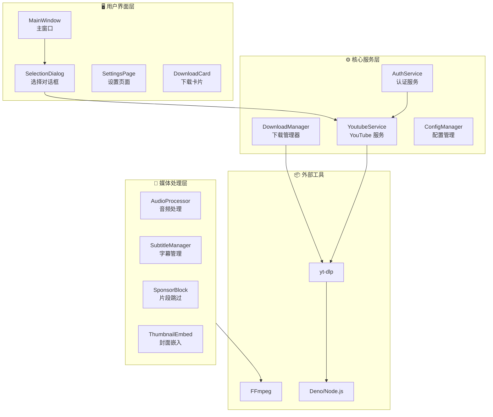
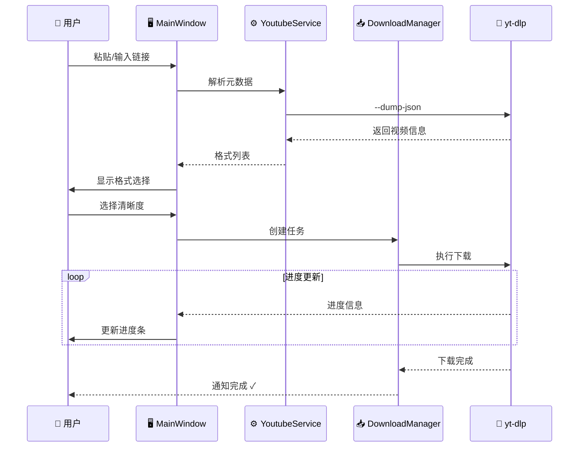
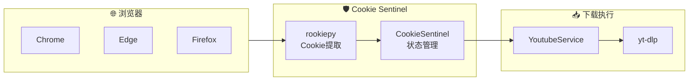

# FluentYTDL

<p align="center">
  
</p>

<p align="center">
  <strong>🎬 现代、流畅、轻量的 YouTube/视频下载器</strong>
</p>

<p align="center">
  <a href="https://www.python.org/"></a>
  <a href="LICENSE"></a>
  <a href="https://github.com/user/FluentYTDL/releases"></a>
  <a href="#"></a>
</p>

---

## ✨ 功能亮点

| 特性 | 描述 |
|------|------|
| 🎨 **Fluent Design** | 现代化 UI，支持深色/浅色模式（基于 QFluentWidgets） |
| 📋 **剪贴板监听** | 复制链接自动弹出下载，即刻开始 |
| 🎞️ **多格式支持** | 4K/8K 视频、纯音频、字幕下载 |
| 🔐 **Cookie 认证** | 自动提取浏览器 Cookie，解锁会员/年龄限制内容 |
| ⏭️ **SponsorBlock** | 自动跳过/移除赞助片段 |
| 🔄 **断点续传** | 网络中断后无缝继续下载 |
| 💾 **封面 & 元数据** | 自动嵌入封面、标题、作者等信息 |

---

## 🏗️ 系统架构



---

## 🔄 下载流程



---

## 🔐 Cookie 认证流程



---

## 🧩 核心模块

### YoutubeService
封装所有 yt-dlp 调用的核心服务，提供：
- 视频/播放列表元数据提取
- 反封锁机制（客户端模拟、UA 轮换）
- Cookie 身份验证集成

### DownloadManager
任务并发控制和生命周期管理：
- 并发下载数量限制
- 任务队列管理 (FIFO)
- Worker 线程池管理

### AuthService
统一的 Cookie 认证管理：
- 自动从浏览器提取 Cookie
- Windows UAC 提权支持
- Cookie 缓存与验证

### AudioProcessor
音频处理和后处理：
- 多格式预设 (MP3/AAC/FLAC/Opus)
- 封面嵌入
- 音量标准化

---

## 📦 技术栈

| 组件 | 技术 |
|------|------|
| **UI 框架** | PySide6 + QFluentWidgets |
| **下载核心** | yt-dlp (CLI 调用) |
| **媒体处理** | FFmpeg |
| **JS 运行时** | Deno / Node.js |
| **Cookie 提取** | rookiepy |
| **日志系统** | loguru |

---

## 📥 安装与下载

### 方式一：下载发行版（推荐）

前往 [**Releases**](https://github.com/user/FluentYTDL/releases) 页面下载最新版：
1. 下载 `FluentYTDL-vX.X.X-win64.zip`
2. 解压到任意目录
3. 运行 `FluentYTDL.exe`

### 方式二：从源码运行

```bash
# 克隆仓库
git clone https://github.com/user/FluentYTDL.git
cd FluentYTDL

# 安装依赖
pip install -e .

# 启动程序
python main.py
```

---

## 🚀 快速开始

1. **复制链接** - 复制 YouTube 视频或播放列表链接
2. **选择格式** - 在弹出对话框中选择清晰度/格式
3. **开始下载** - 点击下载，等待完成

> 💡 **提示**：启用剪贴板监听后，复制链接会自动弹出下载对话框

---

## ⚙️ 高级配置

### Cookie 认证
1. 在设置页面选择浏览器源（Chrome/Edge/Firefox）
2. 点击"刷新 Cookie"
3. 验证状态显示绿色后即可下载会员内容

### SponsorBlock
1. 在设置中启用 SponsorBlock
2. 选择要跳过的片段类型（赞助、片头、互动等）
3. 下载时自动移除广告片段

---

## 📁 项目结构

```
FluentYTDL/
├── main.py                 # 程序入口
├── src/fluentytdl/
│   ├── core/               # 核心服务
│   ├── download/           # 下载模块
│   ├── processing/         # 媒体处理
│   ├── ui/                 # 用户界面
│   └── utils/              # 工具函数
├── docs/                   # 文档
└── assets/                 # 资源文件
```

---

## 🤝 贡献

欢迎贡献代码！请查看 [CONTRIBUTING.md](CONTRIBUTING.md) 了解详情。

---

## 📄 开源协议

本项目采用 [MIT License](LICENSE) 开源。

---

<p align="center">
  <sub>Made with ❤️ using Python + PySide6</sub>
</p>
