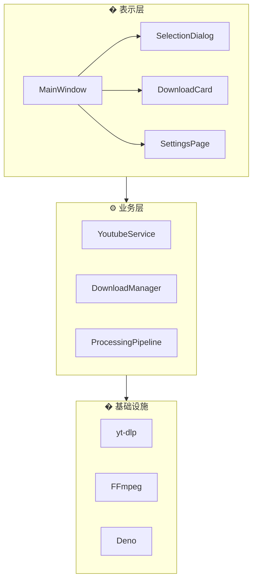

# FluentYTDL

<p align="center">
  
</p>

<p align="center">
  <strong>🎬 现代、流畅、轻量的 YouTube/视频下载器</strong>
</p>

<p align="center">
  <a href="https://www.python.org/"></a>
  <a href="LICENSE"></a>
  <a href="https://github.com/SakuraPuare/FluentYTDL/releases"></a>
  <a href="#"></a>
</p>

---

## ✨ 功能亮点

| 特性 | 描述 |
|------|------|
| 🎨 **Fluent Design** | 现代化 UI，支持深色/浅色模式（基于 QFluentWidgets） |
| 📋 **剪贴板监听** | 复制链接自动弹出下载，即刻开始 |
| 🎞️ **多格式支持** | 4K/8K 视频、纯音频、字幕下载 |
| 🔐 **Cookie 认证** | 自动提取浏览器 Cookie，解锁会员/年龄限制内容 |
| ⏭️ **SponsorBlock** | 自动跳过/移除赞助片段 |
| 🔄 **断点续传** | 网络中断后无缝继续下载 |
| 💾 **封面 & 元数据** | 自动嵌入封面、标题、作者等信息 |

---

## 📥 安装与下载

### 方式一：下载发行版（推荐）

前往 [**Releases**](https://github.com/SakuraPuare/FluentYTDL/releases) 页面下载最新版：

| 版本 | 说明 | 适用场景 |
|------|------|----------|
| `*-setup.exe` | Windows 安装包 | 推荐普通用户使用 |
| `*-full.7z` | 便携完整版 | 无需安装，解压即用 |
| `*-portable.exe` | 轻量便携版 | 单文件，需自备 yt-dlp/ffmpeg |

### 方式二：从源码运行

```bash
# 克隆仓库
git clone https://github.com/SakuraPuare/FluentYTDL.git
cd FluentYTDL

# 安装依赖
pip install -e .

# 启动程序
python main.py
```

---

## 🚀 快速开始

1. **复制链接** - 复制 YouTube 视频或播放列表链接
2. **选择格式** - 在弹出对话框中选择清晰度/格式
3. **开始下载** - 点击下载，等待完成

> 💡 **提示**：启用剪贴板监听后，复制链接会自动弹出下载对话框

---

## 🎯 格式选择

FluentYTDL 提供两种格式选择模式：

### 简易模式（推荐）

一键选择常用格式预设：

| 预设 | 说明 |
|------|------|
| 🎬 **最佳画质 (MP4)** | 自动选择最佳画质，封装为 MP4 格式 |
| 🎯 **最佳画质 (原盘)** | 保持原始格式，追求极致画质 |
| 📺 **2160p/1440p/1080p/720p/480p/360p** | 限制最大分辨率 |
| 🎵 **纯音频 (MP3)** | 仅下载音频，转码为 320k MP3 |

### 专业模式

精确选择视频流和音频流：

- **可组装模式** - 分别选择视频和音频流，自动合并
- **整合流模式** - 选择已封装的完整流
- **仅视频/仅音频** - 单独下载视频或音频

---

## ⚙️ 高级配置

### Cookie 认证

解锁会员内容和年龄限制视频：

1. 在设置页面选择浏览器源（Chrome/Edge/Firefox）
2. 点击"刷新 Cookie"
3. 验证状态显示绿色后即可下载会员内容

### SponsorBlock

自动跳过视频中的广告片段：

1. 在设置中启用 SponsorBlock
2. 选择要跳过的片段类型（赞助、片头、互动等）
3. 下载时自动移除广告片段

### 代理设置

支持多种代理模式：

- **系统代理** - 自动使用系统代理设置
- **自定义代理** - 手动设置 HTTP/SOCKS5 代理

---

## 🏗️ 技术架构

FluentYTDL 采用分层架构设计：



### 核心模块

| 模块 | 职责 |
|------|------|
| **YoutubeService** | 视频信息提取、反封锁策略、Cookie 认证 |
| **DownloadManager** | 任务队列管理、并发控制、Worker 线程池 |
| **ProcessingPipeline** | 后处理管线：SponsorBlock、封面嵌入、元数据 |
| **AuthService** | Cookie 提取、缓存、自动刷新 |
| **ConfigManager** | 配置持久化、热更新 |

> 📚 详细架构设计请参阅 [ARCHITECTURE.md](docs/ARCHITECTURE.md)

---

## 📦 技术栈

| 组件 | 技术 |
|------|------|
| **UI 框架** | PySide6 + QFluentWidgets |
| **下载核心** | yt-dlp (CLI 调用) |
| **媒体处理** | FFmpeg |
| **封面嵌入** | AtomicParsley / mutagen |
| **JS 运行时** | Deno / Node.js |
| **Cookie 提取** | rookiepy |
| **日志系统** | loguru |

---

## 📁 项目结构

```
FluentYTDL/
├── main.py                 # 程序入口
├── src/fluentytdl/
│   ├── core/               # 核心服务 (ConfigManager, AuthService)
│   ├── download/           # 下载模块 (DownloadManager, Workers)
│   ├── processing/         # 媒体处理 (SponsorBlock, ThumbnailEmbedder)
│   ├── ui/                 # 用户界面 (MainWindow, Pages, Dialogs)
│   ├── youtube/            # YouTube 服务封装
│   └── utils/              # 工具函数 (Logger, Paths)
├── docs/                   # 文档
│   └── ARCHITECTURE.md     # 架构设计文档
└── assets/                 # 资源文件
```

---

## 🤝 贡献

欢迎贡献代码！请查看 [CONTRIBUTING.md](CONTRIBUTING.md) 了解详情。

---

## 📄 开源协议

本项目采用 [MIT License](LICENSE) 开源。

---

<p align="center">
  <sub>Made with ❤️ using Python + PySide6</sub>
</p>
