# FluentYTDL 架构设计文档

> 一个现代、流畅的 YouTube/视频下载器的完整技术架构

---

## 📐 设计理念

### 核心原则

1. **分层解耦** - UI、业务逻辑、基础设施严格分离
2. **外部工具封装** - 所有外部依赖（yt-dlp/FFmpeg）通过服务层抽象
3. **配置驱动** - 行为由配置决定，支持热更新
4. **异步优先** - 耗时操作全部异步，不阻塞 UI

### 技术栈

| 层级 | 技术栈 |
|------|--------|
| UI 框架 | PySide6 + QFluentWidgets |
| 下载引擎 | yt-dlp (CLI) |
| 媒体处理 | FFmpeg |
| 封面嵌入 | AtomicParsley / mutagen |
| Cookie 提取 | rookiepy |
| JS 运行时 | Deno / Node.js |
| 日志系统 | loguru |

---

## 🏗️ 系统分层架构

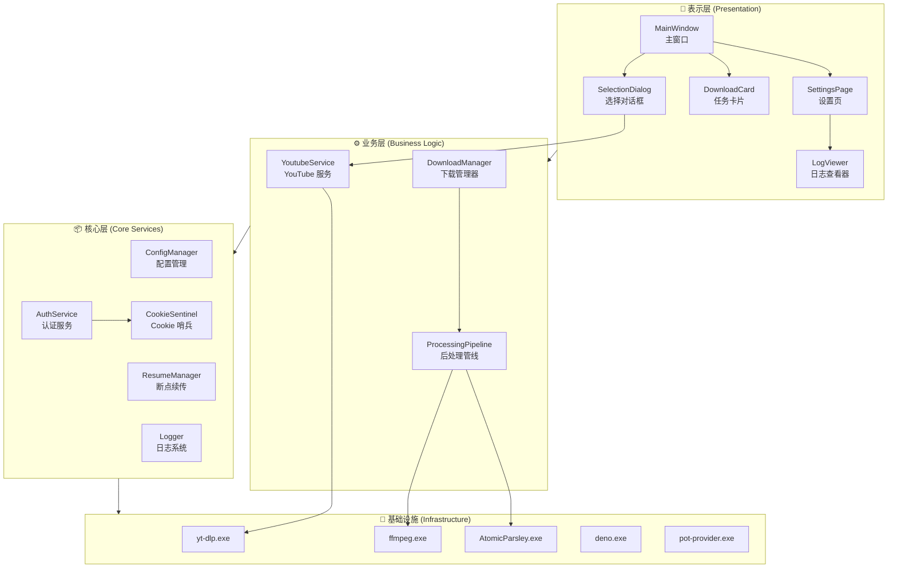
```mermaid
graph TB
    subgraph Presentation["🎨 表示层 (Presentation)"]
        MW[MainWindow<br/>主窗口]
        SP[SettingsPage<br/>设置页]
        SD[SelectionDialog<br/>选择对话框]
        DC[DownloadCard<br/>任务卡片]
        LV[LogViewer<br/>日志查看器]
    end
    
    subgraph Business["⚙️ 业务层 (Business Logic)"]
        YS[YoutubeService<br/>YouTube 服务]
        DM[DownloadManager<br/>下载管理器]
        PP[ProcessingPipeline<br/>后处理管线]
    end
    
    subgraph Core["📦 核心层 (Core Services)"]
        CM[ConfigManager<br/>配置管理]
        AS[AuthService<br/>认证服务]
        CS[CookieSentinel<br/>Cookie 哨兵]
        RM[ResumeManager<br/>断点续传]
        LG[Logger<br/>日志系统]
    end
    
    subgraph Infrastructure["🔧 基础设施 (Infrastructure)"]
        YTDLP[yt-dlp.exe]
        FF[ffmpeg.exe]
        AP[AtomicParsley.exe]
        DENO[deno.exe]
        POT[pot-provider.exe]
    end
    
    Presentation --> Business
    Business --> Core
    Core --> Infrastructure
    
    MW --> SP
    MW --> SD
    MW --> DC
    SP --> LV
    SD --> YS
    DM --> PP
    YS --> YTDLP
    PP --> FF
    PP --> AP
    AS --> CS
```

---

## 🧩 模块职责详解

### 1. 表示层 (Presentation)

#### MainWindow 主窗口
- 导航管理 (侧边栏)
- 全局状态显示 (Cookie 状态、任务统计)
- 剪贴板监听触发

#### SettingsPage 设置页
设置页包含 9 个功能组：

| 设置组 | 功能 |
|--------|------|
| 下载选项 | 默认保存路径 |
| 网络连接 | 代理模式、自定义代理 |
| 核心组件 | Cookie 认证、yt-dlp/FFmpeg/Deno 更新 |
| 高级 | PO Token、JS Runtime 路径 |
| 自动化 | 剪贴板自动识别 |
| 后处理 | 封面嵌入、元数据嵌入 |
| 行为策略 | 删除策略、播放列表加速 |
| 日志管理 | 查看/清理日志 |
| 关于 | 版本信息 |

#### SelectionDialog 选择对话框
- 格式/清晰度选择
- 播放列表批量选择
- 下载选项配置

---

### 2. 业务层 (Business Logic)

#### YoutubeService - YouTube 服务

**设计模式**: 单例 + 配置聚合 + 策略模式

YoutubeService 是与 yt-dlp 交互的核心封装层，提供统一的视频信息提取和下载接口。

---

##### 配置类体系

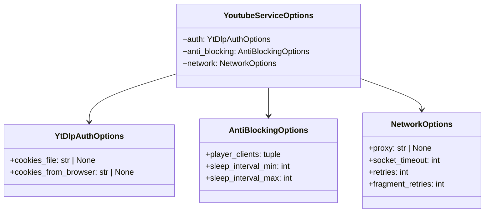
```mermaid
classDiagram
    class YoutubeServiceOptions {
        +auth: YtDlpAuthOptions
        +anti_blocking: AntiBlockingOptions
        +network: NetworkOptions
    }
    
    class YtDlpAuthOptions {
        +cookies_file: str | None
        +cookies_from_browser: str | None
    }
    
    class AntiBlockingOptions {
        +player_clients: tuple
        +sleep_interval_min: int
        +sleep_interval_max: int
    }
    
    class NetworkOptions {
        +proxy: str | None
        +socket_timeout: int
        +retries: int
        +fragment_retries: int
    }
    
    YoutubeServiceOptions --> YtDlpAuthOptions
    YoutubeServiceOptions --> AntiBlockingOptions
    YoutubeServiceOptions --> NetworkOptions
```

---

##### 选项构建流程

`build_ydl_options()` 是核心方法，将配置转换为 yt-dlp 可用的参数字典：

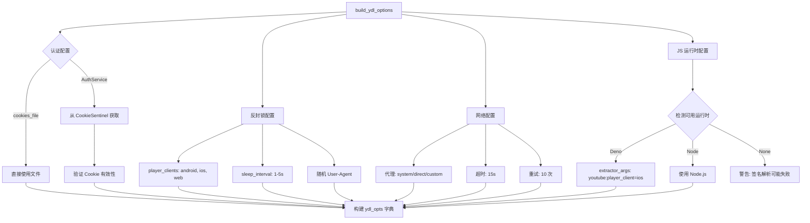
```mermaid
flowchart TD
    Start[build_ydl_options] --> Auth{认证配置}
    
    Auth -->|cookies_file| Direct[直接使用文件]
    Auth -->|AuthService| AS[从 CookieSentinel 获取]
    AS --> Validate[验证 Cookie 有效性]
    
    Start --> Anti[反封锁配置]
    Anti --> PC[player_clients: android, ios, web]
    Anti --> Sleep[sleep_interval: 1-5s]
    Anti --> UA[随机 User-Agent]
    
    Start --> Net[网络配置]
    Net --> Proxy[代理: system/direct/custom]
    Net --> Timeout[超时: 15s]
    Net --> Retry[重试: 10 次]
    
    Start --> JS[JS 运行时配置]
    JS --> Detect{检测可用运行时}
    Detect -->|Deno| UseDeno[extractor_args: youtube:player_client=ios]
    Detect -->|Node| UseNode[使用 Node.js]
    Detect -->|None| Warn[警告: 签名解析可能失败]
    
    Direct --> Build[构建 ydl_opts 字典]
    Validate --> Build
    PC --> Build
    Sleep --> Build
    UA --> Build
    Proxy --> Build
    Timeout --> Build
    Retry --> Build
    UseDeno --> Build
    UseNode --> Build
```

---

##### 元数据提取方法

| 方法 | 用途 | 特点 |
|------|------|------|
| `extract_info_sync()` | 完整提取 | 阻塞调用，用于 Worker 线程 |
| `extract_info_for_dialog_sync()` | UI 对话框 | 单视频保留 formats，播放列表快速枚举 |
| `extract_playlist_flat()` | 播放列表快速提取 | 不提取每个视频的格式信息 |
| `extract_info()` | 异步提取 | 安全用于 UI 线程 |

**设计决策**：分离同步和异步方法，Worker 线程使用 `_sync` 方法直接阻塞，UI 线程使用 `async` 方法避免卡顿。

---

##### 解析策略：单视频 vs 播放列表

应用采用智能的解析策略，针对不同场景优化性能和用户体验：

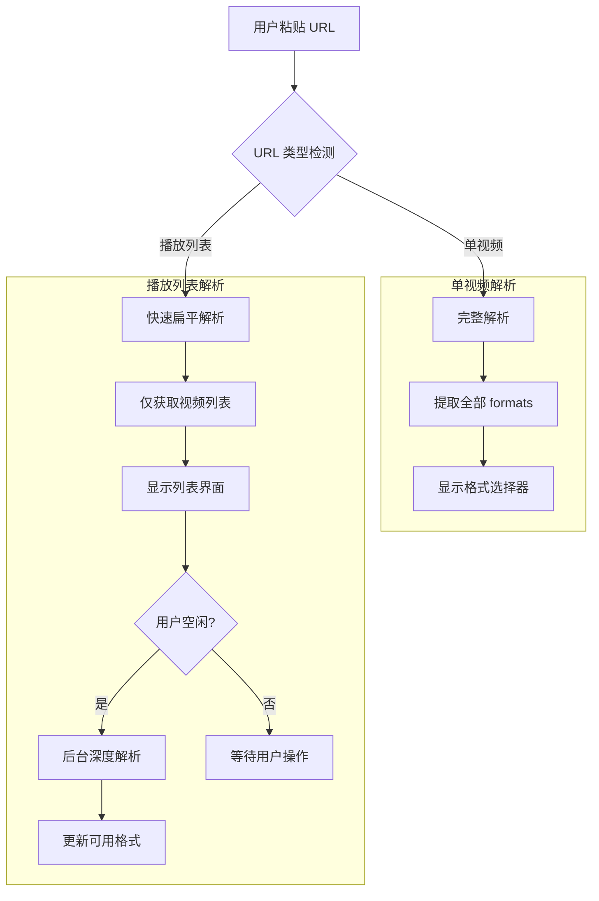
```mermaid
flowchart TD
    Start["用户粘贴 URL"] --> Detect{"URL 类型检测"}
    
    Detect -->|单视频| Single["完整解析"]
    Detect -->|播放列表| Flat["快速扁平解析"]
    
    subgraph SingleFlow["单视频解析"]
        Single --> Formats["提取全部 formats"]
        Formats --> UI1["显示格式选择器"]
    end
    
    subgraph PlaylistFlow["播放列表解析"]
        Flat --> List["仅获取视频列表"]
        List --> UI2["显示列表界面"]
        UI2 --> Idle{"用户空闲?"}
        Idle -->|是| Deep["后台深度解析"]
        Idle -->|否| Wait["等待用户操作"]
        Deep --> Update["更新可用格式"]
    end
```

**设计原理**：

| 场景 | 策略 | 原因 |
|------|------|------|
| **单视频** | 完整解析 (`extract_info_sync`) | 用户需要选择格式，必须获取完整 formats |
| **播放列表初始** | 快速扁平解析 (`extract_playlist_flat`) | 100 个视频完整解析需 ~5 分钟，不可接受 |
| **播放列表详情** | 延迟逐项解析 (`EntryDetailWorker`) | 用户浏览时后台逐个补全格式信息 |

---

##### 格式选择器：简易模式 vs 专业模式

格式选择器 (`VideoFormatSelectorWidget`) 支持两种模式，通过 `SegmentedWidget` 切换：

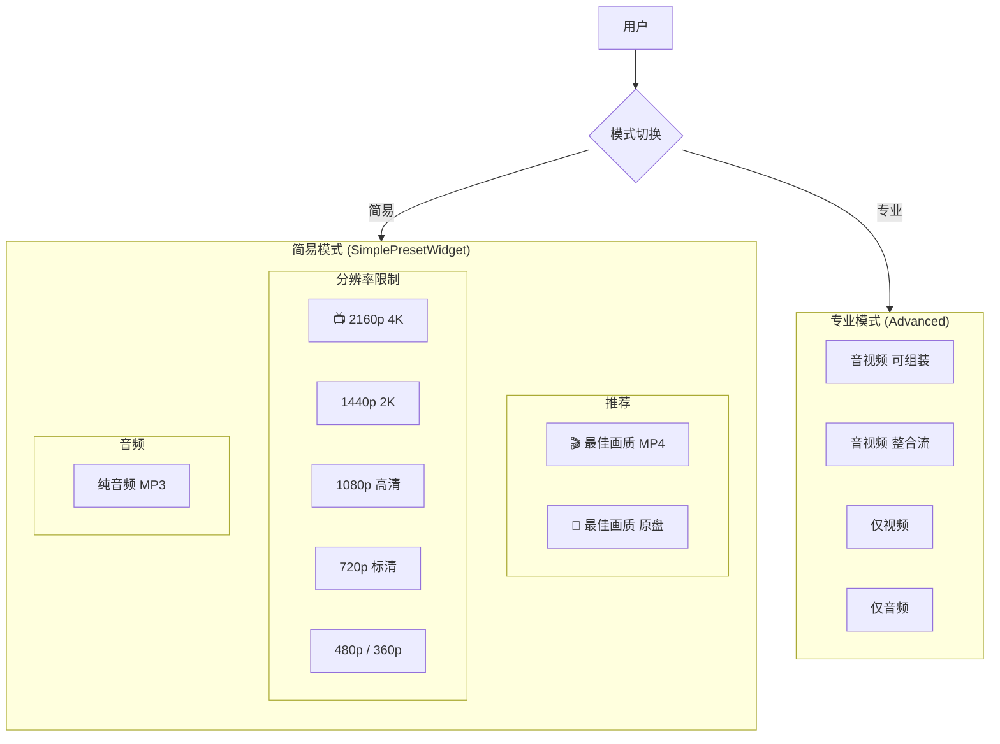
```mermaid
flowchart TB
    subgraph Simple["简易模式 (SimplePresetWidget)"]
        direction TB
        subgraph Recommend["推荐"]
            P1[🎬 最佳画质 MP4]
            P2[🎯 最佳画质 原盘]
        end
        subgraph Resolution["分辨率限制"]
            P3[📺 2160p 4K]
            P4["1440p 2K"]
            P5["1080p 高清"]
            P6["720p 标清"]
            P7["480p / 360p"]
        end
        subgraph Audio["音频"]
            P8["纯音频 MP3"]
        end
    end
    
    subgraph Advanced["专业模式 (Advanced)"]
        M1["音视频 可组装"]
        M2["音视频 整合流"]
        M3["仅视频"]
        M4["仅音频"]
    end
    
    User["用户"] --> Toggle{"模式切换"}
    Toggle -->|简易| Simple
    Toggle -->|专业| Advanced
```

**简易模式预设**：

| 预设 ID | 名称 | yt-dlp format 字符串 | 额外参数 |
|---------|------|---------------------|----------|
| `best_mp4` | 🎬 最佳画质 (MP4) | `bv*[ext=mp4]+ba[ext=m4a]/b[ext=mp4] / bv*+ba/b` | `merge_output_format: mp4` |
| `best_raw` | 🎯 最佳画质 (原盘) | `bestvideo+bestaudio/best` | - |
| `2160p` | 📺 2160p 4K (MP4) | `bv*[height<=2160][ext=mp4]+ba[ext=m4a]/...` | `merge_output_format: mp4` |
| `1440p` | 📺 1440p 2K (MP4) | `bv*[height<=1440][ext=mp4]+ba[ext=m4a]/...` | `merge_output_format: mp4` |
| `1080p` | 📺 1080p 高清 (MP4) | `bv*[height<=1080][ext=mp4]+ba[ext=m4a]/...` | `merge_output_format: mp4` |
| `720p` | 📺 720p 标清 (MP4) | `bv*[height<=720][ext=mp4]+ba[ext=m4a]/...` | `merge_output_format: mp4` |
| `480p` | 📺 480p (MP4) | `bv*[height<=480][ext=mp4]+ba[ext=m4a]/...` | `merge_output_format: mp4` |
| `360p` | 📺 360p (MP4) | `bv*[height<=360][ext=mp4]+ba[ext=m4a]/...` | `merge_output_format: mp4` |
| `audio_mp3` | 🎵 纯音频 (MP3) | `bestaudio/best` | `extract_audio: true, audio_format: mp3` |

**专业模式**：

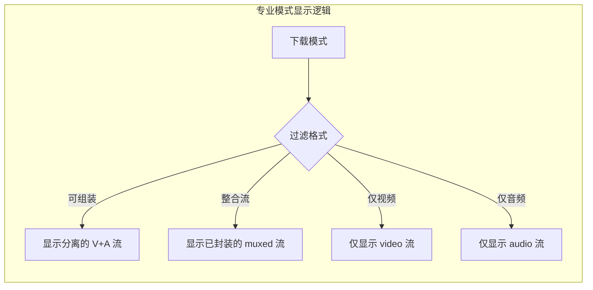
```mermaid
flowchart LR
    subgraph Display["专业模式显示逻辑"]
        Mode["下载模式"] --> Filter{"过滤格式"}
        
        Filter -->|可组装| ShowVA["显示分离的 V+A 流"]
        Filter -->|整合流| ShowMuxed["显示已封装的 muxed 流"]
        Filter -->|仅视频| ShowV["仅显示 video 流"]
        Filter -->|仅音频| ShowA["仅显示 audio 流"]
    end
```

**格式组装逻辑**：

```python
# 专业模式：用户选择视频流 + 音频流
if video_id and audio_id:
    format_str = f"{video_id}+{audio_id}"
    # 智能选择封装容器
    if vext == "webm" and aext == "webm":
        container = "webm"
    elif vext in {"mp4", "m4v"} and aext in {"m4a", "aac"}:
        container = "mp4"
    else:
        container = "mkv"  # 万能容器
```

---

##### 播放列表批量选择

播放列表界面提供批量操作和预设套用：

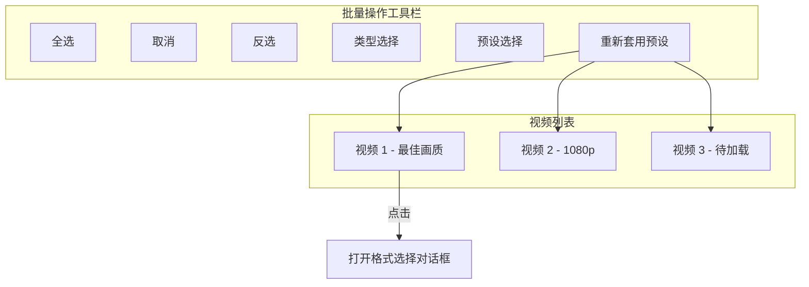
```mermaid
flowchart TB
    subgraph Toolbar["批量操作工具栏"]
        SelectAll["全选"]
        Unselect["取消"]
        Invert["反选"]
        Type["类型选择"]
        Preset["预设选择"]
        Apply["重新套用预设"]
    end
    
    subgraph List["视频列表"]
        Row1["视频 1 - 最佳画质"]
        Row2["视频 2 - 1080p"]
        Row3["视频 3 - 待加载"]
    end
    
    Apply --> Row1
    Apply --> Row2
    Apply --> Row3
    
    Row1 -->|点击| Quality["打开格式选择对话框"]
```

**预设列表**：

| 索引 | 预设名称 | 说明 |
|------|----------|------|
| 0 | 最高质量(自动) | `bestvideo+bestaudio` |
| 1 | 2160p(严格) | 限制最大高度 2160 |
| 2 | 1440p(严格) | 限制最大高度 1440 |
| 3 | 1080p(严格) | 限制最大高度 1080 |
| 4 | 720p(严格) | 限制最大高度 720 |
| 5 | 480p(严格) | 限制最大高度 480 |
| 6 | 360p(严格) | 限制最大高度 360 |

---

##### 延迟深度解析 (EntryDetailWorker)

播放列表采用"先显示后补全"策略，用户空闲时后台逐项深度解析：

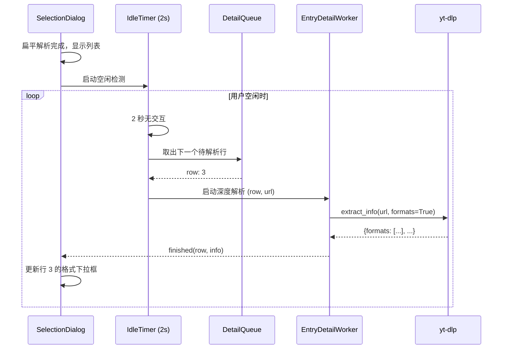
```mermaid
sequenceDiagram
    participant UI as SelectionDialog
    participant Timer as IdleTimer (2s)
    participant Queue as DetailQueue
    participant Worker as EntryDetailWorker
    participant YT as yt-dlp
    
    UI->>UI: 扁平解析完成，显示列表
    UI->>Timer: 启动空闲检测
    
    loop 用户空闲时
        Timer->>Timer: 2 秒无交互
        Timer->>Queue: 取出下一个待解析行
        Queue-->>Timer: row: 3
        
        Timer->>Worker: 启动深度解析 (row, url)
        Worker->>YT: extract_info(url, formats=True)
        YT-->>Worker: {formats: [...], ...}
        Worker-->>UI: finished(row, info)
        
        UI->>UI: 更新行 3 的格式下拉框
    end
```

**空闲检测逻辑**：

```python
# 每次用户交互时更新时间戳
def _record_interaction(self):
    self._last_interaction = time.monotonic()

# 定时器每 2 秒检查一次
def _on_idle_tick(self):
    if time.monotonic() - self._last_interaction > 2.0:
        self._fetch_next_detail()
```

**设计优势**：
1. **快速响应**：播放列表立即显示，无需等待所有视频解析
2. **节省资源**：只在用户空闲时解析，不阻塞 UI
3. **按需加载**：用户点击某行时优先解析该行


---

##### JS 运行时配置 (YouTube 签名解析)

YouTube 使用混淆的 JavaScript 生成视频签名，需要外部 JS 运行时解析：

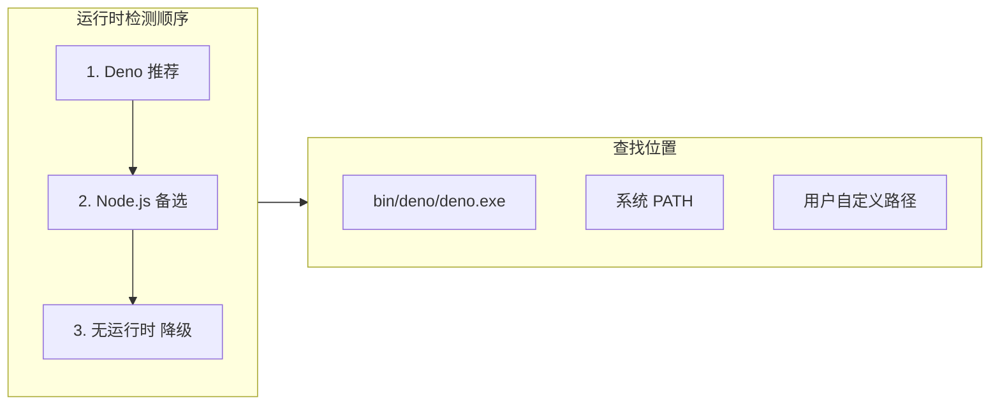
```mermaid
flowchart LR
    subgraph Detection["运行时检测顺序"]
        D1["1. Deno 推荐"] --> D2["2. Node.js 备选"]
        D2 --> D3["3. 无运行时 降级"]
    end
    
    subgraph Locations["查找位置"]
        L1["bin/deno/deno.exe"]
        L2["系统 PATH"]
        L3["用户自定义路径"]
    end
    
    Detection --> Locations
```

**配置方式**：
- 自动检测 `bin/deno/` 目录
- 配置项 `extractor_args = "youtube:player_client=ios,android"`
- 使用移动端客户端模拟可绕过部分限制

---

#### DownloadManager / TaskQueue - 下载管理器

**设计模式**: 生产者-消费者 + 观察者模式

下载系统由三个组件协作：

| 组件 | 职责 |
|------|------|
| **TaskQueue** | 任务持久化、状态管理、重试逻辑 |
| **DownloadManager** | 并发控制、Worker 调度、信号广播 |
| **DownloadWorker** | 执行实际下载、进度解析、后处理 |

---

##### 任务状态模型

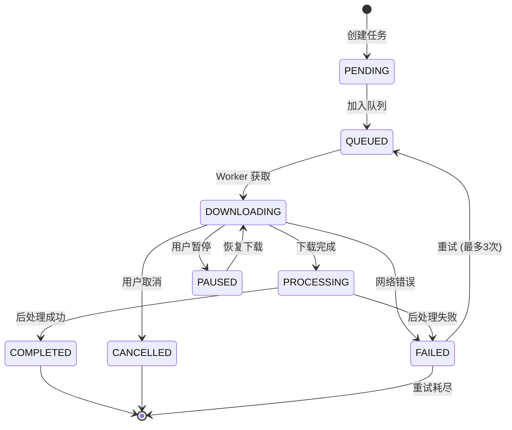
```mermaid
stateDiagram-v2
    [*] --> PENDING: 创建任务
    
    PENDING --> QUEUED: 加入队列
    QUEUED --> DOWNLOADING: Worker 获取
    
    DOWNLOADING --> PROCESSING: 下载完成
    DOWNLOADING --> PAUSED: 用户暂停
    DOWNLOADING --> FAILED: 网络错误
    DOWNLOADING --> CANCELLED: 用户取消
    
    PAUSED --> DOWNLOADING: 恢复下载
    
    PROCESSING --> COMPLETED: 后处理成功
    PROCESSING --> FAILED: 后处理失败
    
    FAILED --> QUEUED: 重试 (最多3次)
    
    COMPLETED --> [*]
    CANCELLED --> [*]
    FAILED --> [*]: 重试耗尽
```

**TaskStatus 枚举**:
```python
class TaskStatus(Enum):
    PENDING = "pending"       # 待处理
    QUEUED = "queued"         # 已入队
    DOWNLOADING = "downloading" # 下载中
    PAUSED = "paused"         # 已暂停
    COMPLETED = "completed"   # 已完成
    FAILED = "failed"         # 失败
    CANCELLED = "cancelled"   # 已取消
```

---

##### 任务持久化

任务队列自动持久化到 JSON 文件，支持程序重启后恢复：

```json
{
  "tasks": [
    {
      "id": "a1b2c3d4",
      "url": "https://youtube.com/watch?v=xxx",
      "output_dir": "D:/Downloads",
      "status": "downloading",
      "progress": 45.5,
      "retry_count": 0,
      "created_at": "2026-02-02T15:00:00",
      "options": { "format": "bestvideo+bestaudio" }
    }
  ]
}
```

---

##### Worker 线程内部流程

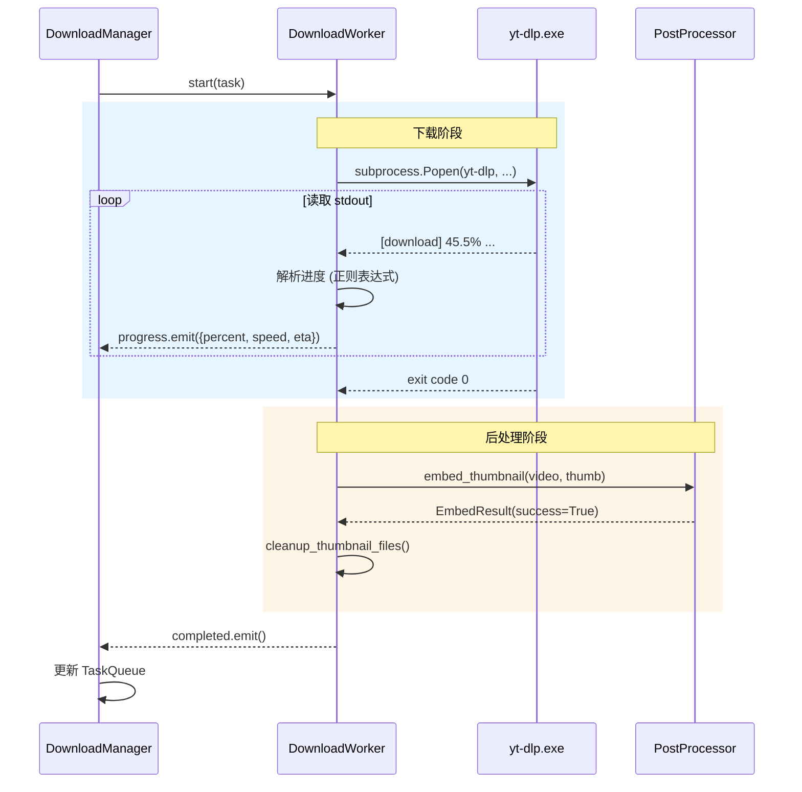
```mermaid
sequenceDiagram
    participant DM as DownloadManager
    participant W as DownloadWorker
    participant YT as yt-dlp.exe
    participant PP as PostProcessor
    
    DM->>W: start(task)
    
    rect rgb(230, 245, 255)
        Note over W,YT: 下载阶段
        W->>YT: subprocess.Popen(yt-dlp, ...)
        
        loop 读取 stdout
            YT-->>W: [download] 45.5% ...
            W->>W: 解析进度 (正则表达式)
            W-->>DM: progress.emit({percent, speed, eta})
        end
        
        YT-->>W: exit code 0
    end
    
    rect rgb(255, 245, 230)
        Note over W,PP: 后处理阶段
        W->>PP: embed_thumbnail(video, thumb)
        PP-->>W: EmbedResult(success=True)
        
        W->>W: cleanup_thumbnail_files()
    end
    
    W-->>DM: completed.emit()
    DM->>DM: 更新 TaskQueue
```

---

##### 进度解析正则

Worker 解析 yt-dlp 输出的正则表达式：

```python
# 解析 [download] 45.5% of 123.45MiB at 5.67MiB/s ETA 00:15
PROGRESS_PATTERN = re.compile(
    r'\[download\]\s+(\d+\.?\d*)%\s+of\s+~?(\d+\.?\d*)(Ki|Mi|Gi)?B'
    r'(?:\s+at\s+(\d+\.?\d*)(Ki|Mi|Gi)?B/s)?'
    r'(?:\s+ETA\s+(\d+:\d+))?'
)
```

---

#### ProcessingPipeline - 后处理管线

**设计模式**: 责任链模式

下载完成后，视频/音频文件经过一系列后处理步骤：

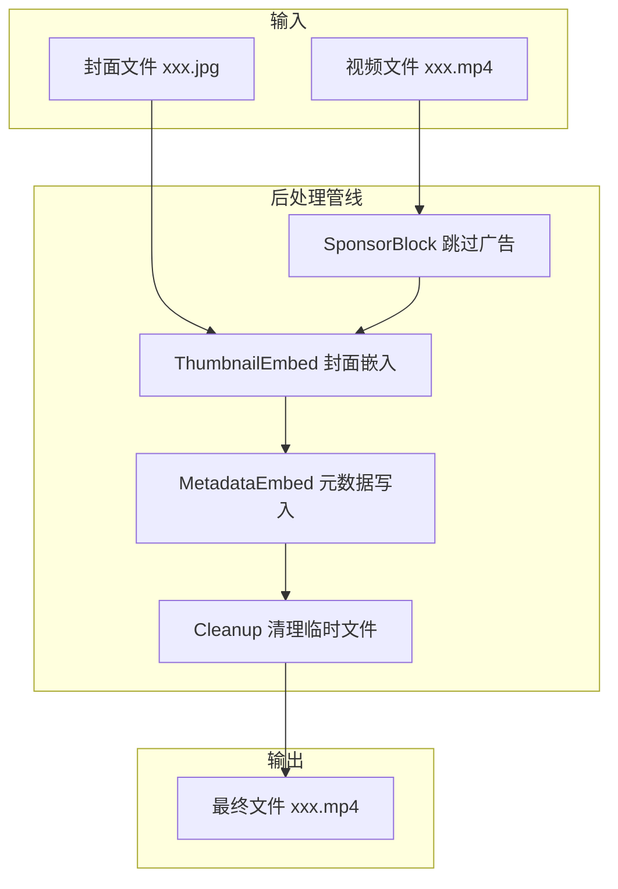
```mermaid
flowchart TB
    subgraph Input["输入"]
        VF["视频文件 xxx.mp4"]
        TF["封面文件 xxx.jpg"]
    end
    
    subgraph Pipeline["后处理管线"]
        SB["SponsorBlock 跳过广告"]
        TE["ThumbnailEmbed 封面嵌入"]
        ME["MetadataEmbed 元数据写入"]
        CL["Cleanup 清理临时文件"]
    end
    
    subgraph Output["输出"]
        OF["最终文件 xxx.mp4"]
    end
    
    VF --> SB
    TF --> TE
    SB --> TE
    TE --> ME
    ME --> CL
    CL --> OF
```

---

##### SponsorBlock 集成

SponsorBlock 是社区驱动的广告跳过数据库，支持以下片段类型：

| 类别 ID | 名称 | 描述 |
|---------|------|------|
| `sponsor` | 赞助广告 | 跳过赞助商推广 |
| `selfpromo` | 自我推广 | 跳过频道推广 |
| `interaction` | 互动提醒 | 跳过"点赞订阅"提醒 |
| `intro` | 片头 | 跳过视频片头动画 |
| `outro` | 片尾 | 跳过视频片尾 |
| `preview` | 预览 | 跳过"回顾"片段 |
| `filler` | 填充内容 | 跳过无关内容 |
| `music_offtopic` | 非音乐内容 | 跳过音乐视频中的非音乐部分 |

**处理模式**：
- `remove` - 从视频中切除片段（需要重新编码）
- `mark` - 标记为章节（保留原视频）

yt-dlp 参数：
```python
ydl_opts["sponsorblock_remove"] = ["sponsor", "selfpromo", "interaction"]
```

---

##### ThumbnailEmbedder - 封面嵌入器

封面嵌入器支持三种工具，根据文件格式自动选择最佳方案：

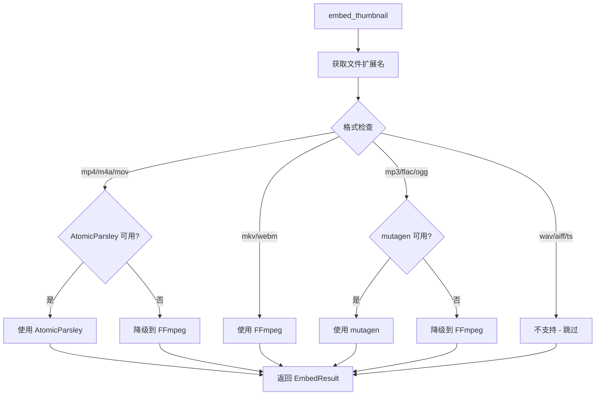
```mermaid
flowchart TD
    Start[embed_thumbnail] --> GetExt[获取文件扩展名]
    
    GetExt --> Check{格式检查}
    
    Check -->|mp4/m4a/mov| AP{AtomicParsley 可用?}
    AP -->|是| UseAP[使用 AtomicParsley]
    AP -->|否| FallbackFF1[降级到 FFmpeg]
    
    Check -->|mkv/webm| UseFF[使用 FFmpeg]
    
    Check -->|mp3/flac/ogg| MG{mutagen 可用?}
    MG -->|是| UseMG[使用 mutagen]
    MG -->|否| FallbackFF2[降级到 FFmpeg]
    
    Check -->|wav/aiff/ts| Skip[不支持 - 跳过]
    
    UseAP --> Result[返回 EmbedResult]
    FallbackFF1 --> Result
    UseFF --> Result
    UseMG --> Result
    FallbackFF2 --> Result
    Skip --> Result
```

**工具对比**：

| 工具 | 支持格式 | 优点 | 缺点 |
|------|----------|------|------|
| **AtomicParsley** | MP4/M4A/MOV | 专业、可靠、保留元数据 | 需单独安装 |
| **FFmpeg** | MKV/WebM/大多数 | 通用性强 | MP4 嵌入质量一般 |
| **mutagen** | MP3/FLAC/OGG | 纯 Python，无需外部工具 | 仅支持音频 |

**封面嵌入代码示例**:
```python
# AtomicParsley 命令
subprocess.run([
    "AtomicParsley.exe",
    "video.mp4",
    "--artwork", "cover.jpg",
    "--overWrite"
])

# FFmpeg 命令 (MKV)
subprocess.run([
    "ffmpeg.exe",
    "-i", "video.mkv",
    "-attach", "cover.jpg",
    "-metadata:s:t", "mimetype=image/jpeg",
    "-c", "copy",
    "output.mkv"
])

# mutagen (MP3)
from mutagen.id3 import ID3, APIC
audio = MP3("audio.mp3")
audio.tags.add(APIC(type=3, mime="image/jpeg", data=thumbnail_data))
audio.save()
```


---

### 3. 核心层 (Core Services)

#### ConfigManager - 配置管理
**设计模式**: 单例 + 观察者

```python
# 主要配置项
download_dir          # 下载目录
max_concurrent        # 最大并发数
embed_thumbnail       # 嵌入封面
embed_metadata        # 嵌入元数据
sponsorblock_enabled  # SponsorBlock 开关
proxy_mode            # 代理模式
cookie_mode           # Cookie 模式
...
```

#### AuthService / CookieSentinel - 认证系统

**设计模式**: 策略模式 + 单例 + 延迟清理

Cookie 认证系统是解锁会员内容、年龄限制视频的核心。由两个核心组件协作：

| 组件 | 职责 |
|------|------|
| **AuthService** | Cookie 来源管理、从浏览器提取、验证有效性 |
| **CookieSentinel** | 统一的 `bin/cookies.txt` 生命周期管理 |

---

##### 为什么需要两层架构？

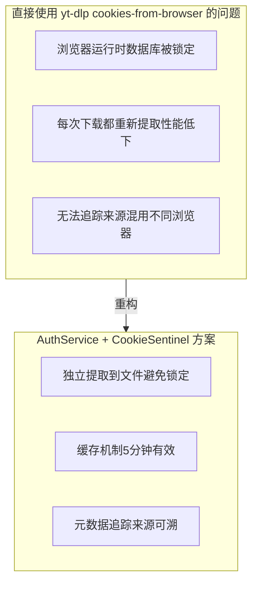
```mermaid
flowchart TB
    subgraph Problem["直接使用 yt-dlp cookies-from-browser 的问题"]
        P1["浏览器运行时数据库被锁定"]
        P2["每次下载都重新提取性能低下"]
        P3["无法追踪来源混用不同浏览器"]
    end
    
    subgraph Solution["AuthService + CookieSentinel 方案"]
        S1["独立提取到文件避免锁定"]
        S2["缓存机制5分钟有效"]
        S3["元数据追踪来源可溯"]
    end
    
    Problem -->|重构| Solution
```

---

##### Cookie 提取流程

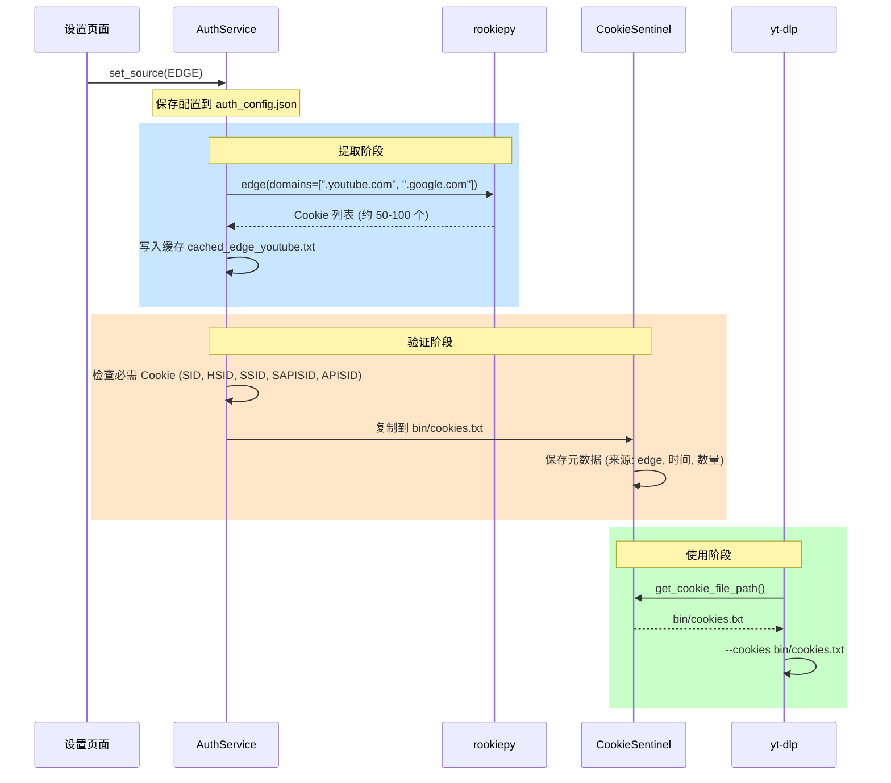
```mermaid
sequenceDiagram
    participant UI as 设置页面
    participant AS as AuthService
    participant RP as rookiepy
    participant CS as CookieSentinel
    participant YT as yt-dlp
    
    UI->>AS: set_source(EDGE)
    Note over AS: 保存配置到 auth_config.json
    
    rect rgb(200, 230, 255)
        Note over AS,RP: 提取阶段
        AS->>RP: edge(domains=[".youtube.com", ".google.com"])
        RP-->>AS: Cookie 列表 (约 50-100 个)
        AS->>AS: 写入缓存 cached_edge_youtube.txt
    end
    
    rect rgb(255, 230, 200)
        Note over AS,CS: 验证阶段
        AS->>AS: 检查必需 Cookie (SID, HSID, SSID, SAPISID, APISID)
        AS->>CS: 复制到 bin/cookies.txt
        CS->>CS: 保存元数据 (来源: edge, 时间, 数量)
    end
    
    rect rgb(200, 255, 200)
        Note over CS,YT: 使用阶段
        YT->>CS: get_cookie_file_path()
        CS-->>YT: bin/cookies.txt
        YT->>YT: --cookies bin/cookies.txt
    end
```

---

##### 支持的浏览器

| 浏览器 | 类型 | 权限需求 | 说明 |
|--------|------|----------|------|
| **Edge** | Chromium | 管理员 (v130+) | 推荐，Windows 默认安装 |
| **Chrome** | Chromium | 管理员 (v130+) | App-Bound 加密需要提权 |
| **Chromium** | Chromium | 管理员 (v130+) | 开源版 |
| **Brave** | Chromium | 管理员 (v130+) | 隐私浏览器 |
| **Opera** | Chromium | 管理员 (v130+) | - |
| **Opera GX** | Chromium | 管理员 (v130+) | 游戏版 |
| **Vivaldi** | Chromium | 管理员 (v130+) | 高度可定制 |
| **Arc** | Chromium | 管理员 (v130+) | 新一代浏览器 |
| **Firefox** | Gecko | 无需特权 ✅ | SQLite 直读 |
| **LibreWolf** | Gecko | 无需特权 ✅ | Firefox 隐私分支 |
| **手动文件** | - | 无 | 用户提供 cookies.txt |

> **💡 设计决策**：Chromium v130+ 引入了 App-Bound 加密，Cookie 只能在管理员权限下解密。
> 我们检测此错误后提示用户以管理员身份重启程序，而非每次都请求 UAC。

---

##### Windows UAC 提权策略

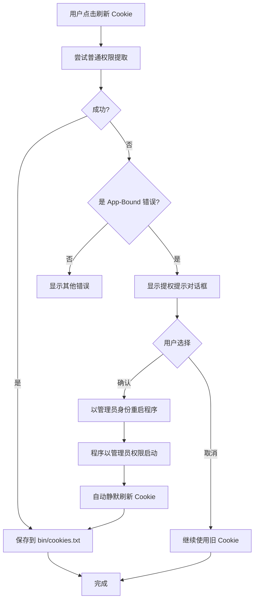
```mermaid
flowchart TD
    Start[用户点击刷新 Cookie] --> Try[尝试普通权限提取]
    Try --> Success{成功?}
    
    Success -->|是| Save[保存到 bin/cookies.txt]
    Success -->|否| IsAppBound{是 App-Bound 错误?}
    
    IsAppBound -->|是| ShowPrompt[显示提权提示对话框]
    IsAppBound -->|否| ShowError[显示其他错误]
    
    ShowPrompt --> UserChoice{用户选择}
    UserChoice -->|确认| Restart[以管理员身份重启程序]
    UserChoice -->|取消| UseOld[继续使用旧 Cookie]
    
    Restart --> AdminStart[程序以管理员权限启动]
    AdminStart --> AutoRefresh[自动静默刷新 Cookie]
    AutoRefresh --> Save
    
    Save --> Done[完成]
    UseOld --> Done
```

**核心代码逻辑** (`auth_service.py`):

```python
def _extract_and_cache(self, browser: str, ...):
    try:
        cookies = rookiepy.edge(domains)  # 首次尝试
    except Exception as e:
        if _is_appbound_error(e):
            # 检测到 App-Bound 加密，需要管理员权限
            raise PermissionError(
                f"{browser} v130+ 使用了 App-Bound 加密。\n"
                "需要以管理员身份重新启动程序才能提取 Cookie。"
            )
```

---

##### Cookie 生命周期管理 (CookieSentinel)

CookieSentinel 是 Cookie 的"守护者"，确保整个应用只使用一个统一的文件：

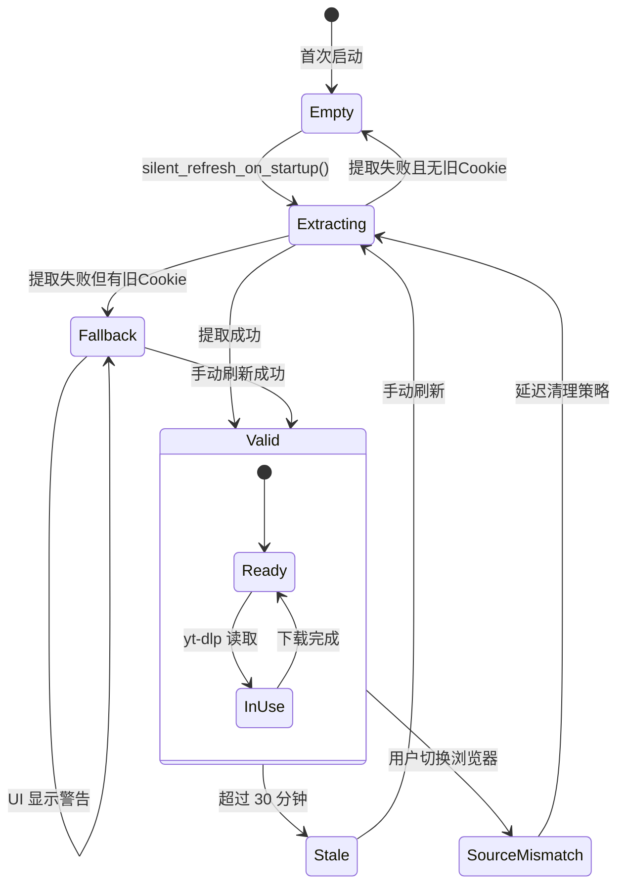
```mermaid
stateDiagram-v2
    [*] --> Empty: 首次启动
    
    Empty --> Extracting: silent_refresh_on_startup()
    
    Extracting --> Valid: 提取成功
    Extracting --> Fallback: 提取失败但有旧Cookie
    Extracting --> Empty: 提取失败且无旧Cookie
    
    Valid --> Stale: 超过 30 分钟
    Stale --> Extracting: 手动刷新
    
    Valid --> SourceMismatch: 用户切换浏览器
    SourceMismatch --> Extracting: 延迟清理策略
    
    Fallback --> Valid: 手动刷新成功
    Fallback --> Fallback: UI 显示警告
    
    state Valid {
        [*] --> Ready
        Ready --> InUse: yt-dlp 读取
        InUse --> Ready: 下载完成
    }
```

**关键设计决策**:

1. **延迟清理策略**
   - 切换浏览器时**不立即删除**旧 Cookie
   - 只有新提取**成功后**才覆盖旧文件
   - 避免提取失败时丢失可用的旧 Cookie

2. **来源追踪**
   - 每次提取时保存 `.meta` 元数据文件
   - 记录：来源浏览器、提取时间、Cookie 数量
   - 检测来源不匹配时显示警告

3. **回退机制**
   - 提取失败时检测是否有旧 Cookie 可用
   - 设置 `_using_fallback = True` 标记
   - UI 显示黄色警告："配置为 Edge，但当前使用 Firefox 的 Cookie"

---

##### Cookie 验证逻辑

YouTube 登录需要 5 个关键 Cookie：

```python
YOUTUBE_REQUIRED_COOKIES = {"SID", "HSID", "SSID", "SAPISID", "APISID"}
```

验证流程：
1. 解析 Netscape 格式文件
2. 检查是否包含所有必需 Cookie
3. 返回状态：`{ valid: bool, message: str, cookie_count: int }`

```python
def _validate_cookies(self, cookies: list[dict], platform: str):
    found = {c.get("name", "") for c in cookies}
    missing = YOUTUBE_REQUIRED_COOKIES - found
    
    if missing:
        return {"valid": False, "message": f"缺少: {', '.join(missing)}"}
    return {"valid": True, "message": "已验证 (检测到 YouTube 登录)"}
```

---

##### 错误检测与自动修复

当 yt-dlp 返回错误时，CookieSentinel 自动检测是否为 Cookie 问题：

```python
COOKIE_ERROR_KEYWORDS = [
    "sign in to confirm your age",      # 年龄限制
    "sign in to confirm you're not a bot",  # 机器人检测
    "http error 403",                    # 禁止访问
    "forbidden",
    "private video",                     # 私有视频
    "members-only",                      # 会员专属
    "requires authentication",
]
```

检测到 Cookie 问题后：
1. 标记任务失败原因为 "Cookie 失效"
2. 在 UI 中显示"点击此处刷新 Cookie"按钮
3. 用户点击后触发 `force_refresh_with_uac()`

---

##### 配置持久化

Cookie 配置存储在 `%TEMP%/fluentytdl_auth/auth_config.json`：

```json
{
  "version": 2,
  "source": "edge",
  "file_path": null,
  "auto_refresh": true,
  "updated_at": "2026-02-02T15:00:00"
}
```

---

#### Logger - 日志系统

**技术**: loguru + Qt Signal 实时转发

日志系统采用 loguru 库，提供三种输出目标和完整的异常捕获能力。

---

##### 日志架构

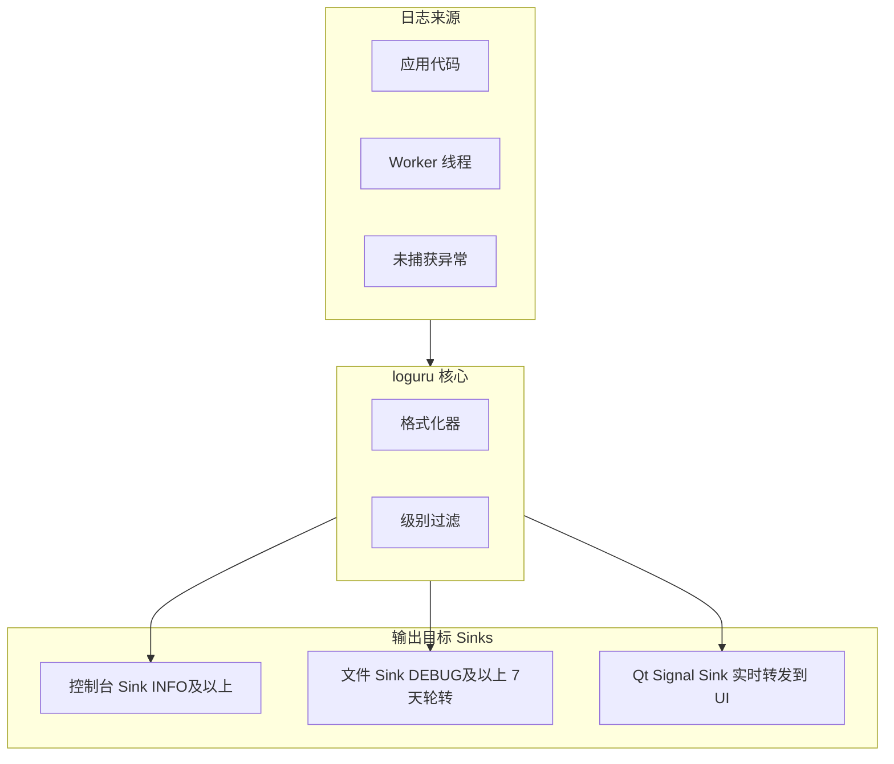
```mermaid
flowchart TD
    subgraph Sources["日志来源"]
        App["应用代码"]
        Worker["Worker 线程"]
        Exception["未捕获异常"]
    end
    
    subgraph Loguru["loguru 核心"]
        Format["格式化器"]
        Filter["级别过滤"]
    end
    
    subgraph Sinks["输出目标 Sinks"]
        Console["控制台 Sink INFO及以上"]
        File["文件 Sink DEBUG及以上 7天轮转"]
        Signal["Qt Signal Sink 实时转发到 UI"]
    end
    
    Sources --> Loguru
    Loguru --> Console
    Loguru --> File
    Loguru --> Signal
```

---

##### 日志存储路径

| 环境 | 路径 |
|------|------|
| **开发环境** | `<项目根>/logs/` |
| **打包后 (frozen)** | `Documents/FluentYTDL/logs/` |
| **降级 (无写权限)** | `%TEMP%/FluentYTDL_logs/` |

**路径选择逻辑**:
```python
if getattr(sys, "frozen", False):
    # 打包后: 用户文档目录 (可写)
    LOG_DIR = os.path.join(os.path.expanduser("~"), "Documents", "FluentYTDL", "logs")
else:
    # 开发环境: 项目根目录
    LOG_DIR = os.path.join(BASE_DIR, "logs")
```

---

##### 控制台输出格式

```
14:35:22 | INFO     | fluentytdl.core.auth_service:set_source:243 - 验证源已设置: Edge 浏览器
14:35:23 | WARNING  | fluentytdl.download.workers:run:180 - 下载超时，重试中...
14:35:25 | ERROR    | fluentytdl.youtube.yt_dlp_cli:_handle_error:89 - yt-dlp 错误: HTTP 403
```

**格式化配置**:
```python
logger.add(
    sys.stderr,
    level="INFO",
    format=(
        "<green>{time:HH:mm:ss}</green> | <level>{level: <8}</level> | "
        "<cyan>{name}</cyan>:<cyan>{function}</cyan>:<cyan>{line}</cyan> - "
        "<level>{message}</level>"
    ),
)
```

---

##### 文件日志配置

文件日志记录所有级别，支持自动轮转和压缩：

```python
logger.add(
    os.path.join(LOG_DIR, "app_{time:YYYY-MM-DD}.log"),
    level="DEBUG",           # 记录所有级别
    rotation="00:00",        # 每日午夜轮转
    retention="7 days",      # 保留 7 天
    compression="zip",       # 旧日志压缩
    encoding="utf-8",
    enqueue=True,            # 异步写入，不阻塞主线程
    backtrace=True,          # 记录异常堆栈
    diagnose=True,           # 诊断模式
)
```

**生成的日志文件**:
```
logs/
├── app_2026-02-01.log.zip   # 昨日日志 (已压缩)
├── app_2026-02-02.log       # 今日日志 (当前)
└── ...
```

---

##### Qt Signal 实时转发 (LogSignalHandler)

为了在 UI 中实时显示日志，我们创建了自定义的 loguru sink：

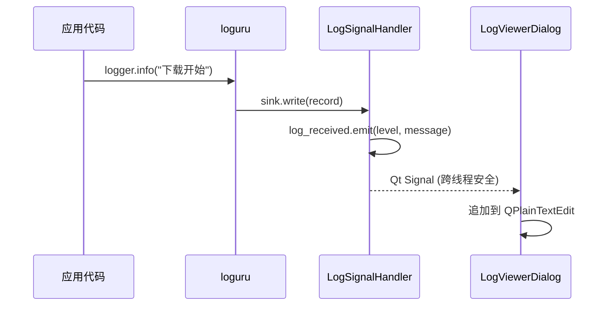
```mermaid
sequenceDiagram
    participant App as 应用代码
    participant LG as loguru
    participant LSH as LogSignalHandler
    participant UI as LogViewerDialog
    
    App->>LG: logger.info("下载开始")
    LG->>LSH: sink.write(record)
    LSH->>LSH: log_received.emit(level, message)
    LSH-->>UI: Qt Signal (跨线程安全)
    UI->>UI: 追加到 QPlainTextEdit
```

**LogSignalHandler 代码**:
```python
class LogSignalHandler(QObject):
    log_received = Signal(str, str)  # (level, message)
    
    def write(self, message):
        """loguru sink 回调"""
        record = message.record
        level = record["level"].name
        text = record["message"]
        self.log_received.emit(level, text)
    
    def install(self):
        """安装到 loguru"""
        self._handler_id = logger.add(
            self.write,
            format="{message}",
            level="DEBUG",
        )
```

---

##### 全局异常捕获

程序即使崩溃，也会在日志中记录完整堆栈：

```python
def handle_exception(exc_type, exc_value, exc_traceback):
    if issubclass(exc_type, KeyboardInterrupt):
        sys.__excepthook__(exc_type, exc_value, exc_traceback)
        return
    logger.opt(exception=(exc_type, exc_value, exc_traceback)).critical("Uncaught exception")

sys.excepthook = handle_exception
```

**示例崩溃日志**:
```
14:35:30 | CRITICAL | Uncaught exception
Traceback (most recent call last):
  File "main.py", line 42, in <module>
    ...
ZeroDivisionError: division by zero
```

---

##### 日志查看器 UI

设置页的日志管理功能：

| 功能 | 说明 |
|------|------|
| **查看日志** | 打开 LogViewerDialog，实时显示 |
| **清理日志** | 删除旧日志文件 |
| **打开目录** | 在资源管理器中打开 logs 文件夹 |

**LogViewerDialog 特性**：
- 级别过滤 (DEBUG/INFO/WARNING/ERROR)
- 关键词搜索
- 自动滚动
- 加载今日已有日志（最近 500 行）


---

### 4. 后处理模块详解

#### ThumbnailEmbedder - 封面嵌入器

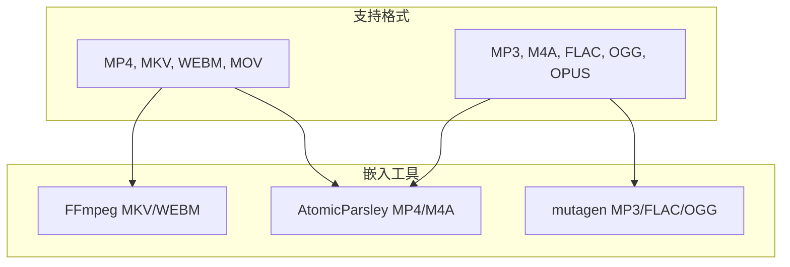
```mermaid
flowchart TB
    subgraph Tools["嵌入工具"]
        AP["AtomicParsley MP4/M4A"]
        FF["FFmpeg MKV/WEBM"]
        MG["mutagen MP3/FLAC/OGG"]
    end
    
    subgraph Formats["支持格式"]
        Video["MP4, MKV, WEBM, MOV"]
        Audio["MP3, M4A, FLAC, OGG, OPUS"]
    end
    
    Video --> AP
    Video --> FF
    Audio --> MG
    Audio --> AP
```

**工具选择策略**：
| 格式 | 首选工具 | 备选 |
|------|----------|------|
| MP4/M4A | AtomicParsley | FFmpeg |
| MKV/WEBM | FFmpeg | - |
| MP3/FLAC/OGG | mutagen | FFmpeg |

#### SponsorBlock - 广告跳过

**支持类别**：
| ID | 名称 | 描述 |
|----|------|------|
| sponsor | 赞助广告 | 跳过赞助商内容 |
| selfpromo | 自我推广 | 跳过频道推广 |
| interaction | 互动提醒 | 跳过订阅/点赞提醒 |
| intro | 片头 | 跳过视频片头 |
| outro | 片尾 | 跳过视频片尾 |

**处理模式**：
- `remove` - 从视频中移除片段
- `mark` - 标记为章节

---

## 🔄 线程与进程模型

```mermaid
graph TB
    subgraph MainProcess["主进程"]
        GUI["GUI 主线程 事件循环"]
        W1["Worker 1 下载线程"]
        W2["Worker 2 下载线程"]
        W3["Worker 3 下载线程"]
    end
    
    subgraph SubProcesses["子进程"]
        YTDLP1["yt-dlp 1"]
        YTDLP2["yt-dlp 2"]
        FFMPEG["ffmpeg"]
        POT["pot-provider 后台服务"]
    end
    
    GUI --> W1
    GUI --> W2
    GUI --> W3
    GUI -.-> POT
    W1 -.-> YTDLP1
    W2 -.-> YTDLP2
    W1 -.-> FFMPEG
```

**线程职责**：
- **GUI 主线程**: 事件循环、UI 更新
- **Worker 线程**: 执行下载、监控进度
- **POT 服务**: 后台常驻，提供 PO Token

---

## 📡 信号系统设计

使用 Qt Signal/Slot 实现跨线程通信：

```mermaid
sequenceDiagram
    participant Worker as Worker 线程
    participant DM as DownloadManager
    participant UI as UI 主线程
    
    Worker->>DM: progress_updated.emit(task_id, %)
    DM->>UI: task_progress_changed.emit(task_id, %)
    UI->>UI: 更新进度条
    
    Worker->>DM: task_completed.emit(task_id)
    DM->>UI: task_status_changed.emit(task_id, COMPLETED)
    UI->>UI: 显示完成通知
```

---

## 📁 目录结构

```
src/fluentytdl/
├── core/                   # 核心服务
│   ├── config_manager.py   # 配置管理
│   ├── auth_service.py     # 认证服务
│   ├── cookie_sentinel.py  # Cookie 哨兵
│   ├── dependency_manager.py # 依赖管理
│   ├── pot_manager.py      # PO Token 服务
│   └── resume_manager.py   # 断点续传
├── download/               # 下载模块
│   ├── manager.py          # 下载管理器
│   ├── workers.py          # 工作线程
│   └── task.py             # 任务模型
├── processing/             # 后处理
│   ├── thumbnail_embedder.py  # 封面嵌入
│   ├── sponsorblock.py     # SponsorBlock
│   ├── audio_processor.py  # 音频处理
│   └── subtitle_manager.py # 字幕管理
├── youtube/                # YouTube 封装
│   ├── youtube_service.py  # 核心服务
│   └── yt_dlp_cli.py       # CLI 构建
├── ui/                     # 用户界面
│   ├── reimagined_main_window.py
│   ├── settings_page.py
│   └── components/         # UI 组件
└── utils/                  # 工具
    ├── logger.py           # 日志配置
    ├── log_signal_handler.py # 日志信号
    └── paths.py            # 路径工具
```

---

## 🔧 外部依赖管理

### DependencyManager

**设计模式**: 异步 Worker + 信号通知

DependencyManager 负责检查、下载和安装外部工具，所有操作在后台线程执行。

---

##### 管理的组件

| 组件 | 用途 | 版本检测方式 | 下载源 |
|------|------|--------------|--------|
| **yt-dlp** | 视频下载核心 | `yt-dlp --version` | GitHub Releases |
| **FFmpeg** | 媒体处理 | `ffmpeg -version` | gyan.dev / GitHub |
| **Deno** | JS 运行时 (签名解析) | `deno --version` | GitHub Releases |
| **AtomicParsley** | 封面嵌入 (MP4) | 文件存在检测 | GitHub Releases |
| **pot-provider** | PO Token 提供 | 文件存在检测 | 自定义源 |

---

##### 组件信息模型

```python
class ComponentInfo:
    key: str           # 内部标识: 'yt-dlp', 'ffmpeg', 'deno'
    name: str          # 显示名称
    exe_name: str      # 可执行文件名 (e.g., yt-dlp.exe)
    current_version: str | None   # 本地版本
    latest_version: str | None    # 远程最新版本
    download_url: str | None      # 下载链接
```

---

##### 更新检查流程

```mermaid
sequenceDiagram
    participant UI as 设置页面
    participant DM as DependencyManager
    participant Worker as UpdateCheckerWorker
    participant GitHub as GitHub API
    
    UI->>DM: check_update("yt-dlp")
    DM->>Worker: start()
    
    rect rgb(230, 245, 255)
        Note over Worker,GitHub: 后台线程
        Worker->>Worker: _get_local_version()
        Note over Worker: 执行 yt-dlp --version
        
        Worker->>GitHub: GET /repos/yt-dlp/yt-dlp/releases/latest
        GitHub-->>Worker: {tag_name: "2026.02.01", assets: [...]}
        
        Worker->>Worker: 对比版本
    end
    
    Worker-->>DM: finished_signal.emit(key, result)
    DM-->>UI: check_finished.emit(key, {has_update: True, ...})
    UI->>UI: 显示更新按钮
```

---

##### 安装流程

```mermaid
flowchart TD
    Start[用户点击更新] --> Download[DownloaderWorker.start]
    
    Download --> Progress{下载进度}
    Progress -->|更新| UI[progress_signal: 45%]
    Progress -->|完成| Handle{文件类型}
    
    Handle -->|.exe| Copy[直接复制到 bin/]
    Handle -->|.zip| Unzip[解压到 bin/{component}/]
    
    Copy --> Success[finished_signal.emit]
    Unzip --> Success
    
    Success --> Refresh[刷新本地版本]
```

---

##### 镜像源支持

对于国内用户，支持 GHProxy 镜像加速：

```python
def get_mirror_url(self, original_url: str) -> str:
    """应用配置的镜像源"""
    source = config_manager.update_source  # "github" or "ghproxy"
    
    if source == "ghproxy" and "github.com" in original_url:
        # https://github.com/xxx -> https://ghproxy.com/github.com/xxx
        return original_url.replace(
            "https://github.com",
            "https://ghproxy.com/https://github.com"
        )
    return original_url
```

**配置选项**:
```json
{
  "update_source": "github"  // 或 "ghproxy"
}
```

---

##### 安装位置

| 环境 | 安装路径 |
|------|----------|
| **开发环境** | `<项目根>/bin/{component}/` |
| **打包后** | `<exe目录>/bin/{component}/` |

**目录结构**:
```
bin/
├── yt-dlp/
│   └── yt-dlp.exe
├── ffmpeg/
│   ├── ffmpeg.exe
│   └── ffprobe.exe
├── deno/
│   └── deno.exe
├── atomicparsley/
│   └── AtomicParsley.exe
└── pot-provider/
    └── pot-provider.exe
```

---

##### Qt 信号系统

DependencyManager 通过信号通知 UI 更新状态：

| 信号 | 参数 | 用途 |
|------|------|------|
| `check_started` | (key) | 开始检查 |
| `check_finished` | (key, result_dict) | 检查完成 |
| `check_error` | (key, error_msg) | 检查失败 |
| `download_started` | (key) | 开始下载 |
| `download_progress` | (key, percent) | 下载进度 |
| `download_finished` | (key) | 下载完成 |
| `download_error` | (key, error_msg) | 下载失败 |


---

## 📝 配置持久化

配置存储在 `config.json`：

```json
{
  "download_dir": "D:/Downloads",
  "max_concurrent_downloads": 3,
  "embed_thumbnail": true,
  "embed_metadata": true,
  "sponsorblock_enabled": true,
  "cookie_mode": "auto",
  "cookie_browser": "edge",
  "proxy_mode": "system",
  "update_source": "github"
}
```

---

<p align="center">
  <sub>FluentYTDL Architecture v1.0 | 2026</sub>
</p>
