# FluentYTDL 架构文档

> [English version](ARCHITECTURE_EN.md)
>
> 本文档基于直接代码分析描述当前架构。开发规则见 `docs/RULES.md`，yt-dlp 排障知识见 `docs/YTDLP_KNOWLEDGE.md`。

## 0. 全局数据流

下图展示了从用户粘贴 URL 到最终输出文件的完整链路：

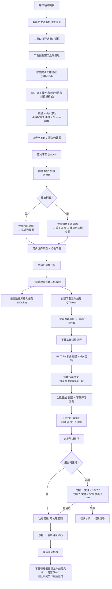

---

## 1. 架构总览

### 1.1 分层架构

FluentYTDL 遵循严格的四层依赖模型：

```
┌─────────────────────────────────────────────┐
│  UI 层 (ui/)                                 │
│  53 个文件：主窗口、页面、组件、委托、模型      │
├──────────────┬──────────────────────────────-┤
│              ↓ 依赖                          │
│  服务层                                       │
│  auth/  youtube/  download/  processing/     │
│  storage/                                    │
├──────────────┬──────────────────────────────-┤
│              ↓ 依赖                          │
│  核心基础设施 (core/)                          │
│  ConfigManager、controller、dependency_mgr   │
├──────────────┬──────────────────────────────-┤
│              ↓ 依赖                          │
│  基础层 (utils/, models/)                     │
│  无内部依赖                                    │
└─────────────────────────────────────────────┘
```

**强制规则：**
- UI 绝不能直接调用 yt-dlp — 所有交互通过 `youtube_service`
- 服务层绝不能从 `ui/` 导入 — 仅通过 Qt Signal 通信
- Models 自包含 — 无循环依赖

### 1.2 设计原则

| 原则 | 实现 |
|------|------|
| 单向依赖 | 第 N 层只能从第 N-1、N-2、... 层导入 |
| Qt Signal/Slot 通信 | 所有 UI-后端解耦使用 `pyqtSignal`/`pyqtSlot` |
| 子进程隔离 | yt-dlp 和 ffmpeg 作为 CLI 子进程运行，绝不作为 Python 库 |
| 沙箱隔离 | 每个下载在独立的临时目录中运行 |
| 懒清理 | 在新状态验证前绝不删除旧状态（cookies、临时文件） |
| 渐进式恢复 | 放弃前多级递增尝试（POT Manager、错误重试） |

### 1.3 包布局

```
src/fluentytdl/
├── auth/                  — Cookie 生命周期、DLE/WebView2 提供者、CookieSentinel
│   └── providers/         — DLE 提供者（Chrome 扩展注入）、WebView2 提供者（pywebview）
├── core/                  — ConfigManager（JSON+Qt Signal）、controller（View↔Backend 桥梁）、DependencyManager
├── download/              — DownloadManager（队列+并发）、DownloadExecutor（子进程）、DownloadWorker（QThread）、
│                            Feature 管道（5 个 Feature）、Strategy（SPEED/STABLE/HARSH）、AsyncExtractManager
├── models/                — DTO：YtMediaDTO（防腐层）、VideoTask（UI 领域模型）、VideoInfo、错误码
│   └── mappers/           — 原始 yt-dlp dict → 类型化 DTO 转换器（VideoInfoMapper）
├── processing/            — 音频/字幕/封面后处理、SponsorBlock 集成
├── storage/               — TaskDB（SQLite WAL）、历史服务、TaskDBWriter（异步写入线程）
├── ui/                    — 53 个文件：主窗口、页面、组件、委托、模型
│   ├── components/        — 可复用控件（24 个文件），含 DownloadConfigWindow（~3600 行）
│   ├── delegates/         — QPainter 列表项渲染器（3 个文件：播放列表、下载、历史）
│   ├── dialogs/           — 模态对话框（4 个文件）
│   ├── models/            — Qt 列表模型（PlaylistListModel，含脏行去抖）
│   ├── pages/             — 页面容器
│   └── settings/          — 设置子模块
├── utils/                 — 路径、日志、error_parser（16 规则诊断引擎）、format_scorer、验证器
│   └── spatialmedia/      — Google 空间媒体工具包（第三方，Apache 2.0），用于 VR 元数据
├── youtube/               — YoutubeService（yt-dlp CLI 封装）、POT Manager（PO Token 提供者）、节点诊断
└── yt_dlp_plugins_ext/    — yt-dlp PO Token 提供者插件（随应用捆绑）
    └── yt_dlp_plugins/extractor/
```

### 1.4 关键单例

| 单例 | 文件 | 用途 |
|------|------|------|
| `config_manager` | `core/config_manager.py` | JSON 配置存储；每次变更发射 Qt Signal |
| `download_manager` | `download/download_manager.py` | 任务队列、槽位并发、崩溃恢复 |
| `auth_service` | `auth/auth_service.py` | 统一 Cookie 处理、浏览器提取路由 |
| `cookie_sentinel` | `auth/cookie_sentinel.py` | Cookie 生命周期：静默预提取、403 恢复、懒清理 |
| `youtube_service` | `youtube/youtube_service.py` | 所有 yt-dlp 交互、格式排序、选项构建 |
| `pot_manager` | `youtube/pot_manager.py` | PO Token 提供者生命周期、3 级渐进恢复 |
| `task_db` | `storage/task_db.py` | SQLite WAL 模式任务持久化 |
| `app_controller` | `core/controller.py` | View 与 Backend 的桥梁 |

---

## 2. 下载状态机

下载系统采用**两层状态设计**：持久层（SQLite）用于崩溃恢复，临时层（Worker 对象）用于实时运行时状态。

### 2.1 状态定义

状态是纯字符串（非枚举），在三个层之间共享：

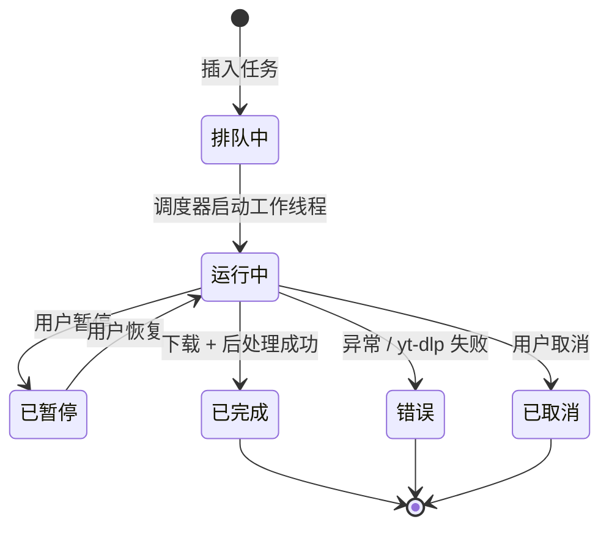

| 状态 | 含义 | 设置者 |
|------|------|--------|
| `queued` | 等待并发槽位 | `task_db.insert_task()` 默认值 |
| `running` / `downloading` | 正在下载 | `CleanLogger` 通过 `unified_status` signal |
| `parsing` | 从 yt-dlp 提取元数据 | `CleanLogger.force_update("parsing", ...)` |
| `paused` | 用户暂停或崩溃恢复时自动暂停 | `DownloadWorker.pause()` |
| `completed` | 下载成功完成 | `DownloadWorker.run()` 后处理块 |
| `error` | 下载失败 | `run()` 中的异常处理 |
| `cancelled` | 用户取消 | `DownloadCancelled` 处理 |

### 2.2 两层设计

**持久层（SQLite）：** `TaskDB` 是以 WAL 模式运行的单例。它存储 `tasks` 表，包含 `state`、`progress`、`status_text`、`output_path`、`file_size`、`ydl_opts_json` 等列。所有跨会话有意义的状态转换都持久化在此。

**临时层（Worker 对象）：** `DownloadWorker` 是一个 `QThread`，持有实时运行时状态：`_pause_event`、`_cancel_event`、`executor`、`output_path`、`dest_paths`、`progress_val`、`status_text`。进程退出时销毁。

**桥接层：** `TaskDBWriter` 是一个专用后台线程，带 `Queue`。主线程绝不直接操作高频写入的 SQLite。`DownloadManager.create_worker()` 将 `worker.unified_status` signal 以 `Qt.ConnectionType.QueuedConnection` 连接到 `db_writer.enqueue_status()` — "单写者桥接连接"防止 SQLite 争用。

**`effective_state` 属性：** `DownloadWorker` 上的权威状态解析器。消除 `_final_state`（由 CleanLogger 设置）和 `QThread.isRunning()` 之间的竞态条件：
- 如果线程 `isRunning()` → 返回 `"running"`（除非 CleanLogger 已标记为 `"paused"`）
- 如果不在运行 → 检查 `_final_state` 是否为终止状态
- 如果 `isFinished()` 但无显式状态 → 默认 `"completed"`
- 否则 → `"queued"`

### 2.3 崩溃恢复

启动时，`DownloadManager.load_unfinished_tasks()`：

1. 从 `task_db.get_all_tasks()` 读取所有行
2. 按逆时间顺序遍历
3. 跳过终止状态（`completed`、`error`、`cancelled`）
4. 跳过 `skip_download` 任务（字幕/封面提取）— 标记为错误，因为对话上下文已丢失
5. **关键安全阀：** 所有 `running`/`downloading`/`parsing` 状态的任务降级为 `paused` — 防止重启时并发下载风暴
6. 从持久化字段重建 `DownloadWorker` 对象
7. 不调用 `pump()` — 等待 UI 初始化

### 2.4 Worker.run() 三路分支

`DownloadWorker.run()` 有三个互斥的执行路径：

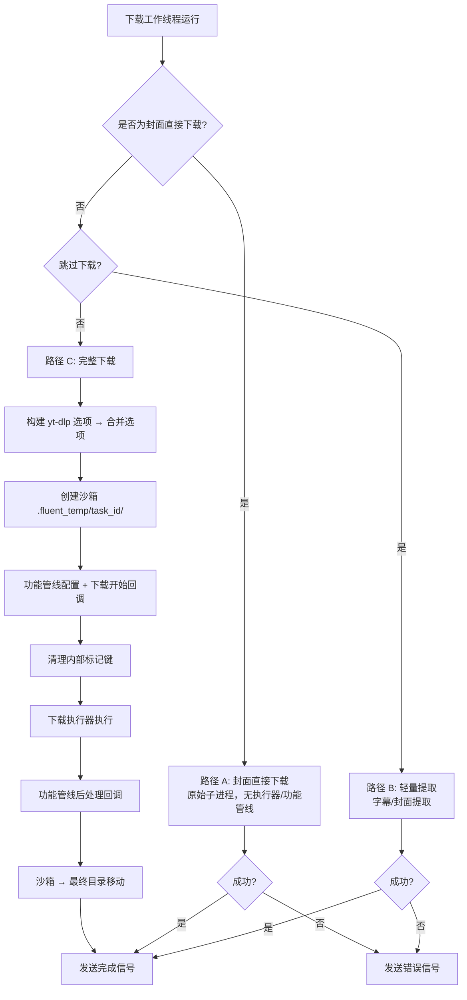

### 2.5 异常处理流程

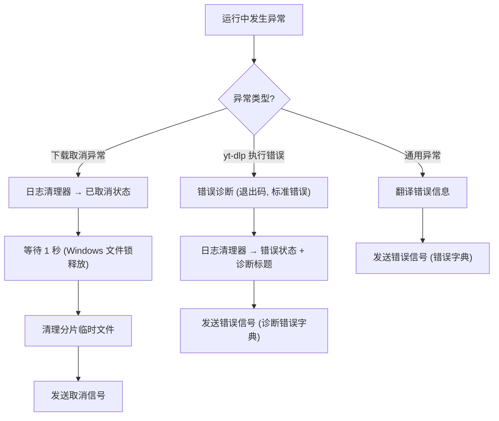

---

## 3. 并发模型

### 3.1 槽位调度器

`DownloadManager` 使用两个数据结构：

- `active_workers: list[DownloadWorker]` — 本次会话创建的所有 worker
- `_pending_workers: deque[DownloadWorker]` — 等待槽位的 FIFO 队列

并发限制从配置运行时读取（`max_concurrent_downloads`，默认 3，钳制在 `[1, 2_147_483_647]`）。

### 3.2 pump() 循环

并发调度器的核心：

```python
def pump(self) -> None:
    limit = self._max_concurrent()
    while self._pending_workers and self._running_count() < limit:
        w = self._pending_workers.popleft()
        if w.isRunning() or w.isFinished():
            continue
        w.start()
    self.task_updated.emit()
```

从队列前端弹出 worker（FIFO），检查未在运行/已完成，然后启动。当待处理队列为空或运行数达到限制时停止。

### 3.3 自动补充链

创建 worker 时，`DownloadManager.create_worker()` 将 worker 的 `QThread.finished` signal 连接到 `_on_worker_finished`：

```
Worker 完成 → _on_worker_finished() → 槽位释放 → pump() → 下一个排队 worker 启动
```

形成自动补充链。`stop_all()` 先清空待处理队列（防止暂停运行中的任务后排队任务启动），然后停止每个运行中的 worker。`shutdown()` 提供可配置的宽限期（默认 2000ms），超时后回退到 `terminate()`，然后刷新 `TaskDBWriter`。

---

## 4. 沙箱下载模式

### 4.1 为什么需要沙箱？

直接下载到最终目录会在取消或失败时留下碎片文件（`.part`、`.ytdl`）。沙箱模式将所有中间文件隔离在每个任务的临时目录中，保持用户下载目录干净。

### 4.2 生命周期

```
创建沙箱              下载到沙箱中                移动 / 清理
     │                    │                         │
     ▼                    ▼                         ▼
.fluent_temp/         yt-dlp 写入               成功时：
  task_{id}/          .part、.ytdl、             扫描沙箱 →
  ├── home: 沙箱      最终文件                   将所有非 .part
  └── temp: 沙箱      全部在此                   文件移动到 download_dir
                                                    → rmtree 沙箱

                                               取消时：
                                                sleep(1.0) 等待 Windows
                                                文件锁释放
                                                → rmtree 沙箱（5 次重试）
                                                → 回退：逐个删除文件
```

### 4.3 关键设计决策

| 决策 | 原因 |
|------|------|
| 沙箱使用 DB 主键（`db_id`），非 UUID | 崩溃恢复确定性 — 恢复的任务写入同一沙箱 |
| 沙箱是 `download_dir` 的子目录 | 同文件系统 → 原子 `shutil.move()`，无跨设备复制 |
| `home` 和 `temp` 路径都重定向 | yt-dlp 碎片和最终输出都落在沙箱中 |
| 取消前 1 秒延迟 | Windows 在进程终止后仍持有文件锁；子进程（ffmpeg）可能仍有句柄 |
| 清理中 5 次重试、0.5 秒延迟 | 对持久 Windows 文件锁的额外弹性 |
| `_clean_part_files()` 用于 403 恢复 | 陈旧的 `.part` 碎片导致 yt-dlp 恢复时重新请求已过期的签名 URL |

### 4.4 沙箱绕过场景

两种下载路径跳过沙箱：
- **封面直链**（`__fluentytdl_is_cover_direct`）：直接下载单个图片 URL
- **轻量提取**（`skip_download`）：不下载视频的字幕/封面提取

---

## 5. Feature 管道

### 5.1 模板方法模式

基类 `DownloadFeature` 定义三个生命周期钩子：


| 钩子 | 时机 | 用途 |
|------|------|------|
| `configure(ydl_opts)` | yt-dlp 运行前 | 修改选项字典（添加后处理器、设置标志） |
| `on_download_start(context)` | yt-dlp 运行前 | 基于上下文的预检调整 |
| `on_post_process(context)` | yt-dlp 完成后 | 下载后处理（嵌入、转换、注入） |

### 5.2 5 个 Feature（固定顺序）

```python
self.features = [
    SponsorBlockFeature(),   # 1. 仅 configure() — 注入 sponsorblock_remove/mark
    MetadataFeature(),       # 2. 仅 configure() — 追加 FFmpegMetadata 后处理器
    SubtitleFeature(),       # 3. 两个钩子 — 双语合并、格式兼容修复、嵌入
    ThumbnailFeature(),      # 4. 仅 on_post_process() — 通过 AtomicParsley/FFmpeg/mutagen 嵌入
    VRFeature(),             # 5. 仅 on_post_process() — EAC→Equi 转换 + 空间元数据
]
```

执行顺序固定且不可更改 — 后续 Feature 依赖前面的已完成配置。

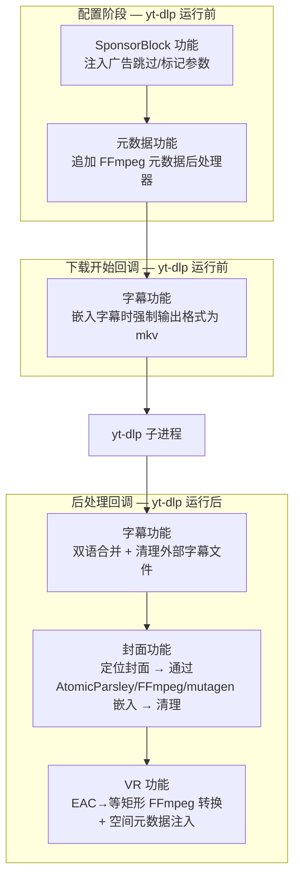

### 5.3 DownloadContext 外观

`DownloadContext` 封装 `DownloadWorker`，为 Feature 提供受控接口：
- `output_path` 属性（getter/setter）
- `dest_paths` 属性（只读）
- `emit_status(msg)`、`emit_warning(msg)`、`emit_thumbnail_warning(msg)`
- `find_final_merged_file()` — 即使 `output_path` 指向碎片文件（如 `.f136.mp4`）也能定位合并后的输出
- `find_thumbnail_file(video_path)` — 扫描 `.jpg/.jpeg/.webp/.png` 变体

### 5.4 `__fluentytdl_` 前缀约定

以 `__fluentytdl_` 为前缀的内部元数据键在 UI/选项层和 Feature 管道之间传递应用特定标志。在传入 yt-dlp 前从选项字典中剥离：

```python
for k in list(merged.keys()):
    if isinstance(k, str) and k.startswith("__fluentytdl_"):
        merged.pop(k, None)
```

示例：`__fluentytdl_is_cover_direct`、`__fluentytdl_use_android_vr`、`__vr_projection`、`__vr_convert_eac`、`__vr_stereo_mode`。

---

## 6. 三种下载路径

`DownloadWorker.run()` 方法实现三种由选项标志选择的执行路径：

### 6.1 路径对比

| 方面 | 路径 A：封面直链 | 路径 B：轻量提取 | 路径 C：完整下载 |
|------|-----------------|-----------------|-----------------|
| 触发条件 | `__fluentytdl_is_cover_direct` | `skip_download` | 默认 |
| 用途 | 单个图片 URL | 字幕/封面提取 | 视频/音频下载 |
| Executor | 否（原始子进程） | 否（原始子进程） | 是（`DownloadExecutor`） |
| Strategy | 否 | 否 | 是（SPEED/STABLE/HARSH） |
| 沙箱 | 否 | 否 | 是（`.fluent_temp/task_{id}/`） |
| Feature 管道 | 否 | 否 | 是（全部 5 个 Feature） |
| 进度 | 最小（"Destination:" 时 50%） | `YtDlpOutputParser` | 完整 `FLUENTYTDL\|` 模板 |
| 崩溃恢复 | 否 | 否（对话上下文丢失） | 是 |
| 使用者 | 封面解析模式 | 字幕 + 封面（回退） | 视频、VR、频道、播放列表 |

### 6.2 完整下载管道（路径 C）

```
1. 与 youtube_service.build_ydl_options() 基础选项合并
2. 创建沙箱目录（.fluent_temp/task_{id}/）
3. Feature 管道：对全部 5 个 Feature 执行 configure() + on_download_start()
4. 剥离 __fluentytdl_ 内部键
5. 创建 DownloadExecutor → execute() 并传入进度/状态/取消回调
6. Feature 管道：对全部 5 个 Feature 执行 on_post_process()
7. 将文件从沙箱移动到最终目录
8. 发射 completed signal
```

---

## 7. 播放列表懒加载架构

这是最复杂的子系统之一。它处理播放列表（可能有数千条目）和频道标签页列表，使用多层优先队列和视口感知调度。

### 7.1 两阶段提取

**阶段 1 — 扁平枚举（快速，2-5 秒）：**

```python
ydl_opts = {
    "extract_flat": True,      # 仅枚举，不获取每条详情
    "lazy_playlist": True,     # yt-dlp 懒模式
    "skip_download": True,
}
```

返回扁平条目列表，仅有基本元数据（标题、id、URL、缩略图）— 无格式列表，无详细元数据。

**阶段 2 — 逐条深度提取（懒加载，按需）：**

每个条目的完整元数据（格式、时长等）由 `EntryDetailWorker` 通过 `AsyncExtractManager` 单独获取。`PlaylistScheduler` 优先处理可见行，然后在后台爬取其余部分。

### 7.2 PlaylistScheduler — 三层优先队列

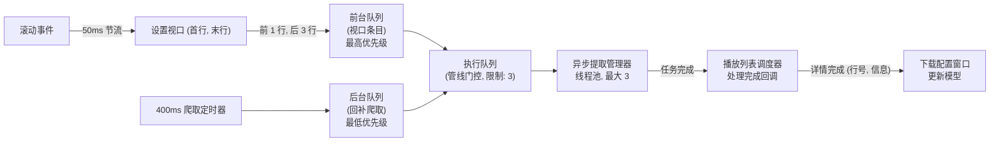

| 层级 | 队列 | 优先级 | 来源 |
|------|------|--------|------|
| **前台** | `_fg_queue` / `_fg_set` | 最高 — 始终优先消费 | `set_viewport()` + 用户点击 |
| **执行** | `_exec_queue` / `_exec_set` | 管道门控（限制：3） | `_fill_exec_queue()` 从前台或后台移入 |
| **后台** | `_bg_queue` / `_bg_set` | 最低 — 仅当前台为空时消费 | 400ms 爬取定时器 |

### 7.3 视口优先调度

`set_viewport(first, last)` 实现前瞻：

```python
pre_first = max(0, first - 1)      # 第一个可见行前 1 行
pre_last = min(total - 1, last + 3) # 最后一个可见行后 3 行
for row in range(pre_first, pre_last + 1):
    self._enqueue(row, foreground=True)
self._pump()
```

`_enqueue()` 方法处理去重，并将已在后台队列中的行**提升**到前台 — 视口条目始终抢占后台工作。

**基于 URL 的任务标识：** 不使用行号（会导致行偏移 bug），而是使用条目 URL 作为稳定的 `task_id`。双向映射（`_url_to_row` / `_row_to_row`）在 URL 和行号之间转换。

**重试逻辑：** 出错时，调度器自动重试一次。如果重试也失败，行标记为失败。

### 7.4 数据流 — 5 阶段管道

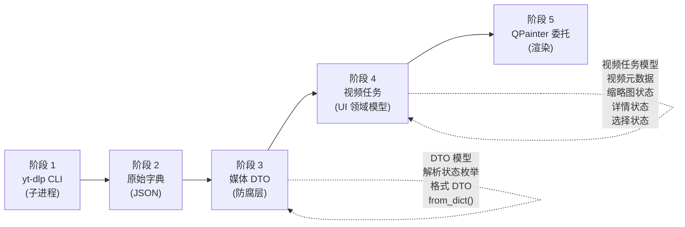

**阶段 1 — yt-dlp 子进程：** 通过 `run_dump_single_json()` 调用 CLI。扁平播放列表使用 `--flat-playlist --lazy-playlist --dump-single-json`。

**阶段 2 — 原始 Dict：** JSON dict 含 `entries` 数组。每个条目是部分 dict（扁平模式下无 `formats`）。

**阶段 3 — YtMediaDTO（防腐层）：** `YtMediaDTO.from_dict()` 将原始 dict 转换为类型化 DTO。`ParseState` 枚举跟踪提取深度：`FLAT`（仅标题/缩略图）、`FETCHING`（深度请求进行中）、`READY`（格式可用）。

**阶段 4 — VideoTask（UI 领域模型）：** 使用子数据类组合：
- `VideoMetadata` — 轻量级，用于初始列表渲染
- `ThumbnailState` — URL 和缓存状态
- `DetailState` — 重量级状态（格式、DTO 引用、状态：idle/loading/ready/error）
- `SelectionState` — 用户本地选择（复选框、自定义格式覆盖）

**阶段 5 — PlaylistListModel + QPainter 委托：** `PlaylistListModel` 存储 `VideoTask` 对象。`PlaylistItemDelegate` 通过 `TaskObjectRole` 读取任务，直接用 QPainter 绘制。

### 7.5 分块模型填充

播放列表条目以 30 个为一块添加到模型：

```python
self._build_chunk_size = 30
# 每块：QTimer.singleShot(0, self._process_next_build_chunk)
# 块间让出事件循环 → UI 保持响应
```

所有块完成后：
1. 通过 `_setup_scheduler()` 创建 `PlaylistScheduler`
2. 启动缩略图加载
3. 50ms 后调度初始视口扫描
4. 200ms 后启动后台爬取

### 7.6 脏行去抖

`PlaylistListModel` 使用前缘去抖模式：

```python
_dirty_rows: set[int]     # 累积的脏行
_update_timer: QTimer     # 200ms 单次触发

def mark_row_dirty(row):
    self._dirty_rows.add(row)
    if not self._update_timer.isActive():
        self._update_timer.start()  # 前缘：第一次标记启动窗口

def _flush_updates():
    rows = sorted(self._dirty_rows)
    # 将连续行合并为最小 dataChanged 范围
    # 50 行脏行 → 约 3-5 个 dataChanged signal
```

即使 200ms 内有 50 行更新，视图也只收到覆盖连续范围的少量 `dataChanged` signal。

### 7.7 延迟解析指示器

避免快速提取时的"待处理 → 加载中 → 格式"三闪：

```python
def _schedule_deferred_parsing_indicator(self, row):
    def _apply():
        if self._scheduler and (self._scheduler.is_loaded(row) or self._scheduler.is_failed(row)):
            return  # 已完成，跳过加载指示器
        self._set_row_parsing(row, True)
    QTimer.singleShot(800, _apply)  # 仅在提取耗时 >800ms 时显示"加载中"
```

### 7.8 QPainter 委托

所有列表项用 QPainter 渲染，而非每行 QWidget 实例。这避免了 `QScrollArea` 为每行分配多个完整 QWidget 实例，导致高内存占用和卡顿。

```
PlaylistItemDelegate (playlist_delegate.py)
├── paint() 管道：
│   1. 清除背景（WA_OpaquePaintEvent）
│   2. 卡片背景（Fluent Design 颜色，选中/悬停/默认）
│   3. 复选框（自定义 Fluent 风格，无 QCheckBox 控件）
│   4. 缩略图（圆角矩形裁剪，带预缩放缓存的像素图缓存）
│   5. 文本信息（标题加粗 14px 省略，元数据 12px）
│   6. 操作按钮（状态徽章：loading/error/pending/格式字符串）
├── sizeHint()：固定 108px 高度（MARGIN*2 + THUMB_HEIGHT）
└── hit_test()：返回 "checkbox" / "action_btn" / "row"
```

三个委托遵循此模式：`PlaylistItemDelegate`、`HistoryItemDelegate`、`DownloadItemDelegate`。

### 7.9 频道与播放列表

在调度器层面，两者没有区别 — 都使用相同的 `PlaylistScheduler`、`AsyncExtractManager`、`EntryDetailWorker` 和 `PlaylistListModel`。差异仅存在于 UI 层：

| 方面 | 频道 | 播放列表 |
|------|------|----------|
| URL 规范化 | 追加 `/videos` 或 `/shorts` | 无 |
| 标签页组合框 | 视频 / Shorts（用不同后缀重新加载） | 无 |
| 排序组合框 | 最新 / 最旧（`--playlist-reverse`） | 无 |
| 重新加载能力 | 有（清除模型，重新请求 URL） | 无 |
| 检测方式 | `UrlValidator.is_channel_url()` | 响应中 `_type == "playlist"` |

---

## 8. Cookie 与认证生命周期

### 8.1 CookieSentinel — 4 个阶段

CookieSentinel 是线程安全的单例，管理单个规范的 `bin/cookies.txt` 文件：

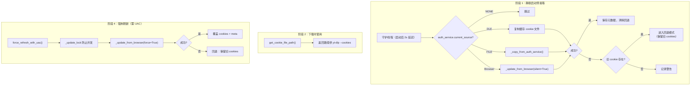

### 8.2 懒清理模式

核心设计原则：**在新提取成功前绝不删除旧 cookies**。

- `_clear_cookie_and_meta()` 存在但在正常流程中**从不调用**
- `validate_source_consistency()` 仅返回状态元组 — 明确不强制清理
- 提取失败时，如果存在来自不同来源的旧 cookie 文件，进入**回退模式**而非删除
- `.txt.meta` 辅助文件记录来源浏览器、提取时间戳和 cookie 数量，用于不匹配检测

### 8.3 DLE vs WebView2 提供者

| 方面 | DLE 提供者 | WebView2 提供者 |
|------|-----------|-----------------|
| 机制 | 临时 Chrome 扩展注入到干净浏览器实例 | pywebview + Edge WebView2 后端 |
| 进程模型 | 同进程（subprocess.Popen） | 双进程（multiprocessing.Process + Queue） |
| 配置文件 | 隔离的 `--user-data-dir` | 持久化 WebView2 缓存（`private_mode=False`） |
| 登录检测 | 轮询本地 HTTP 服务器的 cookie POST | 轮询 `LOGIN_INFO` cookie 存在 |
| 状态 | 旧版 | 当前（替代 DLE） |

### 8.4 POT Manager — 3 级渐进恢复

POTManager 管理 `bgutil-ytdlp-pot-provider` 子进程，用于 PO Token 生成（绕过 YouTube 机器人检测）：

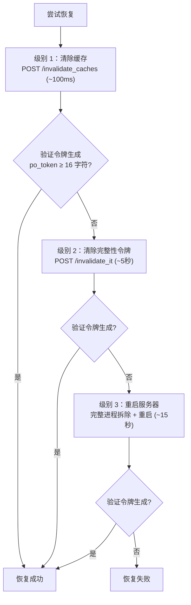

`try_recover()` 实现递增阶梯。每步之后调用 `verify_token_generation()` 验证响应包含至少 16 字符的 `po_token`。

**健康验证层：**
- L0：`is_running()` — 通过 `poll()` 检查进程是否存活
- L1：`verify_token_generation()` — POST `/get_pot`，验证 token 长度
- L2：`check_minter_health()` — GET `/minter_cache`，检查 BotGuard minter 初始化
- 综合：`get_health_status()` — 返回三层状态加人类可读摘要

**Windows Job Object：** POT 提供者子进程分配到具有 `JOB_OBJECT_LIMIT_KILL_ON_JOB_CLOSE` 的 Job Object。如果 FluentYTDL 崩溃，操作系统自动杀死 POT 提供者 — 无僵尸服务器。

---

## 9. 错误诊断引擎

### 9.1 三层专家系统

`utils/error_parser.py` 中的 `diagnose_error()` 实现：

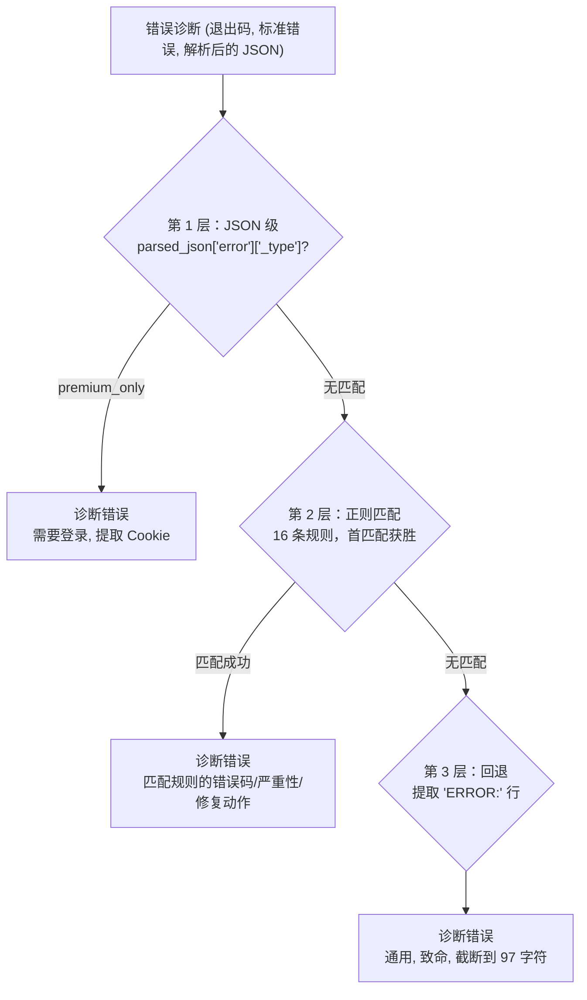

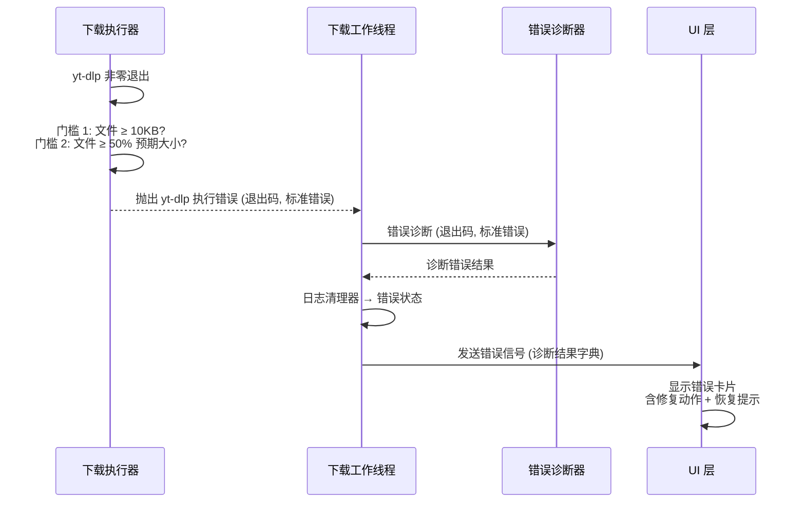

### 9.2 16 条错误规则

| # | 模式 | ErrorCode | 严重性 | 修复动作 |
|---|------|-----------|--------|----------|
| 1 | 机器人检测 / PO Token | POTOKEN_FAILURE | 致命 | — |
| 2 | 会员专属内容 | LOGIN_REQUIRED | 致命 | extract_cookie |
| 3 | 年龄限制 | LOGIN_REQUIRED | 致命 | extract_cookie |
| 4 | 私有视频 | LOGIN_REQUIRED | 致命 | — |
| 5 | "Sign in to confirm" | LOGIN_REQUIRED | 可恢复 | extract_cookie |
| 6 | 连接重置/拒绝/超时 | NETWORK_ERROR | 可恢复 | — |
| 7 | SSL 证书错误 | NETWORK_ERROR | 致命 | — |
| 8 | DNS 解析失败 | NETWORK_ERROR | 致命 | — |
| 9 | HTTP 429 限流 | RATE_LIMITED | 警告 | — |
| 10 | 代理连接失败 | NETWORK_ERROR | 可恢复 | switch_proxy |
| 11 | HTTP 403 / 禁止 | HTTP_ERROR | 可恢复 | — |
| 12 | 地理限制 | GEO_RESTRICTED | 致命 | switch_proxy |
| 13 | 首映未开始 | FORMAT_UNAVAILABLE | 警告 | — |
| 14 | 格式不可用 | FORMAT_UNAVAILABLE | 警告 | — |
| 15 | 缺少 FFmpeg | EXTRACTOR_ERROR | 致命 | — |
| 16 | 磁盘已满 | DISK_FULL | 致命 | — |

### 9.3 错误码模型

```python
class ErrorCode(IntEnum):
    SUCCESS = 0
    GENERAL = 1
    LOGIN_REQUIRED = 2
    FORMAT_UNAVAILABLE = 3
    HTTP_ERROR = 4
    NETWORK_ERROR = 5
    GEO_RESTRICTED = 6
    EXTRACTOR_ERROR = 7
    POTOKEN_FAILURE = 8
    RATE_LIMITED = 9
    COOKIE_EXPIRED = 10
    DISK_FULL = 11
    UNKNOWN = 99
```

`DiagnosedError` 是包含 `code`、`severity`、`user_title`、`user_message`、`fix_action`、`technical_detail`、`recovery_hint` 的数据类。通过 `to_dict()`/`from_dict()` 序列化以跨 Qt Signal 边界传输。

### 9.4 探测函数

| 函数 | 用途 |
|------|------|
| `probe_youtube_connectivity()` | HEAD 请求到 youtube.com，遵循代理配置 |
| `_run_ytdlp_probe()` | 运行 yt-dlp `--dump-json`，每个链接 12 小时冷却 |
| `probe_cookie_and_ip()` | 两阶段探测：先带 cookies，再不带 → 判断是 cookie 问题还是 IP 级别 |
| `probe_ip_risk_control()` | 无 cookie 探测，检测 IP 级别封锁 |

---

## 10. 六种解析流程

### 10.1 流程对比表

| 方面 | 视频 | VR | 频道 | 播放列表 | 字幕 | 封面 |
|------|------|-----|------|----------|------|------|
| UI 页面 | ParsePage | VRParsePage | ChannelParsePage | ParsePage（自动） | SubtitleDownloadPage | CoverDownloadPage |
| ConfigWindow mode | `"default"` | `"vr"` | `"default"` | `"default"` | `"subtitle"` | `"cover"` |
| Extract Worker | InfoExtract | VRInfoExtract | InfoExtract | InfoExtract | InfoExtract | InfoExtract |
| yt-dlp client | 默认 | `android_vr` | 默认 | 默认 | 默认 | 默认 |
| Cookies | 是 | **否** | 是 | 是 | 是 | 是/否 |
| 沙箱 | 是 | 是 | 是 | 是 | **否** | **否** |
| Feature 管道 | 完整 | 完整 + VR | 完整（逐条目） | 完整（逐条目） | **无** | **无** |
| 下载路径 | C（完整） | C（完整） | C（完整） | C（完整） | B（轻量） | A 或 B |
| 最终输出 | 视频文件 | 视频 + VR 元数据 | 视频文件（批量） | 视频文件（批量） | 字幕文件 | 图片文件 |

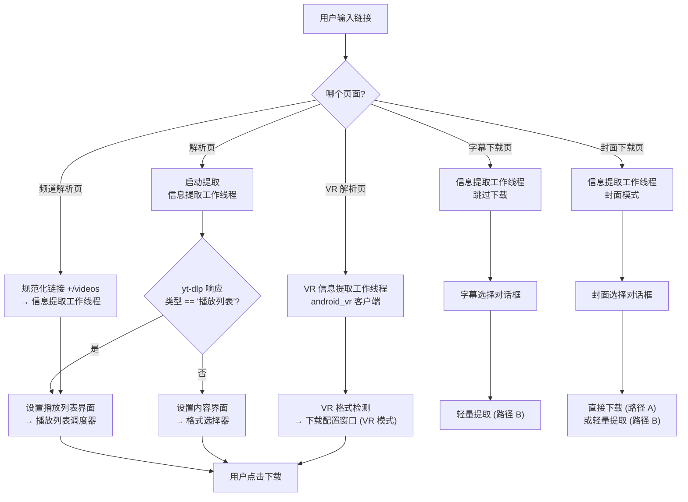

### 10.2 视频解析

- **入口**：`ParsePage` → `show_selection_dialog(url)` → `DownloadConfigWindow(mode="default")`
- **Worker**：`InfoExtractWorker` → `YoutubeService.extract_info_for_dialog_sync()`
- **yt-dlp 选项**：`--flat-playlist --lazy-playlist`，默认 client，通过 Cookie Sentinel 使用 cookies
- **播放列表自动检测**：响应中 `_type == "playlist"` → 分支到 `setup_playlist_ui()`
- **选择控件**：`VideoFormatSelectorWidget`
- **下载路径**：`DownloadExecutor`，完整沙箱模式
- **关键文件**：`parse_page.py`、`download_config_window.py:956`、`workers.py:390`

### 10.3 VR 解析

- **入口**：`VRParsePage` → `show_vr_selection_dialog(url)` → `DownloadConfigWindow(mode="vr", vr_mode=True, smart_detect=True)`
- **Worker**：`VRInfoExtractWorker` → `YoutubeService.extract_vr_info_sync()`
- **yt-dlp 选项**：`player_client=["android_vr"]`、`--no-playlist`、**无 cookies**（android_vr 不支持）
- **VR 检测**：`_detect_vr_projection(info)` 为每个格式标注 `__vr_projection` 和 `__vr_stereo_mode`
- **后处理**：完整管道 + `VRFeature`（始终激活）：
  - EAC → 等矩形投影转换（ffmpeg `v360=eac:e` 滤镜）
  - GPU 加速（NVENC/QSV/AMF）或 CPU（libx264）
  - MP4/MOV 空间元数据注入
- **关键文件**：`vr_parse_page.py`、`youtube_service.py:1229`、`features.py:308`

### 10.4 频道解析

- **入口**：`ChannelParsePage` → `_show_channel_dialog(url)` → URL 规范化（追加 `/videos`）→ `show_selection_dialog(normalized_url)`
- **Worker**：`InfoExtractWorker`（同视频模式）
- **yt-dlp 选项**：同视频模式，URL 带 `/videos` 后缀 → yt-dlp 视为频道标签页列表
- **UI 差异**：
  - 标签页组合框：视频 / Shorts（`_on_channel_tab_changed` 用 `/shorts` 重新加载）
  - 排序组合框：最新 / 最旧（`--playlist-reverse`）
  - `PlaylistScheduler` 在滚动时通过 `EntryDetailWorker` 懒加载条目详情
- **关键文件**：`channel_parse_page.py`、`reimagined_main_window.py:585`

### 10.5 播放列表解析

- **入口**：`ParsePage`（同视频模式）— 通过 yt-dlp 响应中 `_type == "playlist"` 自动检测
- **Worker**：`InfoExtractWorker`（同视频模式）
- **UI 差异**：
  - 批量操作工具栏（全选、预设、类型组合）
  - `PlaylistScheduler` 在滚动时懒加载条目详情
  - 无频道特有的标签页/排序控件
- **关键文件**：`download_config_window.py:1053`（播放列表检测逻辑）

### 10.6 独立字幕解析

- **入口**：`SubtitleDownloadPage` → `show_subtitle_selection_dialog(url)` → `DownloadConfigWindow(mode="subtitle")`
- **yt-dlp 选项**：`skip_download=True`、`writesubtitles`/`writeautomaticsub`、`subtitleslangs`、`convertsubtitles`
- **下载路径**：`_run_lightweight_extract()` — **完全绕过 Executor/Strategy/Feature 管道**
- **后处理**：**无** — .srt/.vtt/.ass 文件即为最终输出
- **关键文件**：`subtitle_download_page.py`、`workers.py:635`

### 10.7 独立封面解析

- **入口**：`CoverDownloadPage` → `show_cover_selection_dialog(url)` → `DownloadConfigWindow(mode="cover")`
- **两条下载路径**：
  - **路径 A** — 直链图片 URL：`_run_cover_direct_download()`（最精简：无 cookie、无 ffmpeg、无 extractor-args）
  - **路径 B** — 回退：`_run_lightweight_extract()`（同字幕模式）
- **后处理**：**无** — 图片文件即为最终输出
- **关键文件**：`cover_download_page.py`、`workers.py:836`

---

## 11. 进度解析

`DownloadExecutor` 使用自定义 `--progress-template` 字符串，输出以 `FLUENTYTDL|` 为前缀的结构化行：

```
FLUENTYTDL|download|<downloaded>|<total>|<estimate>|<speed>|<eta>|<vcodec>|<acodec>|<ext>|<filename>
FLUENTYTDL|postprocess|<status>|<postprocessor>
```

`CleanLogger` 将原始进度转换为统一的 `(state, percent, message)` 三元组，带多流阶段跟踪：
- 视频流：总进度的 0%-50%
- 音频流：50%-95%
- 后处理：95%-99%
- 单流（混合）：0%-95%

## 12. 非零退出验证

yt-dlp 以非零返回码退出时，执行器执行两门验证：

- **门 1**：文件存在且 ≥ 10 KB（处理 Windows `.part-Frag` 删除失败）
- **门 2**：文件 ≥ 预期总大小的 50%（防止将截断的下载视为成功）

如果两门都通过，非零退出码记录为警告但下载被视为成功。

---

## 13. 线程模型

| 线程 | 用途 | 生命周期 |
|------|------|----------|
| 主线程 | Qt 事件循环、UI 更新 | 应用生命周期 |
| DownloadWorker (QThread) | 每个并发下载一个（最多 3 个） | 每个任务 |
| InfoExtractWorker (QThread) | UI 的元数据提取 | 每次提取 |
| VRInfoExtractWorker (QThread) | VR 专用提取 | 每次 VR 提取 |
| EntryDetailWorker (QThread) | 深度播放列表条目提取 | 每个条目 |
| MetadataFetchRunnable (QRunnable) | 封装 EntryDetailWorker 供 QThreadPool 使用 | 每个条目 |
| QThreadPool | 播放列表并发元数据获取 | 应用生命周期 |
| TaskDBWriter | 异步 SQLite 写入 | 应用生命周期 |
| CookieSentinel-SilentRefresh | 启动时 cookie 预提取 | 一次性守护线程 |
| 子进程 | yt-dlp.exe、ffmpeg.exe、AtomicParsley.exe | 每次操作 |

---

## 14. 启动流程

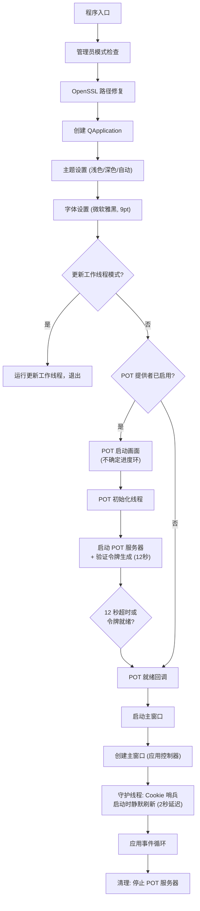

---

## 15. 依赖关系

```
基础层（无内部依赖）：
  utils.logger, utils.paths, utils.formatters, utils.validators,
  models.errors, models.subtitle_config

核心基础设施：
  core.config_manager → models.subtitle_config, utils.paths
  core.dependency_manager → utils.logger, utils.paths

服务层：
  auth.* → utils.*, core.config_manager
  youtube.* → core.config_manager, auth.*, utils.*
  download.* → core.config_manager, youtube.*, storage.*, models.*, processing.*, utils.*
  processing.* → core.config_manager, utils.*
  storage.* → utils.paths

UI 层：
  ui.* → 依赖所有服务层
  download_config_window.py 是耦合度最高的组件（~3600 行，几乎导入了所有包）
```

---

## 16. 配置系统

| 文件 | 用途 | 格式 |
|------|------|------|
| `config.json` | 用户设置（download_dir、max_concurrent、proxy、cookie browser、theme） | JSON |
| `task_db`（SQLite WAL） | 完整任务生命周期持久化、崩溃恢复 | SQLite |

外部工具由 `DependencyManager` 解析：
- `yt-dlp` — 优先级：配置路径 > 捆绑的 `_internal/yt-dlp/yt-dlp.exe` > PATH
- `ffmpeg` — 优先级：捆绑 > PATH
- JS 运行时 — 优先级：捆绑 deno > PATH deno > winget deno > PATH node > PATH bun > PATH quickjs

---

## 17. Windows 进程管理

| 组件 | 机制 | 文件 |
|------|------|------|
| yt-dlp 进程树 | `taskkill /F /T /PID`（杀死整个进程树，含 ffmpeg 子进程） | `executor.py:636` |
| POT 提供者孤儿预防 | Windows Job Object + `JOB_OBJECT_LIMIT_KILL_ON_JOB_CLOSE` | `pot_manager.py:62` |
| WebView2 子进程清理 | `terminate()` → `join(5)` → `kill()` | `webview2_provider.py:416` |
| 沙箱文件清理 | `rmtree` 带 5 次重试、0.5 秒间隔处理文件锁释放 | `workers.py:334` |
| 取消延迟 | 清理前 1 秒延迟等待 Windows 文件锁释放 | `workers.py:599` |

---

## 18. 单例交互图

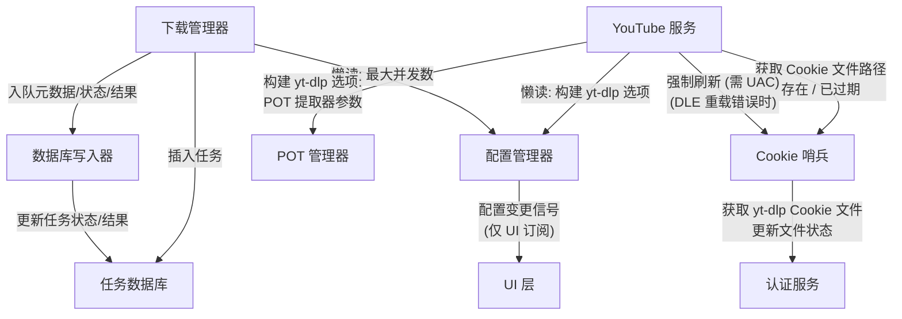

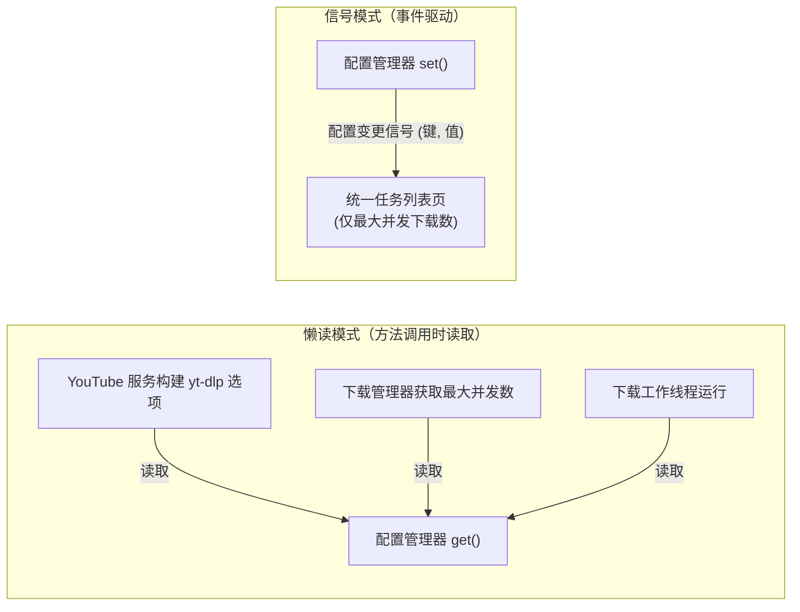

---

## 19. 信号拓扑

### 19.1 DownloadWorker 信号

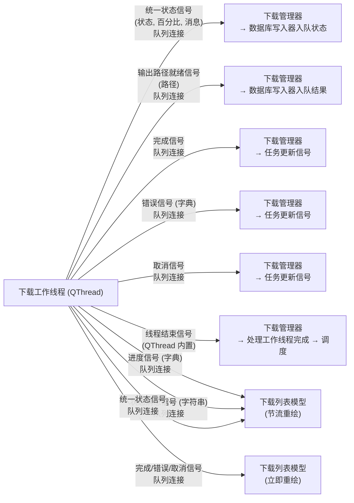

### 19.2 播放列表信号链

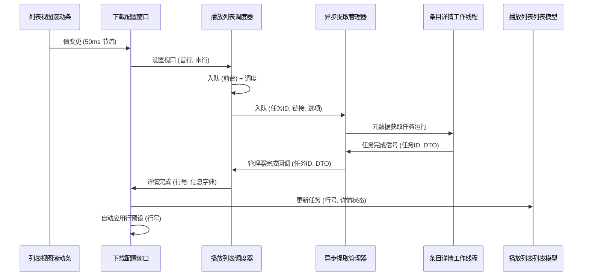

### 19.3 解析 → 下载信号链

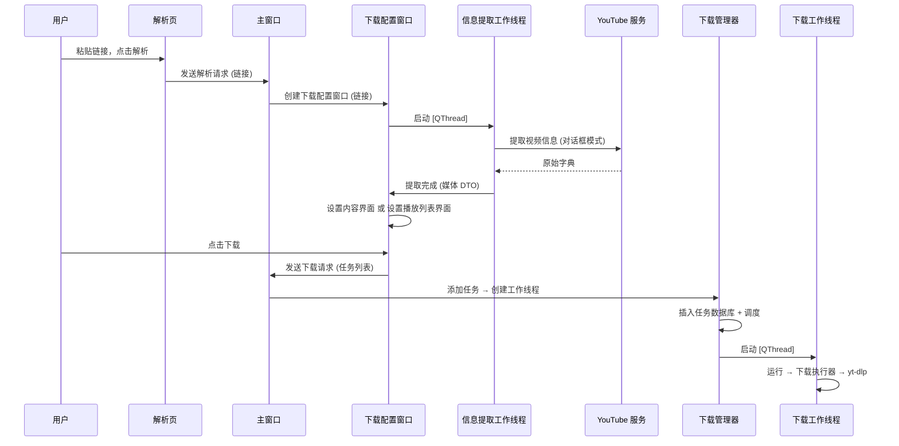
