# FluentYTDL Architecture Document

> [中文版](ARCHITECTURE.md)
>
> This document describes the current architecture based on direct code analysis. For development rules, see `docs/RULES_EN.md`. For yt-dlp troubleshooting knowledge, see `docs/YTDLP_KNOWLEDGE_EN.md`.

## 0. System-Wide Data Flow

The following diagram traces the complete journey from a user pasting a URL to the final output file:

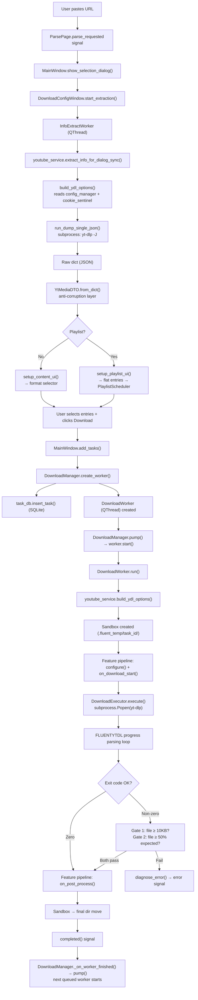

---

## 1. Architectural Overview

### 1.1 Layered Architecture

FluentYTDL follows a strict four-layer dependency model:

```
┌─────────────────────────────────────────────┐
│  UI Layer (ui/)                              │
│  53 files: windows, pages, components,       │
│  delegates, models                           │
├──────────────┬──────────────────────────────-┤
│              ↓ depends on                    │
│  Service Layer                               │
│  auth/  youtube/  download/  processing/     │
│  storage/                                    │
├──────────────┬──────────────────────────────-┤
│              ↓ depends on                    │
│  Core Infrastructure (core/)                 │
│  ConfigManager, controller, dependency_mgr   │
├──────────────┬──────────────────────────────-┤
│              ↓ depends on                    │
│  Foundation (utils/, models/)                │
│  No internal dependencies                    │
└─────────────────────────────────────────────┘
```

**Enforced rules:**
- UI must NOT call yt-dlp directly — all interactions go through `youtube_service`
- Services must NOT import from `ui/` — communication is via Qt Signals only
- Models are self-contained — no circular dependencies

### 1.2 Design Principles

| Principle | Implementation |
|-----------|---------------|
| Single-direction dependencies | Layer N may only import from layers N-1, N-2, ... |
| Qt Signal/Slot communication | All UI-backend decoupling uses `pyqtSignal`/`pyqtSlot` |
| Subprocess isolation | yt-dlp and ffmpeg run as CLI subprocesses, never as Python libraries |
| Sandbox containment | Each download runs in an isolated temp directory |
| Lazy cleanup | Never delete old state until new state is verified (cookies, temp files) |
| Progressive recovery | Multi-level escalation before giving up (POT Manager, error retry) |

### 1.3 Package Layout

```
src/fluentytdl/
├── auth/                  — Cookie lifecycle, DLE/WebView2 providers, CookieSentinel
│   └── providers/         — DLE provider (Chrome extension injection), WebView2 provider (pywebview)
├── core/                  — ConfigManager (JSON+Qt Signal), controller (View↔Backend bridge), DependencyManager
├── download/              — DownloadManager (queue+concurrency), DownloadExecutor (subprocess), DownloadWorker (QThread),
│                            Feature pipeline (5 features), Strategy (SPEED/STABLE/HARSH), AsyncExtractManager
├── models/                — DTOs: YtMediaDTO (anti-corruption layer), VideoTask (UI domain model), VideoInfo, error codes
│   └── mappers/           — Raw yt-dlp dict → typed DTO converters (VideoInfoMapper)
├── processing/            — Audio/subtitle/thumbnail post-processing, SponsorBlock integration
├── storage/               — TaskDB (SQLite WAL), history service, TaskDBWriter (async write thread)
├── ui/                    — 53 files: main window, pages, components, delegates, models
│   ├── components/        — Reusable widgets (24 files), including DownloadConfigWindow (~3600 lines)
│   ├── delegates/         — QPainter-based list item renderers (3 files: playlist, download, history)
│   ├── dialogs/           — Modal dialogs (4 files)
│   ├── models/            — Qt list models (PlaylistListModel with dirty-row debouncing)
│   ├── pages/             — Page containers
│   └── settings/          — Settings sub-modules
├── utils/                 — Paths, logging, error_parser (16-rule diagnosis engine), format_scorer, validators
│   └── spatialmedia/      — Google's spatial media toolkit (vendored, Apache 2.0) for VR metadata
├── youtube/               — YoutubeService (yt-dlp CLI wrapper), POT Manager (PO Token provider), node diagnosis
└── yt_dlp_plugins_ext/    — yt-dlp PO Token provider plugins (bundled with the app)
    └── yt_dlp_plugins/extractor/
```

### 1.4 Key Singletons

| Singleton | File | Purpose |
|-----------|------|---------|
| `config_manager` | `core/config_manager.py` | JSON config store; emits Qt Signal on every change |
| `download_manager` | `download/download_manager.py` | Task queue, slot-based concurrency, crash recovery |
| `auth_service` | `auth/auth_service.py` | Unified cookie handling, browser extraction routing |
| `cookie_sentinel` | `auth/cookie_sentinel.py` | Cookie lifecycle: silent pre-extract, 403 recovery, lazy cleanup |
| `youtube_service` | `youtube/youtube_service.py` | All yt-dlp interactions, format sorting, option building |
| `pot_manager` | `youtube/pot_manager.py` | PO Token provider lifecycle, 3-level progressive recovery |
| `task_db` | `storage/task_db.py` | SQLite WAL-mode task persistence |
| `app_controller` | `core/controller.py` | Bridges View and backend |

---

## 2. Download State Machine

The download system uses a **two-layer state design**: a persistent layer (SQLite) for crash recovery and an ephemeral layer (Worker objects) for live runtime state.

### 2.1 State Definitions

States are plain strings (not an enum) shared across three layers:

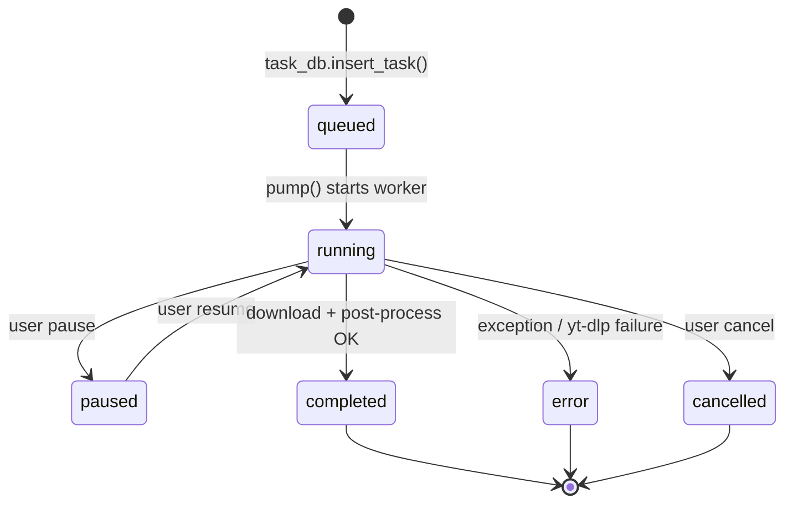

| State | Meaning | Set by |
|-------|---------|--------|
| `queued` | Waiting for a concurrency slot | `task_db.insert_task()` default |
| `running` / `downloading` | Actively downloading | `CleanLogger` via `unified_status` signal |
| `parsing` | Extracting metadata from yt-dlp | `CleanLogger.force_update("parsing", ...)` |
| `paused` | User paused or auto-paused on crash recovery | `DownloadWorker.pause()` |
| `completed` | Download finished successfully | Post-process block in `DownloadWorker.run()` |
| `error` | Download failed | Exception handlers in `run()` |
| `cancelled` | User cancelled | `DownloadCancelled` handler |

### 2.2 Two-Layer Design

**Persistent layer (SQLite):** `TaskDB` is a singleton backed by SQLite in WAL mode. It stores the `tasks` table with columns for `state`, `progress`, `status_text`, `output_path`, `file_size`, `ydl_opts_json`, etc. All state transitions that matter across sessions are persisted here.

**Ephemeral layer (Worker objects):** `DownloadWorker` is a `QThread` that holds live runtime state: `_pause_event`, `_cancel_event`, `executor`, `output_path`, `dest_paths`, `progress_val`, `status_text`. These die when the process exits.

**Bridge:** `TaskDBWriter` is a dedicated background thread with a `Queue`. The main thread never touches SQLite directly for high-frequency writes. Instead, `DownloadManager.create_worker()` wires `worker.unified_status` signal to `db_writer.enqueue_status()` using `Qt.ConnectionType.QueuedConnection` — a "single-writer bridge connection" that prevents SQLite contention.

**`effective_state` property:** This is the authoritative state resolver on `DownloadWorker`. It eliminates race conditions between `_final_state` (set by CleanLogger) and `QThread.isRunning()`:
- If the thread `isRunning()` → return `"running"` (unless CleanLogger marked it `"paused"`)
- If not running → check `_final_state` for terminal states
- If `isFinished()` but no explicit state → default to `"completed"`
- Otherwise → `"queued"`

### 2.3 Crash Recovery

On startup, `DownloadManager.load_unfinished_tasks()`:

1. Reads all rows from `task_db.get_all_tasks()`
2. Iterates in reverse chronological order
3. Skips terminal states (`completed`, `error`, `cancelled`)
4. Skips `skip_download` tasks (subtitle/cover extract) — marks them as error because their dialog context is lost
5. **Critical safety valve:** Any task in `running`/`downloading`/`parsing` state is demoted to `paused` — prevents a thundering herd of concurrent downloads on restart
6. Reconstructs `DownloadWorker` objects from persisted fields
7. Does NOT call `pump()` — waits for UI initialization

### 2.4 Worker.run() Three-Way Branch

`DownloadWorker.run()` has three mutually exclusive execution paths:

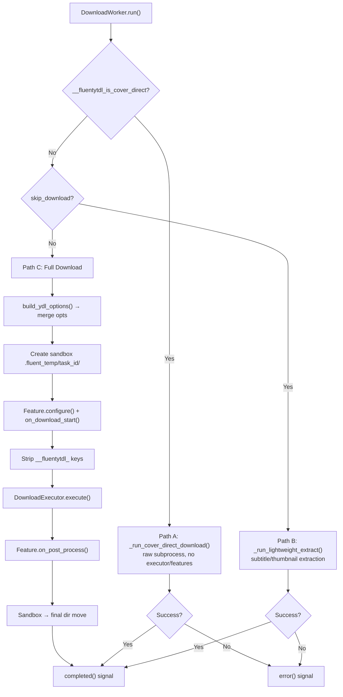

### 2.5 Exception Handling Flow

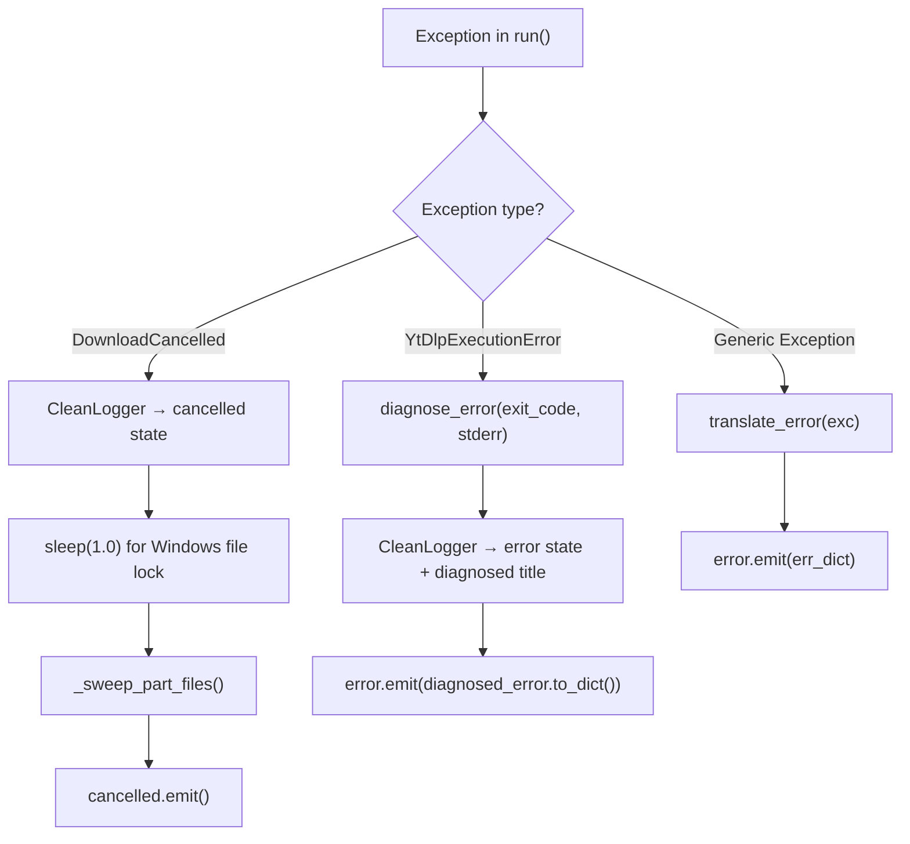

---

## 3. Concurrency Model

### 3.1 Slot-Based Scheduler

`DownloadManager` uses two data structures:

- `active_workers: list[DownloadWorker]` — all workers ever created in this session
- `_pending_workers: deque[DownloadWorker]` — FIFO queue of workers waiting for a slot

Concurrency limit is read from config at runtime (`max_concurrent_downloads`, default 3, clamped to `[1, 2_147_483_647]`).

### 3.2 The pump() Loop

The heart of the concurrency scheduler:

```python
def pump(self) -> None:
    limit = self._max_concurrent()
    while self._pending_workers and self._running_count() < limit:
        w = self._pending_workers.popleft()
        if w.isRunning() or w.isFinished():
            continue
        w.start()
    self.task_updated.emit()
```

Pops workers from the front of the deque (FIFO), checks they aren't already running/finished, and starts them. Stops when the pending queue is empty or the running count hits the limit.

### 3.3 Automatic Refill Chain

When creating a worker, `DownloadManager.create_worker()` connects the worker's `QThread.finished` signal to `_on_worker_finished`:

```
Worker finishes → _on_worker_finished() → slot freed → pump() → next queued worker starts
```

This creates the automatic refill chain. `stop_all()` clears the pending deque first (so queued tasks don't start after pausing running ones), then stops each running worker. `shutdown()` provides a configurable grace period (default 2000ms), falling back to `terminate()` if `wait()` times out, then flushes the `TaskDBWriter`.

---

## 4. Sandbox Download Pattern

### 4.1 Why Sandbox?

Direct download to the final directory leaves fragment files (`.part`, `.ytdl`) when a download is cancelled or fails. The sandbox pattern isolates all intermediate files in a per-task temp directory, keeping the user's download directory clean.

### 4.2 Lifecycle

```
Create sandbox          Download into sandbox         Move / Sweep
     │                       │                            │
     ▼                       ▼                            ▼
.fluent_temp/          yt-dlp writes               On success:
  task_{id}/           .part, .ytdl,               scan sandbox →
  ├── home: sandbox    final files                 move all non-.part
  └── temp: sandbox    all here                    files to download_dir
                                                    → rmtree sandbox

                                               On cancel:
                                                sleep(1.0) for Windows
                                                file lock release
                                                → rmtree sandbox (5 retries)
                                                → fallback: delete individual files
```

### 4.3 Key Design Decisions

| Decision | Rationale |
|----------|-----------|
| Sandbox uses DB primary key (`db_id`), not UUID | Crash recovery is deterministic — a resumed task writes to the same sandbox |
| Sandbox is subdirectory of `download_dir` | Same filesystem → atomic `shutil.move()`, no cross-device copy |
| Both `home` and `temp` paths redirected | yt-dlp fragments AND final output land in the sandbox |
| 1-second sleep before sweep on cancel | Windows holds file locks after process kill; child processes (ffmpeg) may still have handles |
| 5 retries with 0.5s delay in sweep | Additional resilience for lingering Windows file locks |
| `_clean_part_files()` for 403 recovery | Stale `.part` fragments cause yt-dlp resume to re-request expired signed URLs |

### 4.4 When Sandbox Is Bypassed

The sandbox is skipped for two download paths:
- **Cover Direct** (`__fluentytdl_is_cover_direct`): downloads a single image URL directly
- **Lightweight Extract** (`skip_download`): subtitle/cover extraction without video download

---

## 5. Feature Pipeline

### 5.1 Template Method Pattern

The base class `DownloadFeature` defines three lifecycle hooks:

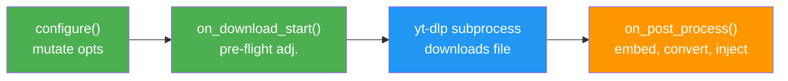

| Hook | When | Purpose |
|------|------|---------|
| `configure(ydl_opts)` | Before yt-dlp runs | Mutate the options dict (add postprocessors, set flags) |
| `on_download_start(context)` | Before yt-dlp runs | Pre-flight adjustments based on context |
| `on_post_process(context)` | After yt-dlp finishes | Post-download processing (embed, convert, inject) |

### 5.2 The 5 Features (Fixed Order)

```python
self.features = [
    SponsorBlockFeature(),   # 1. configure() only — inject sponsorblock_remove/mark
    MetadataFeature(),       # 2. configure() only — append FFmpegMetadata postprocessor
    SubtitleFeature(),       # 3. Both hooks — bilingual merge, format compat fix, embed
    ThumbnailFeature(),      # 4. on_post_process() only — embed via AtomicParsley/FFmpeg/mutagen
    VRFeature(),             # 5. on_post_process() only — EAC→Equi conversion + spatial metadata
]
```

The execution order is fixed and cannot be changed — later features depend on earlier ones having configured the options.

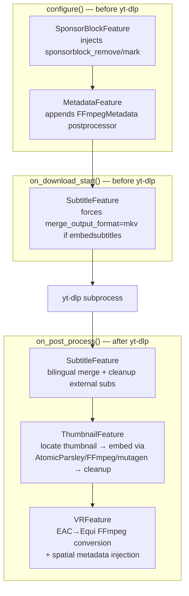


### 5.3 DownloadContext Facade

`DownloadContext` wraps the `DownloadWorker` and provides a controlled interface for features:
- `output_path` property (getter/setter)
- `dest_paths` property (read-only)
- `emit_status(msg)`, `emit_warning(msg)`, `emit_thumbnail_warning(msg)`
- `find_final_merged_file()` — locates the merged output even when `output_path` points to a fragment file (e.g., `.f136.mp4`)
- `find_thumbnail_file(video_path)` — scans for `.jpg/.jpeg/.webp/.png` variants

### 5.4 `__fluentytdl_` Prefix Convention

Internal metadata keys prefixed with `__fluentytdl_` pass application-specific flags between the UI/options layer and the feature pipeline. They are stripped from the options dict just before passing to yt-dlp:

```python
for k in list(merged.keys()):
    if isinstance(k, str) and k.startswith("__fluentytdl_"):
        merged.pop(k, None)
```

Examples: `__fluentytdl_is_cover_direct`, `__fluentytdl_use_android_vr`, `__vr_projection`, `__vr_convert_eac`, `__vr_stereo_mode`.

---

## 6. Three Download Paths

The `DownloadWorker.run()` method implements three distinct execution paths selected by option flags:

### 6.1 Path Comparison

| Aspect | Path A: Cover Direct | Path B: Lightweight Extract | Path C: Full Download |
|--------|---------------------|---------------------------|----------------------|
| Trigger | `__fluentytdl_is_cover_direct` | `skip_download` | Default |
| Purpose | Single image URL | Subtitle/thumbnail extraction | Video/audio download |
| Executor | No (raw subprocess) | No (raw subprocess) | Yes (`DownloadExecutor`) |
| Strategy | No | No | Yes (SPEED/STABLE/HARSH) |
| Sandbox | No | No | Yes (`.fluent_temp/task_{id}/`) |
| Feature Pipeline | No | No | Yes (all 5 features) |
| Progress | Minimal (50% on "Destination:") | `YtDlpOutputParser` | Full `FLUENTYTDL\|` template |
| Crash Recovery | No | No (dialog context lost) | Yes |
| Used by | Cover parsing mode | Subtitle + Cover (fallback) | Video, VR, Channel, Playlist |

### 6.2 Full Download Pipeline (Path C)

```
1. Merge with youtube_service.build_ydl_options() base options
2. Create sandbox directory (.fluent_temp/task_{id}/)
3. Feature pipeline: configure() + on_download_start() for all 5 features
4. Strip __fluentytdl_ internal keys
5. Create DownloadExecutor → execute() with progress/status/cancel callbacks
6. Feature pipeline: on_post_process() for all 5 features
7. Move files from sandbox to final directory
8. Emit completed signal
```

---

## 7. Playlist Lazy Loading Architecture

This is one of the most complex subsystems. It handles playlists (potentially thousands of entries) and channel tab listings with a multi-tier priority queue and viewport-aware scheduling.

### 7.1 Two-Phase Extraction

**Phase 1 — Flat Enumeration (fast, 2-5 seconds):**

```python
ydl_opts = {
    "extract_flat": True,      # Only enumerate, don't fetch per-entry details
    "lazy_playlist": True,     # yt-dlp lazy mode
    "skip_download": True,
}
```

Returns a flat list of entries with only basic metadata (title, id, URL, thumbnail) — no format lists, no detailed metadata.

**Phase 2 — Per-Entry Deep Extraction (lazy, on demand):**

Each entry's full metadata (formats, duration, etc.) is fetched individually by `EntryDetailWorker` via `AsyncExtractManager`. The `PlaylistScheduler` prioritizes visible rows first, then crawls the rest in the background.

### 7.2 PlaylistScheduler — Three-Tier Priority Queue

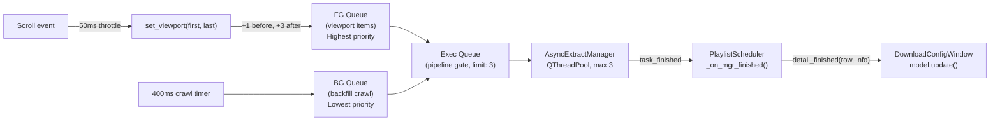

| Tier | Queue | Priority | Fed by |
|------|-------|----------|--------|
| **Foreground** | `_fg_queue` / `_fg_set` | Highest — always consumed first | `set_viewport()` + user click |
| **Exec** | `_exec_queue` / `_exec_set` | Pipeline gate (limit: 3) | `_fill_exec_queue()` from FG or BG |
| **Background** | `_bg_queue` / `_bg_set` | Lowest — consumed only when FG is empty | 400ms crawl timer |

### 7.3 Viewport-Priority Scheduling

`set_viewport(first, last)` implements lookahead:

```python
pre_first = max(0, first - 1)      # 1 row before first visible
pre_last = min(total - 1, last + 3) # 3 rows after last visible
for row in range(pre_first, pre_last + 1):
    self._enqueue(row, foreground=True)
self._pump()
```

The `_enqueue()` method handles deduplication and **promotes** rows from background to foreground if they were already queued — viewport items always preempt background work.

**URL-Based Task Identity:** Instead of row numbers (which caused row-offset bugs), the scheduler uses the entry URL as the stable `task_id`. A bidirectional mapping (`_url_to_row` / `_row_to_row`) translates between URLs and row numbers.

**Retry Logic:** On error, the scheduler automatically retries once. If the retry also fails, the row is marked as failed.

### 7.4 Data Flow — 5-Stage Pipeline

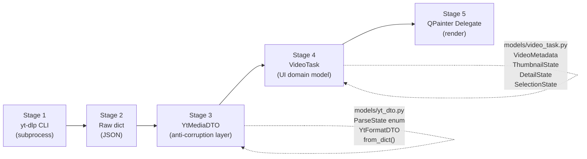

**Stage 1 — yt-dlp Subprocess:** CLI invocation via `run_dump_single_json()`. For flat playlist: `--flat-playlist --lazy-playlist --dump-single-json`.

**Stage 2 — Raw Dict:** JSON dict with `entries` array. Each entry is a partial dict (no `formats` in flat mode).

**Stage 3 — YtMediaDTO (Anti-Corruption Layer):** `YtMediaDTO.from_dict()` converts raw dicts into typed DTOs. `ParseState` enum tracks extraction depth: `FLAT` (title/thumbnail only), `FETCHING` (deep request in progress), `READY` (formats available).

**Stage 4 — VideoTask (UI Domain Model):** Uses composition with sub-dataclasses:
- `VideoMetadata` — lightweight for initial list rendering
- `ThumbnailState` — URL and cache status
- `DetailState` — heavy state (formats, DTO reference, status: idle/loading/ready/error)
- `SelectionState` — user's local selection (checkbox, custom format override)

**Stage 5 — PlaylistListModel + QPainter Delegate:** `PlaylistListModel` stores `VideoTask` objects. `PlaylistItemDelegate` reads tasks via `TaskObjectRole` and paints them directly with QPainter.

### 7.5 Chunked Model Population

Playlist entries are added to the model in chunks of 30:

```python
self._build_chunk_size = 30
# Each chunk: QTimer.singleShot(0, self._process_next_build_chunk)
# Yields to event loop between chunks → UI stays responsive
```

After all chunks complete:
1. Create `PlaylistScheduler` via `_setup_scheduler()`
2. Start thumbnail loading
3. Schedule initial viewport scan after 50ms
4. Start background crawl after 200ms

### 7.6 Dirty Row Debouncing

`PlaylistListModel` uses a leading-edge debounce pattern:

```python
_dirty_rows: set[int]     # Accumulated dirty rows
_update_timer: QTimer     # 200ms single-shot

def mark_row_dirty(row):
    self._dirty_rows.add(row)
    if not self._update_timer.isActive():
        self._update_timer.start()  # Leading edge: first mark starts the window

def _flush_updates():
    rows = sorted(self._dirty_rows)
    # Merge contiguous rows into minimal dataChanged ranges
    # 50 dirty rows → ~3-5 dataChanged signals
```

Even if 50 rows update within 200ms, the view receives at most a handful of `dataChanged` signals covering contiguous ranges.

### 7.7 Deferred Parsing Indicator

To avoid the "pending → loading → format" triple-flash for fast extractions:

```python
def _schedule_deferred_parsing_indicator(self, row):
    def _apply():
        if self._scheduler and (self._scheduler.is_loaded(row) or self._scheduler.is_failed(row)):
            return  # Already done, skip the loading indicator
        self._set_row_parsing(row, True)
    QTimer.singleShot(800, _apply)  # Only show "loading" if extraction takes >800ms
```

### 7.8 QPainter Delegates

All list items are rendered with QPainter, not per-row QWidget instances. This avoids `QScrollArea` allocating multiple full QWidget instances per row, which causes high memory usage and freezes.

```
PlaylistItemDelegate (playlist_delegate.py)
├── paint() pipeline:
│   1. Clear background (WA_OpaquePaintEvent)
│   2. Card background (Fluent Design colors, selected/hover/default)
│   3. Checkbox (custom Fluent-style, no QCheckBox widget)
│   4. Thumbnail (rounded rect clip, pixmap cache with pre-scaled cache)
│   5. Text info (title bold 14px elided, metadata 12px)
│   6. Action button (status badge: loading/error/pending/format string)
├── sizeHint(): fixed 108px height (MARGIN*2 + THUMB_HEIGHT)
└── hit_test(): returns "checkbox" / "action_btn" / "row"
```

Three delegates follow this pattern: `PlaylistItemDelegate`, `HistoryItemDelegate`, `DownloadItemDelegate`.

### 7.9 Channel vs Playlist

At the scheduler level, there is no difference — both use the identical `PlaylistScheduler`, `AsyncExtractManager`, `EntryDetailWorker`, and `PlaylistListModel`. The differences exist only at the UI layer:

| Aspect | Channel | Playlist |
|--------|---------|----------|
| URL normalization | Appends `/videos` or `/shorts` | None |
| Tab combo | Videos / Shorts (reloads with different suffix) | None |
| Sort combo | Newest / Oldest (`--playlist-reverse`) | None |
| Reload capability | Yes (clears model, re-requests URL) | No |
| Detection | `UrlValidator.is_channel_url()` | `_type == "playlist"` in response |

---

## 8. Cookie & Auth Lifecycle

### 8.1 CookieSentinel — 4 Phases

CookieSentinel is a thread-safe singleton that manages the single canonical `bin/cookies.txt` file:

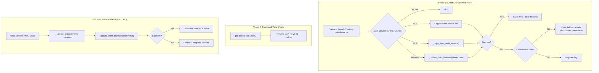

### 8.2 Lazy Cleanup Pattern

The core design principle: **never delete old cookies until new extraction succeeds**.

- `_clear_cookie_and_meta()` exists but is **never called** in the normal flow
- `validate_source_consistency()` only returns a status tuple — explicitly does NOT force cleanup
- On extraction failure, if an old cookie file exists from a different source, enters **fallback mode** rather than deleting
- A `.txt.meta` sidecar file records source browser, extraction timestamp, and cookie count for mismatch detection

### 8.3 DLE vs WebView2 Providers

| Aspect | DLE Provider | WebView2 Provider |
|--------|-------------|-------------------|
| Mechanism | Temporary Chrome extension injected into clean browser | pywebview with Edge WebView2 backend |
| Process model | Same process (subprocess.Popen) | Dual-process (multiprocessing.Process + Queue) |
| Profile | Isolated `--user-data-dir` | Persistent WebView2 cache (`private_mode=False`) |
| Login detection | Polls local HTTP server for cookie POST | Polls `LOGIN_INFO` cookie presence |
| Status | Legacy | Current (replaces DLE) |

### 8.4 POT Manager — 3-Level Progressive Recovery

POTManager manages the `bgutil-ytdlp-pot-provider` subprocess for PO Token generation (bypassing YouTube bot detection):

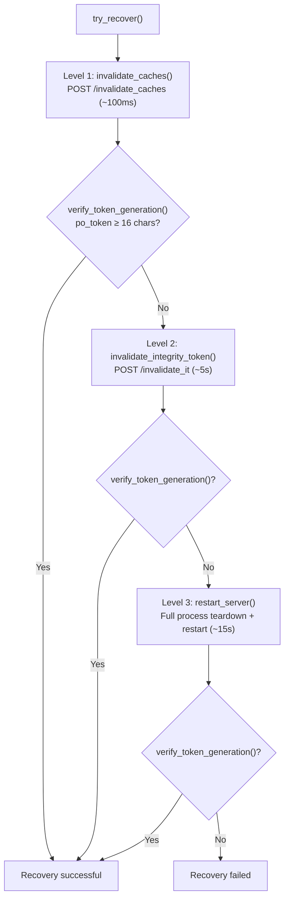

`try_recover()` implements the escalation ladder. After each step, it calls `verify_token_generation()` which validates the response contains a `po_token` of at least 16 characters.

**Health verification layers:**
- L0: `is_running()` — checks if process is alive via `poll()`
- L1: `verify_token_generation()` — POST `/get_pot`, validates token length
- L2: `check_minter_health()` — GET `/minter_cache`, checks BotGuard minter initialization
- Composite: `get_health_status()` — returns all three levels plus human-readable summary

**Windows Job Object:** The POT provider subprocess is assigned to a Job Object with `JOB_OBJECT_LIMIT_KILL_ON_JOB_CLOSE`. If FluentYTDL crashes, the OS automatically kills the POT provider — no zombie servers.

---

## 9. Error Diagnosis Engine

### 9.1 Three-Tier Expert System

`diagnose_error()` in `utils/error_parser.py` implements:

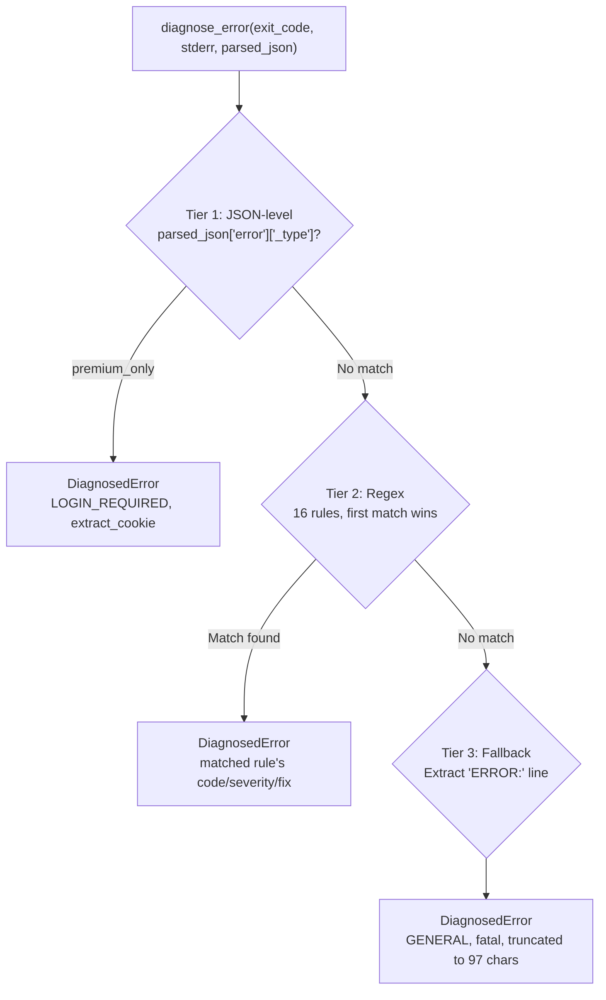

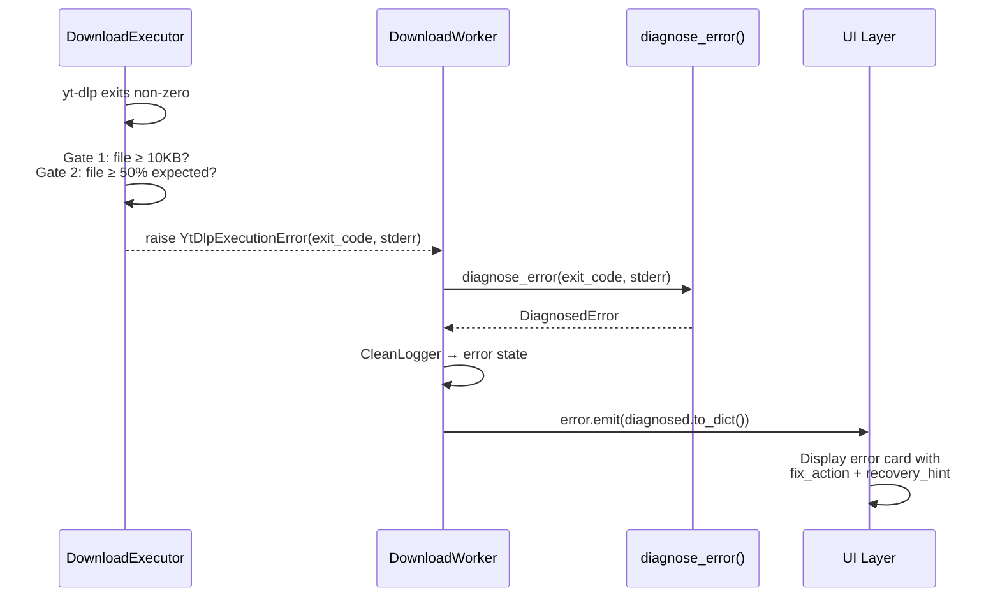

### 9.2 The 16 Error Rules

| # | Pattern | ErrorCode | Severity | Fix Action |
|---|---------|-----------|----------|------------|
| 1 | Bot detection / PO Token | POTOKEN_FAILURE | fatal | — |
| 2 | Members-only content | LOGIN_REQUIRED | fatal | extract_cookie |
| 3 | Age-restricted | LOGIN_REQUIRED | fatal | extract_cookie |
| 4 | Private video | LOGIN_REQUIRED | fatal | — |
| 5 | "Sign in to confirm" | LOGIN_REQUIRED | recoverable | extract_cookie |
| 6 | Connection reset/refused/timeout | NETWORK_ERROR | recoverable | — |
| 7 | SSL certificate errors | NETWORK_ERROR | fatal | — |
| 8 | DNS resolution failures | NETWORK_ERROR | fatal | — |
| 9 | HTTP 429 rate limiting | RATE_LIMITED | warning | — |
| 10 | Proxy connection failures | NETWORK_ERROR | recoverable | switch_proxy |
| 11 | HTTP 403 / forbidden | HTTP_ERROR | recoverable | — |
| 12 | Geo-restriction | GEO_RESTRICTED | fatal | switch_proxy |
| 13 | Premiere not started | FORMAT_UNAVAILABLE | warning | — |
| 14 | Format unavailable | FORMAT_UNAVAILABLE | warning | — |
| 15 | Missing FFmpeg | EXTRACTOR_ERROR | fatal | — |
| 16 | Disk full | DISK_FULL | fatal | — |

### 9.3 Error Code Model

```python
class ErrorCode(IntEnum):
    SUCCESS = 0
    GENERAL = 1
    LOGIN_REQUIRED = 2
    FORMAT_UNAVAILABLE = 3
    HTTP_ERROR = 4
    NETWORK_ERROR = 5
    GEO_RESTRICTED = 6
    EXTRACTOR_ERROR = 7
    POTOKEN_FAILURE = 8
    RATE_LIMITED = 9
    COOKIE_EXPIRED = 10
    DISK_FULL = 11
    UNKNOWN = 99
```

`DiagnosedError` is a dataclass with `code`, `severity`, `user_title`, `user_message`, `fix_action`, `technical_detail`, `recovery_hint`. It serializes via `to_dict()`/`from_dict()` for transmission across Qt Signal boundaries.

### 9.4 Probe Functions

| Function | Purpose |
|----------|---------|
| `probe_youtube_connectivity()` | HEAD request to youtube.com, respects proxy config |
| `_run_ytdlp_probe()` | Runs yt-dlp `--dump-json` with 12-hour cooldown per link |
| `probe_cookie_and_ip()` | Two-phase probe: with cookies, then without → determines if cookie-specific or IP-level |
| `probe_ip_risk_control()` | Cookie-less probe to detect IP-level blocking |

---

## 10. Six Parsing Flows

### 10.1 Flow Comparison Table

| Aspect | Video | VR | Channel | Playlist | Subtitle | Cover |
|--------|-------|-----|---------|----------|----------|-------|
| UI Page | ParsePage | VRParsePage | ChannelParsePage | ParsePage (auto) | SubtitleDownloadPage | CoverDownloadPage |
| ConfigWindow mode | `"default"` | `"vr"` | `"default"` | `"default"` | `"subtitle"` | `"cover"` |
| Extract Worker | InfoExtract | VRInfoExtract | InfoExtract | InfoExtract | InfoExtract | InfoExtract |
| yt-dlp client | Default | `android_vr` | Default | Default | Default | Default |
| Cookies | Yes | **No** | Yes | Yes | Yes | Yes/No |
| Sandbox | Yes | Yes | Yes | Yes | **No** | **No** |
| Feature Pipeline | Full | Full + VR | Full (per entry) | Full (per entry) | **None** | **None** |
| Download Path | C (Full) | C (Full) | C (Full) | C (Full) | B (Lightweight) | A or B |
| Final Output | Video file | Video + VR metadata | Video files (batch) | Video files (batch) | Subtitle files | Image file |

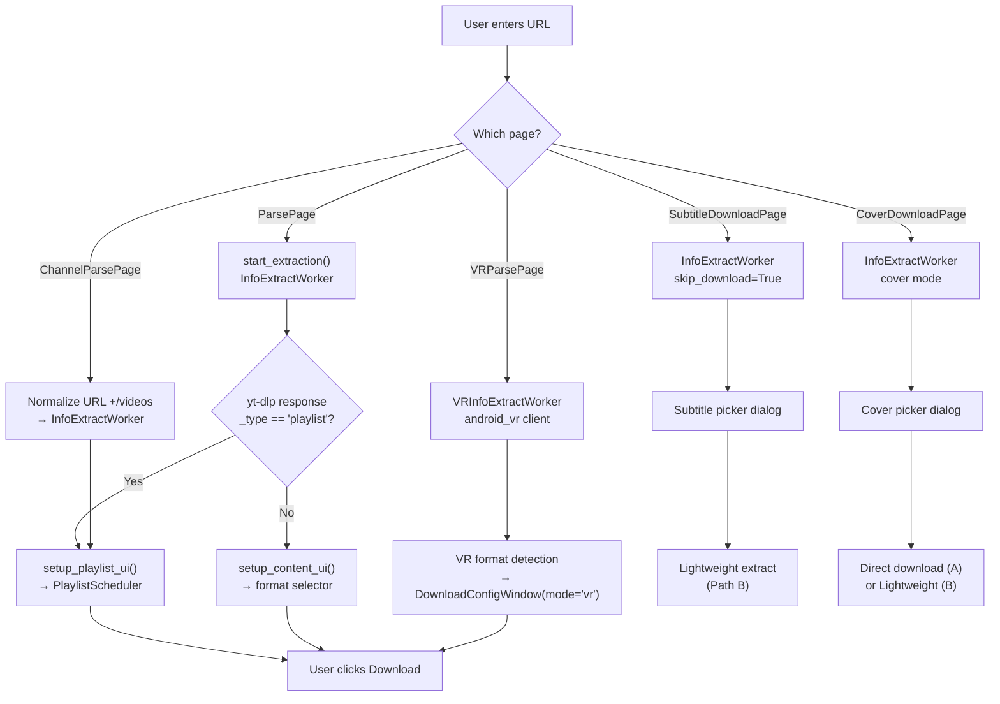

### 10.2 Video Parsing

- **Entry**: `ParsePage` → `show_selection_dialog(url)` → `DownloadConfigWindow(mode="default")`
- **Worker**: `InfoExtractWorker` → `YoutubeService.extract_info_for_dialog_sync()`
- **yt-dlp options**: `--flat-playlist --lazy-playlist`, default client, cookies via Cookie Sentinel
- **Playlist auto-detect**: If `_type == "playlist"` in response → branches to `setup_playlist_ui()`
- **Selector widget**: `VideoFormatSelectorWidget`
- **Download path**: `DownloadExecutor` with full sandbox mode
- **Key files**: `parse_page.py`, `download_config_window.py:956`, `workers.py:390`

### 10.3 VR Parsing

- **Entry**: `VRParsePage` → `show_vr_selection_dialog(url)` → `DownloadConfigWindow(mode="vr", vr_mode=True, smart_detect=True)`
- **Worker**: `VRInfoExtractWorker` → `YoutubeService.extract_vr_info_sync()`
- **yt-dlp options**: `player_client=["android_vr"]`, `--no-playlist`, **NO cookies** (android_vr unsupported)
- **VR detection**: `_detect_vr_projection(info)` annotates each format with `__vr_projection` and `__vr_stereo_mode`
- **Post-processing**: Full pipeline + `VRFeature` (always active):
  - EAC → Equirectangular conversion via ffmpeg `v360=eac:e` filter
  - GPU acceleration (NVENC/QSV/AMF) or CPU (libx264)
  - Spatial metadata injection for MP4/MOV via `metadata_utils.inject_metadata()`
- **Key files**: `vr_parse_page.py`, `youtube_service.py:1229`, `features.py:308`

### 10.4 Channel Parsing

- **Entry**: `ChannelParsePage` → `_show_channel_dialog(url)` → normalizes URL (appends `/videos`) → `show_selection_dialog(normalized_url)`
- **Worker**: `InfoExtractWorker` (same as video)
- **yt-dlp options**: Same as video, URL has `/videos` suffix → yt-dlp treats it as channel tab listing
- **UI differences**:
  - Tab combo: Videos / Shorts (`_on_channel_tab_changed` reloads with `/shorts`)
  - Sort combo: Newest / Oldest (`--playlist-reverse`)
  - `PlaylistScheduler` lazy-loads entry details on scroll via `EntryDetailWorker`
- **Key files**: `channel_parse_page.py`, `reimagined_main_window.py:585`

### 10.5 Playlist Parsing

- **Entry**: `ParsePage` (same as video) — playlist detected by `_type == "playlist"` in yt-dlp response
- **Worker**: `InfoExtractWorker` (same as video)
- **UI differences**:
  - Batch action toolbar (select all, presets, type combo)
  - `PlaylistScheduler` lazy-loads entry details on scroll
  - No channel-specific tab/sort controls
- **Key files**: `download_config_window.py:1053` (playlist detection logic)

### 10.6 Standalone Subtitle Parsing

- **Entry**: `SubtitleDownloadPage` → `show_subtitle_selection_dialog(url)` → `DownloadConfigWindow(mode="subtitle")`
- **yt-dlp options**: `skip_download=True`, `writesubtitles`/`writeautomaticsub`, `subtitleslangs`, `convertsubtitles`
- **Download path**: `_run_lightweight_extract()` — **bypasses Executor/Strategy/Feature pipeline entirely**
- **Post-processing**: **None** — .srt/.vtt/.ass files are the final output
- **Key files**: `subtitle_download_page.py`, `workers.py:635`

### 10.7 Standalone Cover Parsing

- **Entry**: `CoverDownloadPage` → `show_cover_selection_dialog(url)` → `DownloadConfigWindow(mode="cover")`
- **Two download paths**:
  - **Path A** — Direct image URL: `_run_cover_direct_download()` (most minimal: no cookie, no ffmpeg, no extractor-args)
  - **Path B** — Fallback: `_run_lightweight_extract()` (same as subtitle mode)
- **Post-processing**: **None** — image file is the final output
- **Key files**: `cover_download_page.py`, `workers.py:836`

---

## 11. Progress Parsing

`DownloadExecutor` uses custom `--progress-template` strings that output structured lines prefixed with `FLUENTYTDL|`:

```
FLUENTYTDL|download|<downloaded>|<total>|<estimate>|<speed>|<eta>|<vcodec>|<acodec>|<ext>|<filename>
FLUENTYTDL|postprocess|<status>|<postprocessor>
```

`CleanLogger` transforms raw progress into unified `(state, percent, message)` triples with multi-stream phase tracking:
- Video stream: 0%-50% of overall progress
- Audio stream: 50%-95%
- Post-processing: 95%-99%
- Single stream (muxed): 0%-95%

## 12. Non-Zero Exit Validation

When yt-dlp exits with non-zero return code, the executor performs a two-gate validity check:

- **Gate 1**: File exists and is ≥ 10 KB (handles Windows `.part-Frag` deletion failure)
- **Gate 2**: File is ≥ 50% of expected total size (prevents treating truncated downloads as successes)

If both gates pass, the non-zero exit code is logged as a warning but the download is considered successful.

---

## 13. Thread Model

| Thread | Purpose | Lifetime |
|--------|---------|----------|
| Main thread | Qt event loop, UI updates | App lifetime |
| DownloadWorker (QThread) | One per concurrent download (max 3) | Per task |
| InfoExtractWorker (QThread) | Metadata extraction for UI | Per extraction |
| VRInfoExtractWorker (QThread) | VR-specific extraction | Per VR extraction |
| EntryDetailWorker (QThread) | Deep playlist entry extraction | Per entry |
| MetadataFetchRunnable (QRunnable) | Wraps EntryDetailWorker for QThreadPool | Per entry |
| QThreadPool | Concurrent metadata fetch for playlists | App lifetime |
| TaskDBWriter | Async SQLite writes | App lifetime |
| CookieSentinel-SilentRefresh | Startup cookie pre-extract | One-shot daemon |
| Subprocesses | yt-dlp.exe, ffmpeg.exe, AtomicParsley.exe | Per operation |

---

## 14. Startup Flow

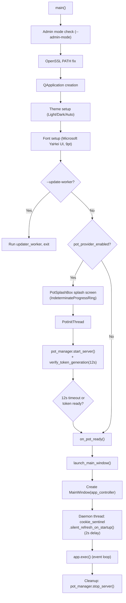

---

## 15. Dependencies

```
Foundation (no internal deps):
  utils.logger, utils.paths, utils.formatters, utils.validators,
  models.errors, models.subtitle_config

Core infrastructure:
  core.config_manager → models.subtitle_config, utils.paths
  core.dependency_manager → utils.logger, utils.paths

Service layer:
  auth.* → utils.*, core.config_manager
  youtube.* → core.config_manager, auth.*, utils.*
  download.* → core.config_manager, youtube.*, storage.*, models.*, processing.*, utils.*
  processing.* → core.config_manager, utils.*
  storage.* → utils.paths

UI layer:
  ui.* → depends on all service layers
  download_config_window.py is the most coupled component (~3600 lines, imports from nearly every package)
```

---

## 16. Configuration

| File | Purpose | Format |
|------|---------|--------|
| `config.json` | User settings (download_dir, max_concurrent, proxy, cookie browser, theme) | JSON |
| `task_db` (SQLite WAL) | Full task lifecycle persistence, crash recovery | SQLite |

External tools resolved by `DependencyManager`:
- `yt-dlp` — priority: config path > bundled `_internal/yt-dlp/yt-dlp.exe` > PATH
- `ffmpeg` — priority: bundled > PATH
- JS runtime — priority: bundled deno > PATH deno > winget deno > PATH node > PATH bun > PATH quickjs

---

## 17. Process Management on Windows

| Component | Mechanism | File |
|-----------|-----------|------|
| yt-dlp process tree | `taskkill /F /T /PID` (kills entire tree including ffmpeg children) | `executor.py:636` |
| POT provider orphan prevention | Windows Job Object with `JOB_OBJECT_LIMIT_KILL_ON_JOB_CLOSE` | `pot_manager.py:62` |
| WebView2 subprocess cleanup | `terminate()` → `join(5)` → `kill()` | `webview2_provider.py:416` |
| Sandbox file sweep | `rmtree` with 5 retries at 0.5s intervals for file lock release | `workers.py:334` |
| Cancel delay | 1-second sleep before sweep for Windows file lock release | `workers.py:599` |

---

## 18. Singleton Interaction Map

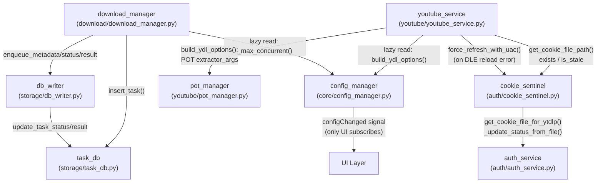

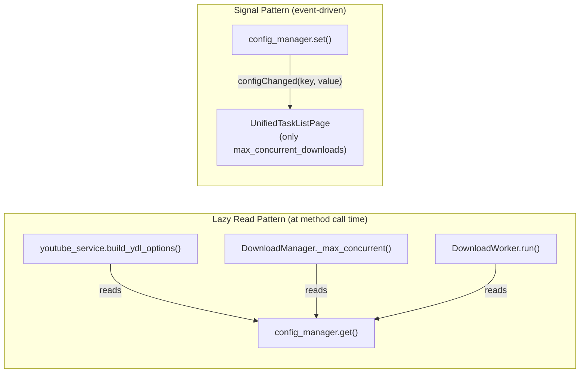

---

## 19. Signal Topology

### 19.1 DownloadWorker Signals

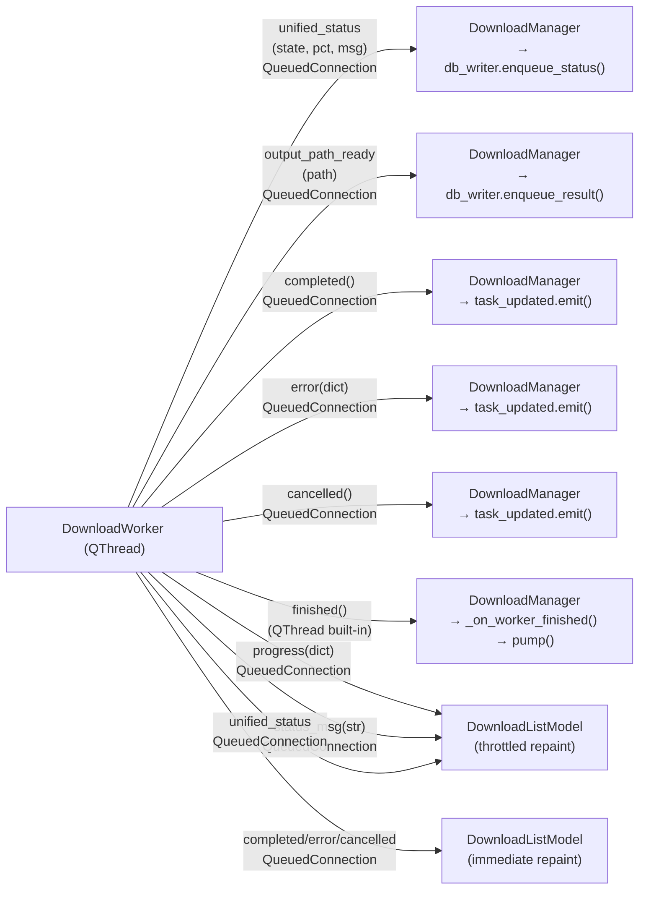

### 19.2 Playlist Signal Chain

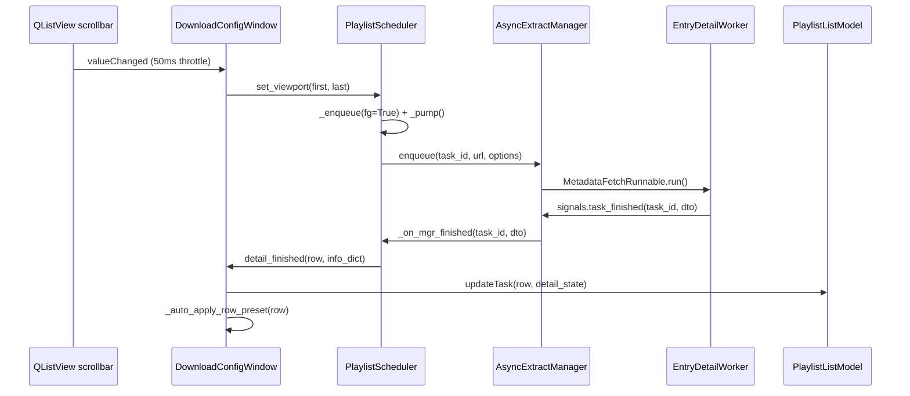

### 19.3 Parse → Download Signal Chain

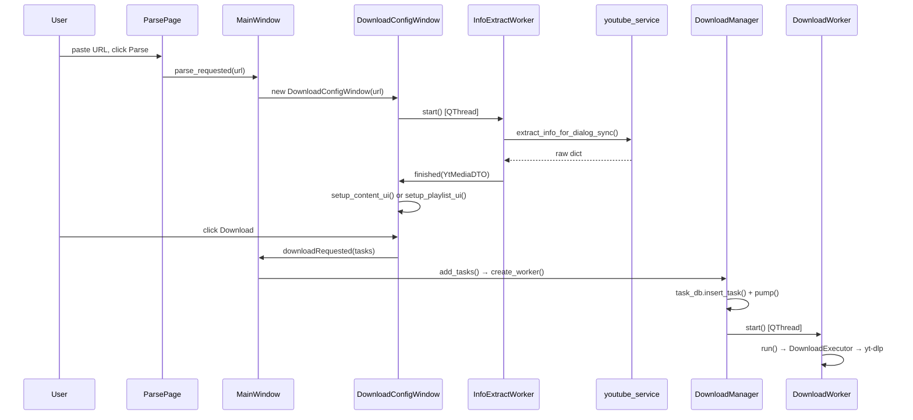
