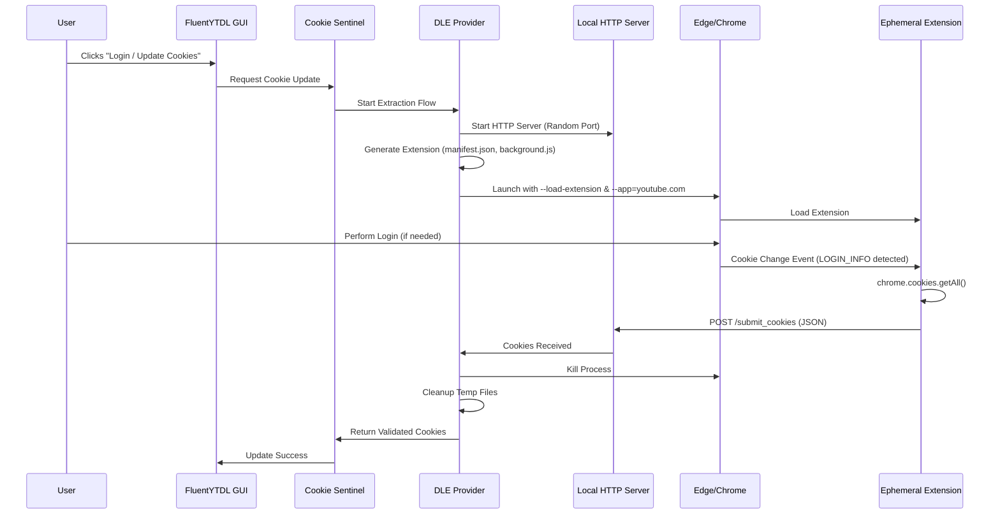

# Dynamic Local Extension (DLE) Integration Design

## 1. Overview

The **Dynamic Local Extension (DLE)** scheme is a novel approach to extract authentication cookies from YouTube/Google. It bypasses recent security enhancements in Chromium-based browsers (like App-Bound Encryption in Chromium 130+) and avoids the risk control issues associated with CDP (Chrome DevTools Protocol) debugging.

**Core Concept**: 
Instead of inspecting the browser from the outside (CDP/SQLite), we inject a temporary, benign browser extension that uses official APIs (`chrome.cookies`) to read cookies and send them to a local receiver.

## 2. Architecture

The DLE system consists of four main components:

1.  **Cookie Sentinel (Manager)**: The existing coordination layer in FluentYTDL.
2.  **DLE Provider**: A new provider implementation responsible for the DLE workflow.
3.  **Local Receiver**: A temporary HTTP server to receive cookie data.
4.  **Ephemeral Extension**: A dynamically generated browser extension.



## 3. Component Design

### 3.1. DLE Provider (`src/fluentytdl/auth/providers/dle_provider.py`)

This class implements the `CookieProvider` interface (if one exists, or simply provides the extraction method).

*   **Responsibilities**:
    *   Orchestrate the entire flow.
    *   Manage temporary directories for the extension.
    *   Manage the browser process (subprocess).
    *   Handle timeouts (e.g., user doesn't login in 5 minutes).
    *   Convert received cookies to Netscape format.

### 3.2. Local Receiver (`src/fluentytdl/auth/server.py`)

A lightweight HTTP server based on `http.server`.

*   **Features**:
    *   Binds to `127.0.0.1` only.
    *   Uses a random ephemeral port.
    *   Single endpoint: `POST /submit_cookies`.
    *   Validates payload structure before accepting.
    *   Uses `threading.Event` to signal completion to the main thread.

### 3.3. Extension Generator (`src/fluentytdl/auth/extension_gen.py`)

Responsible for creating the extension files on the fly.

*   **`manifest.json`**:
    *   Permissions: `["cookies"]`
    *   Host Permissions: `["*://*.youtube.com/*", "*://*.google.com/*"]`
    *   Background Service Worker: `background.js`
*   **`background.js`**:
    *   Contains the logic to listen for `chrome.cookies.onChanged`.
    *   Filters for `LOGIN_INFO` on `youtube.com`.
    *   Fetches all cookies from `youtube.com` and `google.com`.
    *   Sends data to `http://127.0.0.1:{PORT}/submit_cookies`.

### 3.4. Browser Controller

Logic to locate and launch the browser.

*   **Supported Browsers**: Edge (Priority), Chrome.
*   **Launch Arguments**:
    *   `--no-first-run`
    *   `--no-default-browser-check`
    *   `--load-extension={temp_extension_path}`
    *   `--user-data-dir={profile_path}` (Separate profile to avoid conflicts, or main profile if safe/needed)
    *   `--app=https://www.youtube.com` (Launch in app mode for cleaner look)

## 4. Security & Privacy

*   **Zero Risk Control**: The browser runs in standard user mode. No `--remote-debugging-port` is used. Google sees a standard browser instance.
*   **Data Purity**: We use `chrome.cookies.getAll`, which returns the *active, valid* cookies as seen by the browser, bypassing any encryption at rest issues (App-Bound Encryption).
*   **Ephemeral Existence**:
    *   The extension exists only for the duration of the login session.
    *   The HTTP server runs only during the extraction phase.
    *   Temp files are securely deleted immediately after use.

## 5. Integration Plan

### Phase 1: Core Implementation (Current Status: PoC Verified)
- [x] Verify feasibility with PoC script.
- [ ] Port `poc_dle.py` logic into `src/fluentytdl/auth/providers/dle_provider.py`.
- [ ] Implement robust error handling (browser not found, port conflict, timeout).

### Phase 2: Sentinel Integration
- [ ] Update `CookieSentinel` to use `DLEProvider` as the primary extraction method.
- [ ] Add fallback logic (though DLE is expected to be the primary robust solution).

### Phase 3: GUI Updates
- [ ] Update the "Login" button behavior to trigger the DLE flow.
- [ ] Add a progress indicator in the UI ("Waiting for browser login...").
- [ ] Show success/failure notifications.

## 6. Implementation Details (Python)

### Directory Structure
```
src/fluentytdl/auth/
├── __init__.py
├── cookie_manager.py       # Existing manager
├── cookie_sentinel.py      # Existing sentinel
├── providers/
│   ├── __init__.py
│   └── dle_provider.py     # NEW: Main DLE logic
├── server.py               # NEW: HTTP Receiver
└── extension_gen.py        # NEW: Extension generator
```

### Key Dependencies
*   Standard library only (`http.server`, `json`, `subprocess`, `tempfile`, `threading`, `pathlib`).
*   No external heavy dependencies (like Selenium or Playwright).

## 7. Fallback & Edge Cases

*   **Browser Not Found**: Prompt user to install Edge or Chrome, or specify path.
*   **User Closes Window**: Detect process exit and abort cleanly.
*   **Timeout**: If no cookies received in N minutes, stop server and warn user.
*   **Port Conflict**: Retry with a different random port.
