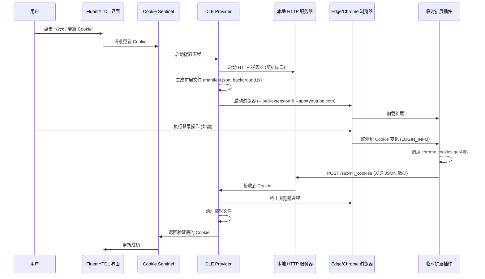

# 动态本地插件注入法 (DLE) 集成方案设计

## 1. 概述

**动态本地插件注入法 (Dynamic Local Extension, DLE)** 是一种从 YouTube/Google 提取认证 Cookie 的创新方案。它成功绕过了 Chromium 内核浏览器近期引入的安全增强功能（如 Chromium 130+ 的 App-Bound Encryption），并彻底规避了 CDP (Chrome DevTools Protocol) 调试模式带来的风控问题。

**核心理念**：
不从外部（CDP/SQLite）窥探浏览器，而是向浏览器注入一个临时的、无害的本地扩展插件。该插件利用浏览器官方提供的 API (`chrome.cookies`) 读取 Cookie，并将其发送回本地接收器。

## 2. 架构

DLE 系统由四个主要组件构成：

1.  **Cookie Sentinel (哨兵/管理器)**：FluentYTDL 现有的协调层。
2.  **DLE Provider (提供者)**：负责 DLE 工作流的具体实现。
3.  **Local Receiver (本地接收器)**：用于接收 Cookie 数据的临时 HTTP 服务器。
4.  **Ephemeral Extension (临时扩展)**：动态生成的浏览器扩展插件。



## 3. 组件设计

### 3.1. DLE Provider (`src/fluentytdl/auth/providers/dle_provider.py`)

该类实现 `CookieProvider` 接口（若存在），或作为主要的提取方法。

*   **职责**：
    *   编排整个提取流程。
    *   管理扩展文件的临时目录。
    *   管理浏览器进程（subprocess）。
    *   处理超时（例如：用户 5 分钟内未登录）。
    *   将接收到的 Cookie 转换为 Netscape 格式。

### 3.2. 本地接收器 (`src/fluentytdl/auth/server.py`)

基于 `http.server` 的轻量级 HTTP 服务器。

*   **特性**：
    *   仅绑定 `127.0.0.1`，确保安全。
    *   使用随机临时端口。
    *   单一端点：`POST /submit_cookies`。
    *   接收前验证数据载荷结构。
    *   使用 `threading.Event` 向主线程发送完成信号。

### 3.3. 扩展生成器 (`src/fluentytdl/auth/extension_gen.py`)

负责动态创建扩展文件。

*   **`manifest.json`**:
    *   权限：`["cookies"]`
    *   主机权限：`["*://*.youtube.com/*", "*://*.google.com/*"]`
    *   后台服务 Worker：`background.js`
*   **`background.js`**:
    *   包含监听 `chrome.cookies.onChanged` 的逻辑。
    *   过滤 `youtube.com` 域下的 `LOGIN_INFO` Cookie。
    *   获取 `youtube.com` 和 `google.com` 的所有 Cookie。
    *   将数据发送至 `http://127.0.0.1:{PORT}/submit_cookies`。

### 3.4. 浏览器控制器

负责定位和启动浏览器的逻辑。

*   **浏览器选择策略**：
    1.  **系统默认**：自动检测系统中安装的默认浏览器（Edge, Chrome, Firefox 等 Chrome 内核浏览器）。
    2.  **用户指定**：在设置页中允许用户手动指定浏览器可执行文件路径，以覆盖自动检测。
*   **支持范围**：
    *   Microsoft Edge (Windows 默认推荐)
    *   Google Chrome
    *   其他 Chromium 内核浏览器 (Brave, Vivaldi 等，需验证兼容性)
*   **启动参数**：
    *   `--no-first-run`
    *   `--no-default-browser-check`
    *   `--load-extension={temp_extension_path}`
    *   `--user-data-dir={profile_path}` (使用独立配置文件避免冲突，或在安全/需要时使用主配置文件)
    *   `--app=https://www.youtube.com` (应用模式启动，界面更简洁)

## 4. 安全与隐私

*   **零风控**：浏览器运行在标准用户模式下。不使用 `--remote-debugging-port`。Google 只能看到一个标准的浏览器实例。
*   **数据纯净**：我们使用 `chrome.cookies.getAll`，获取的是浏览器视角的*活跃、有效* Cookie，直接绕过了静态文件加密 (App-Bound Encryption) 问题。
*   **临时存在**：
    *   扩展插件仅在登录会话期间存在。
    *   HTTP 服务器仅在提取阶段运行。
    *   临时文件用完即焚，立即安全删除。

## 5. 集成计划

### 阶段 1: 核心实现 (当前状态: PoC 验证通过)
- [x] 使用 PoC 脚本验证可行性。
- [ ] 将 `poc_dle.py` 的逻辑移植到 `src/fluentytdl/auth/providers/dle_provider.py`。
- [ ] 实现健壮的错误处理（未找到浏览器、端口冲突、超时）。

### 阶段 2: Sentinel 集成
- [ ] 更新 `CookieSentinel`，将 `DLEProvider` 设为主要提取方式。
- [ ] 添加回退逻辑（尽管 DLE 预计将是主要且稳健的方案）。

### 阶段 3: GUI 更新
- [ ] 更新 "设置" -> "账号验证" 页面：
    - 添加 "Cookie 来源" 选项组。
    - 新增 "登录获取" 选项（作为推荐默认值）。
    - 添加 "自定义浏览器路径" 输入框（高级选项，默认为空，即使用系统默认）。
- [ ] 更新 "登录" 按钮行为以触发 DLE 流程。
- [ ] 在 UI 中添加进度指示器 ("正在等待浏览器登录...")。
- [ ] 显示成功/失败通知。

## 6. 实现细节 (Python)

### 目录结构
```
src/fluentytdl/auth/
├── __init__.py
├── cookie_manager.py       # 现有管理器
├── cookie_sentinel.py      # 现有哨兵
├── providers/
│   ├── __init__.py
│   └── dle_provider.py     # 新增: DLE 核心逻辑
├── server.py               # 新增: HTTP 接收器
└── extension_gen.py        # 新增: 扩展生成器
```

### 关键依赖
*   仅使用标准库 (`http.server`, `json`, `subprocess`, `tempfile`, `threading`, `pathlib`)。
*   无需任何沉重的外部依赖（如 Selenium 或 Playwright）。

## 7. 兜底与边界情况

*   **未找到浏览器**：提示用户安装 Edge 或 Chrome，或指定路径。
*   **用户关闭窗口**：检测进程退出并清理退出。
*   **超时**：如果 N 分钟内未收到 Cookie，停止服务器并警告用户。
*   **端口冲突**：自动重试使用不同的随机端口。
