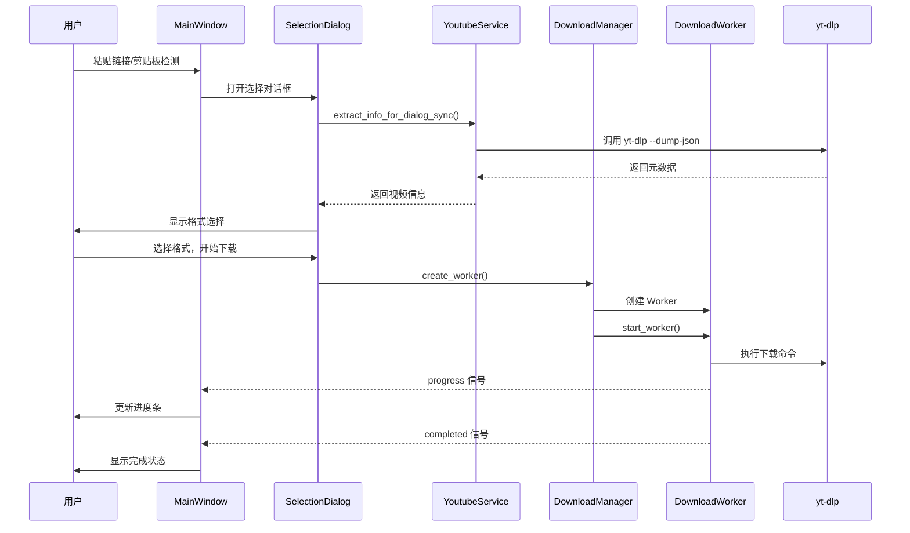

# FluentYTDL 项目架构文档

> 一个现代、流畅、轻量的 YouTube/视频下载器

---

## 📁 项目总览

FluentYTDL 是一个基于 Python + PySide6 的桌面视频下载客户端，采用 Fluent Design 设计风格，提供现代化的用户体验。

### 技术栈

| 组件 | 技术 |
|------|------|
| UI 框架 | PySide6 + QFluentWidgets |
| 下载核心 | yt-dlp (CLI 调用) |
| 媒体处理 | FFmpeg |
| JavaScript 运行时 | Deno/Node.js (用于 YouTube 签名解析) |
| 身份验证 | rookiepy (浏览器 Cookie 提取) |

---

## 🏗️ 目录结构

```
FluentYTDL/
├── main.py                     # 程序入口
├── src/fluentytdl/            # 主代码目录
│   ├── core/                  # 核心业务逻辑
│   ├── download/              # 下载模块 (任务队列、工作线程)
│   ├── processing/            # 媒体处理 (音频、字幕、SponsorBlock)
│   ├── auth/                  # 身份验证模块
│   ├── channel/               # 频道管理模块
│   ├── youtube/               # YouTube 服务封装
│   ├── ui/                    # 用户界面
│   │   ├── components/        # UI 组件库
│   │   ├── dialogs/           # 对话框
│   │   ├── pages/             # 页面
│   │   └── settings/          # 设置页面
│   ├── utils/                 # 工具函数
│   ├── models/                # 数据模型
│   ├── storage/               # 存储模块
│   └── assets/                # 资源文件
├── scripts/                   # 构建与工具脚本
├── docs/                      # 文档
├── assets/                    # 应用资源
├── installer/                 # 安装程序配置
└── tests/                     # 测试用例
```

---

## 🧩 模块详解

### 1. Core 核心模块 (`src/fluentytdl/core/`)

核心模块提供应用的基础服务和业务逻辑。

#### 1.1 配置管理 - `config_manager.py`

**单例类 `ConfigManager`**

管理应用的所有配置项，支持 JSON 持久化。

```python
# 核心配置项
- download_dir          # 下载目录
- max_concurrent_downloads  # 最大并发下载数
- embed_thumbnail       # 嵌入封面
- audio_only_prefer_album_art  # 音频优先使用专辑封面
- sponsorblock_enabled  # SponsorBlock 开关
- ...
```

**主要方法：**
- `get(key, default)` - 获取配置值
- `set(key, value)` - 设置配置值
- `save()` - 保存到文件
- `_load_config()` - 从文件加载

---

#### 1.2 YouTube 服务 - `youtube_service.py`

**单例类 `YoutubeService`**

封装所有 yt-dlp 调用的核心服务。

**配置类：**
- `YtDlpAuthOptions` - 认证选项 (Cookie 文件等)
- `AntiBlockingOptions` - 反封锁选项 (UA 轮换、客户端模拟)
- `NetworkOptions` - 网络选项 (代理、超时、重试)
- `YoutubeServiceOptions` - 综合选项容器

**主要功能：**

| 方法 | 功能 |
|------|------|
| `build_ydl_options()` | 构建 yt-dlp 配置 |
| `extract_info_sync()` | 同步提取视频元数据 |
| `extract_info_for_dialog_sync()` | 为 UI 对话框优化的提取 |
| `extract_playlist_flat()` | 轻量级播放列表提取 |
| `get_local_version()` | 获取 yt-dlp 版本 |

**反封锁机制：**
- 随机 User-Agent 轮换
- 多客户端模拟 (Android, iOS, Web)
- 请求间隔随机休眠
- Cookie 身份验证

---

#### 1.3 身份验证服务 - `auth_service.py`

**单例类 `AuthService`**

统一管理 Cookie 认证。

**支持的认证源 (`AuthSourceType`):**
- `NONE` - 无认证
- `CHROME` - Chrome 浏览器
- `EDGE` - Edge 浏览器
- `FIREFOX` - Firefox 浏览器
- `BRAVE` - Brave 浏览器
- `FILE` - Cookie 文件

**核心功能：**
- 自动从浏览器提取 Cookie
- Windows UAC 提权支持 (Chrome v130+ App-Bound 加密)
- Cookie 验证与状态检查
- Cookie 缓存管理

**主要类：**
- `AuthStatus` - 验证状态
- `AuthProfile` - 认证配置

---

#### 1.4 下载管理 - `download_manager.py`

**单例类 `DownloadManager`**

管理下载任务的并发控制和生命周期。

**核心功能：**
- 并发下载数量限制
- 任务队列管理 (FIFO)
- Worker 生命周期管理

**主要方法：**

| 方法 | 功能 |
|------|------|
| `create_worker(url, opts)` | 创建下载 Worker |
| `start_worker(worker)` | 启动/入队 Worker |
| `pump()` | 调度队列中的任务 |
| `stop_all()` | 停止所有任务 |
| `shutdown()` | 优雅关闭 |

---

#### 1.5 依赖管理 - `dependency_manager.py`

**类 `DependencyManager`**

管理外部依赖 (yt-dlp, FFmpeg, Deno) 的检测、更新和安装。

**支持的组件：**
- `yt-dlp` - 视频下载核心
- `ffmpeg` - 媒体处理
- `deno` - JavaScript 运行时

**功能：**
- 检测本地版本
- 检查远程最新版本
- 自动下载安装
- 镜像源支持

**工作线程：**
- `UpdateCheckerWorker` - 版本检查
- `DownloaderWorker` - 下载安装

---

#### 1.6 yt-dlp CLI 封装 - `yt_dlp_cli.py`

提供 yt-dlp 命令行调用的底层封装。

**主要功能：**

| 函数 | 功能 |
|------|------|
| `resolve_yt_dlp_exe()` | 解析 yt-dlp 可执行文件路径 |
| `prepare_yt_dlp_env()` | 准备环境变量 (PATH 注入) |
| `ydl_opts_to_cli_args()` | Python 选项转 CLI 参数 |
| `run_dump_single_json()` | 执行元数据提取 |
| `run_version()` | 获取版本信息 |

---

#### 1.7 任务队列 - `task_queue.py`

**类 `TaskQueue` 和 `DownloadTask`**

任务持久化和状态管理。

**任务状态 (`TaskStatus`):**
- `PENDING` - 待处理
- `QUEUED` - 排队中
- `DOWNLOADING` - 下载中
- `PAUSED` - 已暂停
- `COMPLETED` - 已完成
- `FAILED` - 失败
- `CANCELLED` - 已取消

**功能：**
- 任务 CRUD
- JSON 持久化
- 自动重试机制
- 程序重启恢复

---

#### 1.8 其他核心模块

| 模块 | 功能 |
|------|------|
| `cookie_manager.py` | Cookie 文件读写 |
| `process_manager.py` | 进程管理 |
| `resume_manager.py` | 断点续传管理 |
| `archive_manager.py` | 下载归档管理 |
| `channel_service.py` | 频道订阅服务 |
| `notification_manager.py` | 系统通知 |
| `guardian_monitor.py` | 看门狗监控 |

---

### 2. Download 下载模块 (`src/fluentytdl/download/`)

#### 2.1 工作线程 - `workers.py`

**核心 Worker 类：**

##### `InfoExtractWorker`
后台元数据提取线程。

**信号：**
- `finished(dict)` - 提取完成
- `error(dict)` - 提取失败

##### `EntryDetailWorker`
播放列表条目深度解析线程。

##### `DownloadWorker`
实际下载执行线程。

**信号：**
- `progress(dict)` - 进度更新
- `completed()` - 下载完成
- `cancelled()` - 下载取消
- `error(dict)` - 下载失败

**进度解析：**
- 支持 yt-dlp 原生进度
- 支持 FFmpeg 合并进度

---

### 3. Processing 处理模块 (`src/fluentytdl/processing/`)

#### 3.1 音频处理 - `audio_processor.py`

**单例类 `AudioProcessor`**

**功能：**
- 音频预设管理 (MP3, AAC, FLAC 等)
- 封面嵌入
- 元数据嵌入
- 音量标准化 (FFmpeg loudnorm)

**预设类型 (`AudioPreset`):**
- `mp3_320` - MP3 320K
- `mp3_v0` - MP3 VBR V0
- `aac_256` - AAC 256K
- `flac` - FLAC 无损
- `opus` - Opus 128K
- 等...

---

#### 3.2 SponsorBlock 集成 - `sponsorblock.py`

**功能：**
- 自动跳过/移除赞助片段
- 章节标记
- 多类别支持

**支持的类别：**
| ID | 名称 | 描述 |
|----|------|------|
| `sponsor` | 赞助广告 | 跳过赞助商内容 |
| `selfpromo` | 自我推广 | 跳过频道推广 |
| `interaction` | 互动提醒 | 跳过订阅/点赞提醒 |
| `intro` | 片头 | 跳过视频片头 |
| `outro` | 片尾 | 跳过视频片尾 |
| `preview` | 预告 | 跳过预告片段 |
| `filler` | 填充 | 跳过无关内容 |

---

#### 3.3 字幕管理 - `subtitle_manager.py`

**功能：**
- 多语言字幕选择
- 格式转换 (SRT, ASS, VTT)
- 双语字幕合成
- 字幕嵌入

**数据类：**
- `SubtitleTrack` - 字幕轨道信息

---

### 4. UI 用户界面 (`src/fluentytdl/ui/`)

#### 4.1 主窗口 - `reimagined_main_window.py`

**类 `MainWindow`**

基于 QFluentWidgets 的 `FluentWindow`。

**页面结构：**
- 下载页 - 当前下载任务
- 历史页 - 已完成任务
- 频道页 - 频道订阅
- 设置页 - 应用设置

**核心功能：**
- 导航管理
- 系统托盘
- 剪贴板监听
- 任务卡片管理

---

#### 4.2 设置页面 - `settings_page.py`

**丰富的设置分组：**

1. **基础设置**
   - 下载目录
   - 并发数设置

2. **组件管理**
   - yt-dlp 更新
   - FFmpeg 管理
   - Deno 运行时

3. **身份验证**
   - 浏览器 Cookie
   - Cookie 文件

4. **高级选项**
   - 代理设置
   - SponsorBlock
   - 字幕选项

---

#### 4.3 核心组件 (`ui/components/`)

| 组件 | 功能 |
|------|------|
| `selection_dialog.py` | 视频/播放列表选择对话框 |
| `format_selector.py` | 格式选择器 (简易/专业模式) |
| `download_card.py` | 下载任务卡片 |
| `download_item_widget.py` | 下载项组件 |
| `subtitle_selector.py` | 字幕选择器 |
| `authentication_card.py` | 身份验证卡片 |
| `clipboard_monitor.py` | 剪贴板监听 |
| `history_card.py` | 历史记录卡片 |
| `section_download_card.py` | 片段下载卡片 |

---

### 5. Utils 工具模块 (`src/fluentytdl/utils/`)

| 模块 | 功能 |
|------|------|
| `paths.py` | 路径管理 (资源定位、配置路径) |
| `path_manager.py` | 路径解析 |
| `logger.py` | 日志系统 |
| `translator.py` | 错误信息翻译 |
| `image_loader.py` | 异步图片加载 |
| `disk_space.py` | 磁盘空间检测 |
| `filesystem.py` | 文件系统操作 |
| `validators.py` | 输入验证 |

---

## 🔄 数据流

### 下载流程



---

## ⚙️ 配置系统

### 配置文件位置

- Windows: `%APPDATA%/FluentYTDL/config.json`
- 开发模式: 项目根目录 `config.json`

### 主要配置项

```json
{
  "download_dir": "C:/Users/.../FluentYTDL",
  "max_concurrent_downloads": 2,
  "audio_default_format": "mp3",
  "audio_default_quality": "320",
  "embed_thumbnail": true,
  "embed_metadata": true,
  "sponsorblock_enabled": false,
  "sponsorblock_categories": ["sponsor", "selfpromo"],
  "proxy": "",
  "mirror_source": "github",
  "auth_source": "none",
  "auto_refresh_cookies": true
}
```

---

## 🧪 扩展点

### 添加新的下载源

1. 在 `core/youtube_service.py` 扩展 `extract_info_sync`
2. 在 `ui/components/selection_dialog.py` 适配 UI

### 添加新的音频预设

1. 在 `processing/audio_processor.py` 的 `AudioPresetManager.BUILTIN_PRESETS` 添加

### 添加新的设置项

1. 在 `core/config_manager.py` 的 `DEFAULT_CONFIG` 添加默认值
2. 在 `ui/settings_page.py` 添加 UI 控件

---

## 📦 构建与打包

### 开发环境

```bash
pip install -r requirements.txt
python main.py
```

### 构建可执行文件

```bash
python scripts/build.py
```

### PyInstaller 配置

参见 `FluentYTDL.spec`

---

## 📝 代码规范

- Python 3.10+
- Type Hints 严格使用
- 单例模式用于核心服务
- Qt 信号/槽用于 UI 通信
- 模块级 logger 用于日志

---

*文档最后更新: 2026-01-13*
