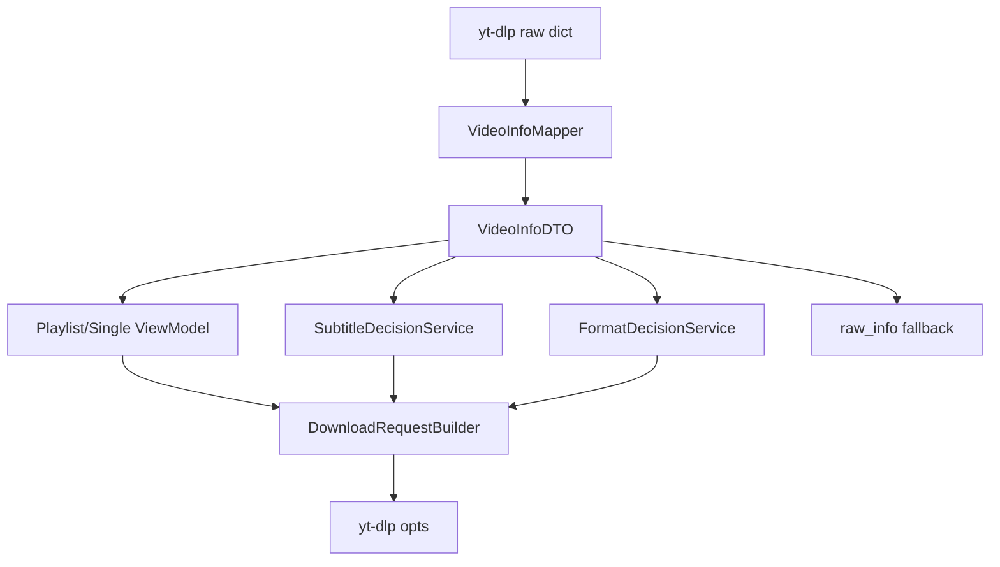

# FluentYTDL DTO 防腐层重构设计稿

本文档给出 FluentYTDL 当前 yt-dlp 信息清洗与转传链路的统一 DTO 重构方案。
目标是把 raw dict 的泄漏范围收敛到边界层，降低 UI 与下载逻辑对 yt-dlp 字段的直接耦合。

## 1. 背景与问题

当前链路中，yt-dlp 返回的原始字典在多个层级直接传递并被读取：

1. 解析入口返回 raw dict。
2. UI 层直接依赖 raw dict 字段进行展示和选项构建。
3. 字幕、格式选择、下载参数构建都在不同模块重复做字段推断和清洗。

主要问题：

1. 字段语义分散：相同含义字段在多个模块重复推断，容易漂移。
2. 变更成本高：yt-dlp 字段变化会影响多个模块。
3. 双轨状态：播放列表同时维护 row_data 和 VideoTask，状态同步复杂。
4. 可测试性弱：大量规则在 UI 组件函数中，不利于纯逻辑单测。

## 2. 设计目标

1. 建立统一的视频领域 DTO，作为业务层唯一可依赖的数据模型。
2. 建立 mapper 边界层，负责 raw dict 到 DTO 的一次性转换。
3. 将清洗规则集中到 models/mappers，避免 UI 重复实现。
4. 将下载参数组装从 UI 抽离为独立 builder。
5. 保持兼容：短期内保留 raw_info 兜底，不做大爆炸式替换。

非目标：

1. 不追求完整建模 yt-dlp 全量字段。
2. 不在首轮重构中替换所有历史路径。

## 3. 目标架构



原则：

1. 业务层读取 DTO，不直接读取 raw dict。
2. raw_info 仅作为调试和兜底扩展字段。
3. 所有 URL/缩略图/格式清洗规则统一通过 mapper 暴露。

## 4. DTO 设计

建议新增或扩展以下模型。

### 4.1 VideoInfoDTO

建议路径：src/fluentytdl/models/video_info.py

核心字段：

1. identity
- video_id: str
- source_url: str
- webpage_url: str
- original_url: str

2. basic
- title: str
- uploader: str
- duration_sec: int | None
- duration_text: str
- upload_date_text: str
- is_live: bool

3. media
- thumbnail_url: str
- thumbnails: list[ThumbnailDTO]
- formats_raw: list[dict[str, Any]]
- video_formats: list[VideoFormatDTO]
- audio_formats: list[AudioFormatDTO]

4. subtitle
- subtitle_tracks: list[SubtitleTrackDTO]
- subtitle_languages: list[SubtitleLanguageDTO]

5. vr
- vr_mode: bool
- vr_projection_summary: VRSummaryDTO | None
- vr_only_format_ids: list[str]
- android_vr_format_ids: list[str]

6. meta
- source_type: Literal[single, playlist_entry, vr_single]
- raw_info: dict[str, Any]

### 4.2 DownloadSelectionDTO

建议路径：src/fluentytdl/models/download_selection.py

字段：

1. mode: Literal[av, video_only, audio_only, subtitle_only, cover_only]
2. format_expr: str
3. merge_output_format: str | None
4. subtitle_embed: bool | None
5. extra_opts: dict[str, Any]

### 4.3 DownloadRequestDTO

建议路径：src/fluentytdl/models/download_request.py

字段：

1. title: str
2. url: str
3. thumbnail_url: str | None
4. selection: DownloadSelectionDTO
5. ydl_opts: dict[str, Any]

## 5. Mapper 与服务分层

### 5.1 VideoInfoMapper

建议路径：src/fluentytdl/models/mappers/video_info_mapper.py

职责：

1. from_raw(raw: dict, context) -> VideoInfoDTO
2. infer_source_url(raw)
3. infer_thumbnail(raw)
4. clean_video_formats(raw)
5. clean_audio_formats(raw)
6. extract_subtitle_tracks(raw)

说明：

1. 现有 selection_dialog 中的 _infer_entry_url/_infer_entry_thumbnail/_clean_video_formats/_clean_audio_formats 迁入此处。
2. models/video_utils.py 保留为轻工具层，实际实现逐步委托到 mapper。

### 5.2 SubtitleDecisionService

建议路径：src/fluentytdl/processing/subtitle_decision_service.py

职责：

1. 输入 VideoInfoDTO + SubtitleConfig。
2. 输出字幕相关 ydl_opts 片段。
3. 不再直接读取 raw dict。

### 5.3 FormatDecisionService

建议路径：src/fluentytdl/processing/format_decision_service.py

职责：

1. 输入 VideoInfoDTO + 用户选择。
2. 输出 format_expr 与 merge/container 决策。
3. 统一处理 AV/视频/音频/VR 规则。

### 5.4 DownloadRequestBuilder

建议路径：src/fluentytdl/download/request_builder.py

职责：

1. 合并基础 opts、格式 opts、字幕 opts、模式 opts。
2. 输出 DownloadRequestDTO 与最终 ydl_opts。
3. 对外提供单视频和播放列表统一构建入口。

## 6. 迁移策略（四阶段）

### Phase 1: 建立模型与 mapper（无行为变化）

改动：

1. 扩展 VideoInfo 模型。
2. 新增 VideoInfoMapper。
3. 编写 mapper 单测。
4. 暂不切换 UI 使用。

验收：

1. mapper 对现有测试样本输出稳定。
2. 与当前 UI 清洗结果一致率达到 100%。

### Phase 2: 切换读取路径（单视频优先）

改动：

1. selection_dialog 在 on_parse_success 时将 raw 转 VideoInfoDTO。
2. get_selected_tasks/get_download_options 优先读取 DTO 字段。
3. 保留 raw_info fallback。

验收：

1. 单视频下载、字幕、封面、VR 不回退。
2. 原有功能行为不变。

### Phase 3: 切换播放列表双轨状态

改动：

1. _on_scheduler_detail_finished 仅更新 VideoTask/DTO，不再维护重复 detail 字段。
2. row_data 缩减为 UI 局部交互态。
3. PlaylistListModel 与 Delegate 仅消费 DTO 投影。

验收：

1. 行状态同步逻辑减少。
2. 解析完成后的渲染和任务构建与旧行为一致。

### Phase 4: 抽离下载请求构建器

改动：

1. get_selected_tasks/_build_playlist_tasks 迁移到 DownloadRequestBuilder。
2. UI 只提交选择输入，不再拼装 ydl_opts。

验收：

1. 任务构建逻辑可单测。
2. UI 文件复杂度显著下降。

## 7. 影响范围

核心影响文件：

1. src/fluentytdl/models/video_info.py
2. src/fluentytdl/models/video_task.py
3. src/fluentytdl/models/video_utils.py
4. src/fluentytdl/ui/components/selection_dialog.py
5. src/fluentytdl/ui/components/download_config_window.py
6. src/fluentytdl/ui/models/playlist_model.py
7. src/fluentytdl/processing/subtitle_service.py
8. src/fluentytdl/download/workers.py

新增建议文件：

1. src/fluentytdl/models/mappers/video_info_mapper.py
2. src/fluentytdl/models/download_selection.py
3. src/fluentytdl/models/download_request.py
4. src/fluentytdl/processing/format_decision_service.py
5. src/fluentytdl/download/request_builder.py

## 8. 风险与回滚

主要风险：

1. DTO 字段缺失导致边缘功能（VR/封面/字幕问答模式）回退。
2. 播放列表状态切换期可能出现 UI 与任务构建不一致。
3. 迁移中期新旧规则并存，可能出现双路径分叉。

缓解措施：

1. 保留 raw_info fallback，渐进切换。
2. 每阶段引入功能开关，支持快速回滚到旧路径。
3. 为格式清洗、字幕策略、任务构建增加快照测试。

回滚策略：

1. 通过配置开关关闭 DTO 路径，回退旧逻辑。
2. 保留旧函数一段时间，待线上稳定后再删除。

## 9. 测试策略

### 9.1 单元测试

1. VideoInfoMapper.from_raw 覆盖：
- 普通单视频
- 播放列表 entry
- VR 信息
- 缺字段与异常字段

2. FormatDecisionService 覆盖：
- AV 组合
- 仅视频
- 仅音频
- 手动覆盖优先级

3. SubtitleDecisionService 覆盖：
- 关闭字幕
- 单语/多语
- ask/embed_mode 逻辑

### 9.2 集成测试

1. 从解析到任务构建全链路快照。
2. 单视频与播放列表的 ydl_opts 快照对比。
3. VR 模式下 format 与 extra_opts 一致性。

### 9.3 UI 回归测试

1. 播放列表懒加载与详情补全无退化。
2. 手动格式选择和批量预设行为一致。
3. 字幕弹窗和下载结果一致。

## 10. 里程碑与工时估算

1. M1 模型与 mapper落地：2 到 3 天
2. M2 单视频切换：1 到 2 天
3. M3 播放列表状态收敛：3 到 4 天
4. M4 下载请求构建器抽离：2 到 3 天
5. M5 回归与文档完善：1 到 2 天

总计：9 到 14 天（不含大规模 UI 交互变更）

## 11. 验收标准

1. UI 业务代码中直接读取 raw dict 的位置减少 70% 以上。
2. selection_dialog 与 download_config_window 中重复清洗函数收敛到 mapper。
3. 下载参数构建逻辑可通过纯逻辑测试验证。
4. 现有核心功能无行为回归：
- 单视频下载
- 播放列表下载
- 字幕下载与嵌入
- VR 下载
- 封面下载

## 12. 下一步实施清单

1. 定义 VideoInfoDTO、VideoFormatDTO、AudioFormatDTO、SubtitleTrackDTO。
2. 新建 VideoInfoMapper 并迁移 URL/缩略图/格式清洗规则。
3. 在单视频路径接入 DTO（保留 fallback）。
4. 增加 mapper 与 request builder 快照测试。
5. 评估并切换播放列表路径到 DTO 主数据流。

## 13. 分阶段执行计划与检查点

本节给出可直接执行的阶段计划。每个阶段包含：

1. 实施任务
2. 手动检查点
3. 自动检查点
4. 出口标准（通过后才能进入下一阶段）

### Phase 1 执行：DTO 与 Mapper 骨架落地

实施任务：

1. 扩展 src/fluentytdl/models/video_info.py，补充 VideoInfoDTO 所需字段。
2. 新增 src/fluentytdl/models/mappers/video_info_mapper.py。
3. 将 URL/缩略图/格式清洗规则迁入 mapper，UI 侧暂不切换。
4. 保留 models/video_utils.py 对外 API，不破坏现有调用点。

手动检查点：

1. 在代码中确认 mapper 不依赖 UI 组件模块。
2. 对比 mapper 输出与旧函数输出，确保同一输入下核心字段一致：
- source_url
- thumbnail_url
- video_formats 数量与首项
- audio_formats 数量与首项
3. 选取 3 组样本进行人工核对：
- 普通单视频
- 播放列表 entry
- VR 视频

自动检查点：

1. 新增单测：tests/test_video_info_mapper.py。
2. 新增参数化测试样本，覆盖缺字段与异常字段。
3. 运行测试命令：

```powershell
pytest tests/test_video_info_mapper.py -q
```

出口标准：

1. mapper 单测全绿。
2. 不影响现有测试集。

### Phase 2 执行：单视频路径接入 DTO

实施任务：

1. 在 selection_dialog 的 on_parse_success 中引入 mapper 转换。
2. 在 get_selected_tasks/get_download_options 优先读取 DTO 字段。
3. 保留 raw_info fallback 与旧路径开关。

手动检查点：

1. 单视频弹窗解析成功后，格式列表、时长、封面显示与重构前一致。
2. 字幕询问弹窗行为不变（ask/never/external/soft）。
3. VR 单视频流程不变：
- VR 标识
- VR 预设
- format 输出
4. 封面模式与字幕模式仍可独立提交任务。

自动检查点：

1. 新增测试：tests/test_selection_dialog_dto_path.py（可用轻量 mock）。
2. 增加 ydl_opts 快照测试，比较 DTO 路径和旧路径输出一致性。
3. 运行测试命令：

```powershell
pytest tests/test_selection_dialog_dto_path.py -q
pytest tests/test_video_analyzer.py tests/test_error_parser.py -q
```

出口标准：

1. 单视频链路无功能回归。
2. ydl_opts 快照差异仅允许白名单字段（如内部标记字段）。

### Phase 3 执行：播放列表主数据流收敛

实施任务：

1. _on_scheduler_detail_finished 只更新 DTO/VideoTask 主数据。
2. row_data 只保留 UI 状态字段（selected、manual override、custom selection）。
3. PlaylistListModel 和 Delegate 只消费 DTO 投影。

手动检查点：

1. 大播放列表（建议 200+）滚动不卡顿且无明显闪烁回归。
2. 视口优先详情加载行为保持。
3. 批量预设、单行手动改格式、反选、全选行为一致。
4. 详情加载失败时错误态展示正常，重试正常。

自动检查点：

1. 新增测试：tests/test_playlist_dto_projection.py。
2. 新增调度状态测试：tests/test_playlist_scheduler_state.py。
3. 运行测试命令：

```powershell
pytest tests/test_playlist_dto_projection.py tests/test_playlist_scheduler_state.py -q
```

出口标准：

1. 双轨字段移除完成，无遗留重复写入点。
2. 播放列表任务构建结果与重构前一致。

### Phase 4 执行：下载请求构建器抽离

实施任务：

1. 新增 src/fluentytdl/download/request_builder.py。
2. 将 get_selected_tasks/_build_playlist_tasks 的拼参逻辑迁移。
3. UI 仅传递选择输入，不再直接拼 ydl_opts。

手动检查点：

1. 单视频和播放列表的任务提交入口行为不变。
2. 字幕、封面、VR、音频-only、视频-only、AV 全模式可提交。
3. 下载队列入库数据（title/url/opts）完整且格式正确。

自动检查点：

1. 新增测试：tests/test_download_request_builder.py。
2. 对典型场景做 opts 快照回归。
3. 运行测试命令：

```powershell
pytest tests/test_download_request_builder.py -q
pytest tests/test_dle_backend.py -q
```

出口标准：

1. UI 侧拼参逻辑删除或仅保留兼容薄层。
2. request_builder 单测覆盖核心分支。

### 阶段间通用检查（每阶段结束都执行）

手动通用检查：

1. 启动应用，验证核心页面可打开：解析窗口、设置页、任务列表。
2. 执行一次真实下载任务，确认无阻断异常。
3. 检查日志中无大量新告警（尤其 DTO 字段缺失警告）。

自动通用检查：

1. 运行静态检查（若项目已配置）：

```powershell
pyright
```

2. 运行回归测试（按现有测试集规模分批）：

```powershell
pytest tests -q
```

3. 如果测试较重，至少执行 DTO 影响域最小集合：

```powershell
pytest tests/test_video_analyzer.py tests/test_error_parser.py tests/test_dle_backend.py -q
```

## 14. 执行顺序建议（可直接照做）

1. 先完成 Phase 1 并通过检查点。
2. 再做 Phase 2，先单视频，不动播放列表。
3. Phase 3 只处理播放列表状态收敛，不引入新功能。
4. 最后做 Phase 4，把拼参统一收口。
5. 每阶段均先开小 PR，保证可回滚。
