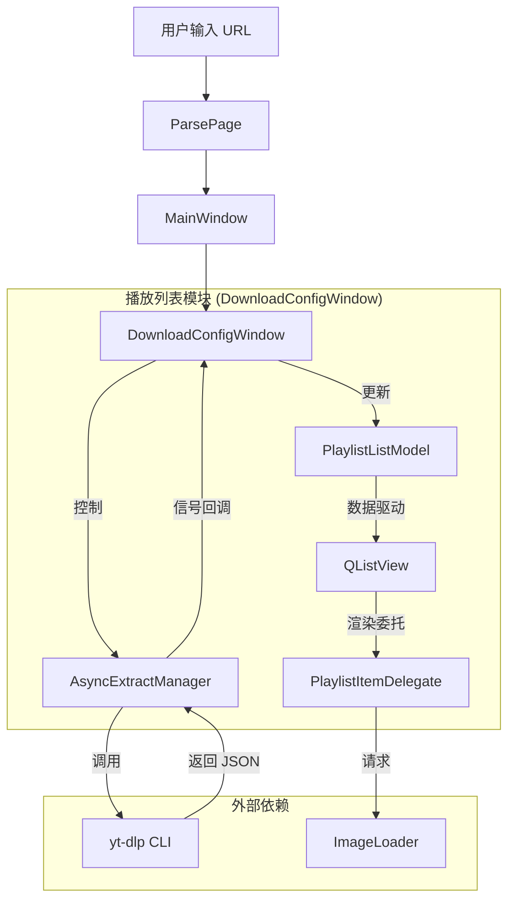

# FluentYTDL 播放列表模块架构分析

本文档对 FluentYTDL 项目中的播放列表（Playlist）模块进行架构分析，涵盖其核心组件、数据流向及外部接口设计。

## 1. 核心架构概览

播放列表功能主要由 **UI 展示层**、**数据模型层** 和 **业务逻辑层** 组成，遵循 Model-View-Delegate (MVD) 模式，并结合了异步任务管理。

### 1.1 组件构成

| 层级 | 核心类/文件 | 职责描述 |
| :--- | :--- | :--- |
| **View (视图)** | `DownloadConfigWindow` | 播放列表的主容器窗口，负责整体布局、状态切换（加载/内容/错误）及用户交互。 |
| | `QListView` | 用于渲染大量列表项的高性能滚动视图。 |
| **Delegate (委托)** | `PlaylistItemDelegate` | 负责每个列表项的绘制（缩略图、标题、格式按钮、复选框等）及交互事件处理。 |
| **Model (模型)** | `PlaylistListModel` | 维护 `VideoTask` 数据列表，提供数据接口给 View，处理数据的增删改查。 |
| **Logic (逻辑)** | `AsyncExtractManager` | 负责后台异步调用 `yt-dlp` 获取视频详情。 |
| | `DownloadConfigWindow` (Controller) | 协调 Model 与 Manager，处理业务逻辑（如批量解析、格式选择）。 |

### 1.2 模块关系图

## 2. 详细数据流分析

### 2.1 初始化与解析阶段
1.  **启动解析**：`DownloadConfigWindow.start_extraction()` 启动 `InfoExtractWorker`。
2.  **获取元数据**：`yt-dlp` 返回播放列表的基础信息（Flat Playlist），包含所有视频的 ID、标题和 URL。
3.  **构建列表**：`DCW._on_parse_success()` 接收基础信息，调用 `_build_playlist_rows()`。
4.  **分块加载**：为了避免 UI 卡顿，使用 `_process_next_build_chunk()` 将数千条数据分批（每批 30 条）写入 `PlaylistListModel`。

### 2.2 详情获取阶段（Background Crawl）
播放列表初次加载时通常只包含基础信息，缺乏详细格式（分辨率、编码）。系统通过“后台爬虫”机制补充详情：
1.  **启动爬虫**：`_start_background_crawl()` 启动定时器 `_bg_crawl_timer`。
2.  **调度任务**：`_bg_crawl_tick()` 遍历列表，将未获取详情的行加入 `_detail_bg_queue`。
3.  **执行解析**：`_pump_detail_pipeline()` 从队列取任务，通过 `AsyncExtractManager` 并发调用 `yt-dlp` 获取单视频详情。
4.  **回填数据**：`_on_extract_task_finished()` 接收详情，更新内部 `_playlist_rows` 和 Model，触发 UI 刷新。

### 2.3 渲染与交互
-   **绘制**：`PlaylistItemDelegate.paint()` 基于 Model 数据全手动绘制列表项。
-   **缓存**：Delegate 内部维护 `_pixmap_cache` 和 `_scaled_cache` 优化图片渲染。
-   **交互**：点击事件通过 `editorEvent` 捕获，判断点击区域（复选框、按钮）并通知 View。

## 3. 外部连接口 (External Interfaces)

### 3.1 输入接口
-   **构造函数**：`DownloadConfigWindow(url, ...)` 接收目标 URL。
-   **用户交互**：
    -   **格式选择**：通过 `ComboBox` (Preset) 或点击单行按钮（`PlaylistFormatDialog`）修改下载格式。
    -   **批量操作**：全选/反选、类型过滤（视频/音频）。

### 3.2 输出接口
-   **信号 `downloadRequested(list)`**：
    -   当用户点击“下载”时发射。
    -   **Payload**：包含多个元组 `(title, url, options, thumbnail)`。
    -   **接收方**：`MainWindow.add_tasks()`，负责将任务转交给 `DownloadManager` 开始下载。

### 3.3 依赖服务接口
-   **yt-dlp CLI**：
    -   **Flat Mode**：`--flat-playlist --dump-single-json` 用于快速获取列表概览。
    -   **Detail Mode**：`--dump-json` 用于获取单个视频的详细格式信息。
-   **ImageLoader**：
    -   异步加载缩略图，通过信号 `loaded_with_url` 回调 UI。
-   **CookieSentinel / AuthService**：
    -   提供 `cookies` 参数，确保能解析需要登录的内容（如会员视频、有年龄限制的视频）。

## 4. 关键设计模式
-   **Proxy Model (Row Proxy)**：`_PlaylistModelRowProxy` 类用于隔离底层 Model 和 UI 逻辑，提供 `begin_batch/end_batch` 机制来合并属性更新。
-   **Throttled Update (节流更新)**：使用 `QTimer` (`_row_update_timer`) 将高频的单行更新合并为批量 `dataChanged` 信号，减少界面重绘压力。
-   **Lazy Loading (懒加载)**：`QListView` 结合 Delegate 仅渲染可见区域；后台详情解析优先处理可见区域任务（`_initial_viewport_scan`）。
