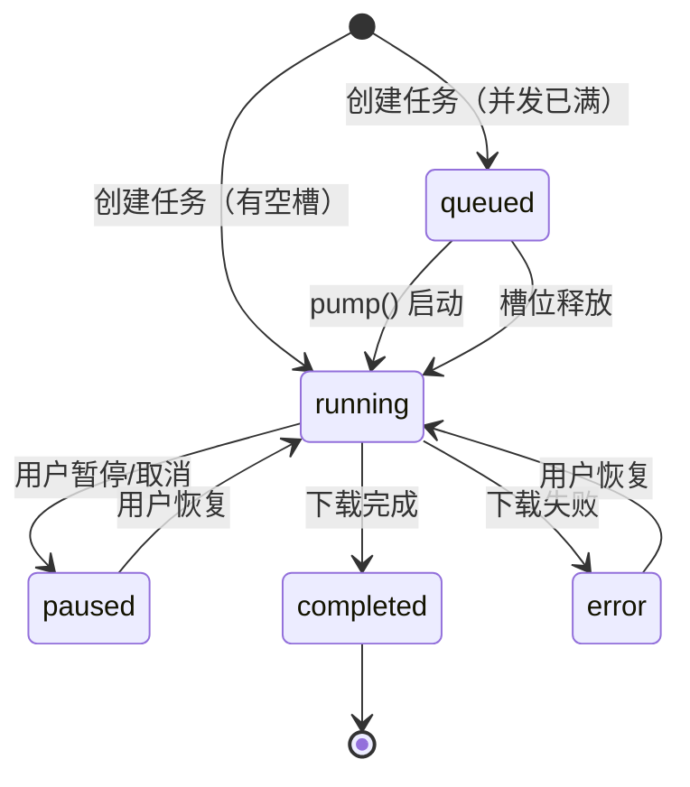

# 下载状态管理系统文档

## 概述

FluentYTDL 使用四个任务列表页面管理下载任务的不同状态，并通过信号机制自动转移任务卡片。

---

## 状态定义

| 状态 | 枚举值 | 页面 | 描述 |
|------|--------|------|------|
| 正在下载 | `running` | `downloading_page` | 任务正在执行下载 |
| 排队中 | `queued` | `queued_page` | 等待并发槽位 |
| 已暂停 | `paused` | `paused_page` | 用户手动暂停或取消 |
| 已完成 | `completed` | `completed_page` | 下载成功完成 |
| 错误 | `error` | `paused_page` | 下载失败（归入暂停页） |

---

## 状态转换流程



---

## 核心组件

### 1. DownloadItemWidget (UI 卡片)

**文件**: [download_item_widget.py](file:///d:/YouTube/FluentYTDL/src/fluentytdl/ui/components/download_item_widget.py)

**职责**: 单个下载任务的 UI 表示

**关键属性**:
- `_state`: 当前状态字符串
- `worker`: 绑定的 `DownloadWorker` 线程

**关键方法**:
```python
def set_state(self, state: str) -> None:
    """设置状态并发射 state_changed 信号"""
    # 验证状态值
    if s not in {"running", "queued", "paused", "completed", "error"}:
        s = "queued"
    # 更新 UI 按钮图标
    # 发射信号触发页面转移
    self.state_changed.emit(self._state)
```

**状态对应的 UI 变化**:
- `running`: 暂停按钮 (⏸)
- `paused/error/queued`: 播放按钮 (▶)
- `completed`: 完成图标 (✓，禁用)

---

### 2. DownloadManager (任务调度器)

**文件**: [download_manager.py](file:///d:/YouTube/FluentYTDL/src/fluentytdl/core/download_manager.py)

**职责**: 管理并发下载和任务队列

**关键属性**:
- `active_workers`: 所有工作线程列表
- `_pending_workers`: 等待执行的队列 (deque)

**关键方法**:
```python
def start_worker(self, worker) -> bool:
    """启动工作线程，如果并发已满则入队"""
    if self._running_count() < self._max_concurrent():
        worker.start()
        return True  # 已启动 -> running
    else:
        self._pending_workers.append(worker)
        return False  # 已排队 -> queued

def pump(self) -> None:
    """从队列中取出任务填充空槽"""
    while self._pending_workers and self._running_count() < limit:
        w = self._pending_workers.popleft()
        w.start()
```

---

### 3. MainWindow (页面路由)

**文件**: [reimagined_main_window.py](file:///d:/YouTube/FluentYTDL/src/fluentytdl/ui/reimagined_main_window.py)

**职责**: 监听状态变化并移动卡片到对应页面

**页面实例**:
```python
self.downloading_page = TaskListPage("正在下载", FluentIcon.DOWNLOAD)
self.paused_page = TaskListPage("已暂停", FluentIcon.PAUSE)
self.completed_page = TaskListPage("已完成", FluentIcon.ACCEPT)
self.queued_page = TaskListPage("排队中", FluentIcon.HISTORY)
```

**状态路由逻辑**:
```python
def on_card_state_changed(self, card, state: str):
    card.setParent(None)  # 从当前页移除
    
    if state == "completed":
        self.completed_page.add_card(card)
    elif state == "queued":
        self.queued_page.add_card(card)
    elif state == "paused":
        self.paused_page.add_card(card)
    elif state == "error":
        self.paused_page.add_card(card)  # 错误归入暂停页
    else:  # running
        self.downloading_page.add_card(card)
```

---

## 信号流程图

```
DownloadWorker                  DownloadItemWidget              MainWindow
    │                               │                               │
    ├──progress──────────────────>│update_progress()              │
    │                               │  └─set_state("running")      │
    │                               │        └─────────────────────>on_card_state_changed()
    │                               │                               │  └─move to downloading_page
    │                               │                               │
    ├──cancelled─────────────────>│on_cancelled()                 │
    │                               │  └─set_state("paused")       │
    │                               │        └─────────────────────>on_card_state_changed()
    │                               │                               │  └─move to paused_page
    │                               │                               │
    ├──completed─────────────────>│on_finished()                  │
    │                               │  └─set_state("completed")    │
    │                               │        └─────────────────────>on_card_state_changed()
    │                               │                               │  └─move to completed_page
    │                               │                               │
    └──error─────────────────────>│on_error()                     │
                                    │  └─set_state("error")        │
                                    │        └─────────────────────>on_card_state_changed()
                                    │                               │  └─move to paused_page
```

---

## 用户操作映射

| 操作 | 触发方法 | 状态变化 |
|------|----------|----------|
| 点击暂停 | `worker.stop()` | running → paused |
| 点击继续 | `MainWindow.on_resume_card()` | paused/error → running |
| 删除任务 | `MainWindow.on_remove_card()` | 移除卡片 |
| 全部暂停 | `download_manager.stop_all()` | 清空队列，暂停所有 |
| 全部开始 | `download_manager.pump()` | 启动队列中的任务 |

---

## 并发控制

配置项: `max_concurrent_downloads` (默认 3)

逻辑:
1. 新任务创建时检查 `running_count < max_concurrent`
2. 是 → 立即启动 `running`
3. 否 → 加入队列 `queued`
4. 任何任务结束后调用 `pump()` 从队列取出下一个
